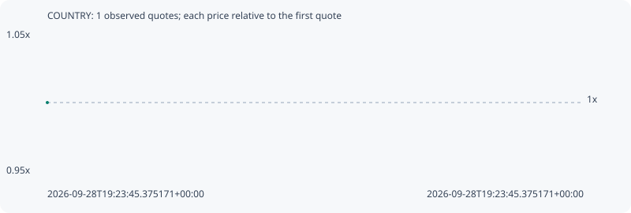

# COUNTRY

**solana** / `FoQq16ZcyvC7kgFAoxLhrAYverC1UqqJenys4L2spump`

[All tokens](README.md) · [Market window](../README.md)

## Native assessments

This contract is in the quote cohort; it has no native model assessment in this window.

## Series 2990fe4ec223761ebf5b

Pool: `not supplied`

[Complete series](../series/solana/2990fe4ec223761ebf5b.json)

Every dot is a captured quote. Lines connect observations; the curve ends at the last available quote.

Fewer than two quotes: return and drawdown are not calculated.

### Complete quote timeline

| Time (UTC) | Price (USD) | Multiple | Evidence |
| --- | ---: | ---: | --- |
| 2026-09-28T19:23:45.375171+00:00 | 5.70429e-06 | 1.0000x | `capture:1b404fa0-870b-4e7c-bafd-c3ef241c5093:rank:86` |

### Exit-policy timeline

Calculated from captured quotes under the window policy. Native assessments are linked separately above.

| Time (UTC) | Action | Price (USD) | Evidence |
| --- | --- | ---: | --- |
