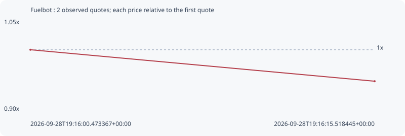

# Fuelbot

**robinhood** / `0xa603f6606099d9b23f6762c78f740950d263860b`

[All tokens](README.md) · [Market window](../README.md)

## Native assessments

This contract is in the quote cohort; it has no native model assessment in this window.

## Series c90d6634502f5a27219b

Pool: `not supplied`

[Complete series](../series/robinhood/c90d6634502f5a27219b.json)

Every dot is a captured quote. Lines connect observations; the curve ends at the last available quote.

| Peak | Final | Return | Maximum drawdown |
| ---: | ---: | ---: | ---: |
| 1.0000x | 0.9468x | -5.32% | 5.32% |

### Complete quote timeline

| Time (UTC) | Price (USD) | Multiple | Evidence |
| --- | ---: | ---: | --- |
| 2026-09-28T19:16:00.473367+00:00 | 1.04518e-05 | 1.0000x | `capture:cd404827-1073-4901-b09c-82ef1488855b:rank:72` |
| 2026-09-28T19:16:15.518445+00:00 | 9.89604e-06 | 0.9468x | `capture:c193221c-c80a-4a3b-ad88-59f12dcb1689:rank:13` |

### Exit-policy timeline

Calculated from captured quotes under the window policy. Native assessments are linked separately above.

| Time (UTC) | Action | Price (USD) | Evidence |
| --- | --- | ---: | --- |
| 2026-09-28T19:16:00.473367+00:00 | BUY | 1.04518e-05 | `capture:cd404827-1073-4901-b09c-82ef1488855b:rank:72` |
| 2026-09-28T19:16:15.518445+00:00 | HOLD | 9.89604e-06 | `capture:c193221c-c80a-4a3b-ad88-59f12dcb1689:rank:13` |
