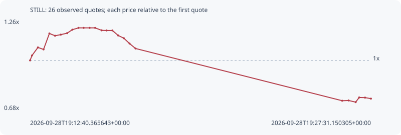

# STILL

**solana** / `7qLn9eW3CHiCMJWokv4Kxmgs4daSnnRE4hxAzqqFpump`

[All tokens](README.md) · [Market window](../README.md)

## Native assessments

This contract is in the quote cohort; it has no native model assessment in this window.

## Series 6c36fd42bdb8afb0205d

Pool: `not supplied`

[Complete series](../series/solana/6c36fd42bdb8afb0205d.json)

Every dot is a captured quote. Lines connect observations; the curve ends at the last available quote.

| Peak | Final | Return | Maximum drawdown |
| ---: | ---: | ---: | ---: |
| 1.2065x | 0.7571x | -24.29% | 39.09% |

### Complete quote timeline

| Time (UTC) | Price (USD) | Multiple | Evidence |
| --- | ---: | ---: | --- |
| 2026-09-28T19:12:40.365643+00:00 | 3.24417e-05 | 1.0000x | `capture:3af1faa1-2074-484e-893e-ed2c676e1576:rank:56` |
| 2026-09-28T19:12:45.490977+00:00 | 3.34613e-05 | 1.0314x | `capture:ac0279d6-7dd1-44b6-bf3e-910bf7b8eddf:rank:55` |
| 2026-09-28T19:13:00.884337+00:00 | 3.51104e-05 | 1.0823x | `capture:5867894f-39b4-4bcd-bd87-86394c63aab4:rank:53` |
| 2026-09-28T19:13:15.565374+00:00 | 3.47029e-05 | 1.0697x | `capture:ca31b3d4-ad60-4333-98b3-6d940a196f86:rank:53` |
| 2026-09-28T19:13:30.833894+00:00 | 3.79865e-05 | 1.1709x | `capture:2beb38a4-bfac-4502-bbc3-8c8c0f943007:rank:54` |
| 2026-09-28T19:13:45.640151+00:00 | 3.75199e-05 | 1.1565x | `capture:4d31b656-3ffe-4768-bef6-377adf019420:rank:52` |
| 2026-09-28T19:14:00.595194+00:00 | 3.77433e-05 | 1.1634x | `capture:2c78112b-48e7-4f74-8c2e-1cb8642a79dc:rank:54` |
| 2026-09-28T19:14:17.246316+00:00 | 3.8054e-05 | 1.1730x | `capture:7a923cde-d765-4388-a15c-4f47fde0a3b5:rank:55` |
| 2026-09-28T19:14:30.874732+00:00 | 3.87675e-05 | 1.1950x | `capture:fa585070-b1ae-4f9d-afbd-aa986f487793:rank:55` |
| 2026-09-28T19:14:46.892387+00:00 | 3.91417e-05 | 1.2065x | `capture:7d9e3e65-8bda-4696-b6d1-7a86825bd98c:rank:61` |
| 2026-09-28T19:15:00.432009+00:00 | 3.91417e-05 | 1.2065x | `capture:797f9a41-958a-44ba-ac57-3b9cacf5d06b:rank:68` |
| 2026-09-28T19:15:16.098308+00:00 | 3.91417e-05 | 1.2065x | `capture:ab2becb9-3f94-4a57-b9e8-472ad0998012:rank:75` |
| 2026-09-28T19:15:30.340579+00:00 | 3.91417e-05 | 1.2065x | `capture:564db5fc-5586-41d3-88fb-a9a955708f1d:rank:76` |
| 2026-09-28T19:15:47.323285+00:00 | 3.86331e-05 | 1.1908x | `capture:65003429-a569-4442-8d4f-b2c93db69061:rank:77` |
| 2026-09-28T19:16:00.259696+00:00 | 3.86057e-05 | 1.1900x | `capture:4236f8d5-90c4-4c9b-a73e-d6443ae3bf32:rank:76` |
| 2026-09-28T19:16:15.455827+00:00 | 3.86057e-05 | 1.1900x | `capture:acc657c6-9a43-46bf-986e-7b907c831cba:rank:82` |
| 2026-09-28T19:16:30.624202+00:00 | 3.75759e-05 | 1.1583x | `capture:0d391072-ec81-4bb7-9be0-0d6bbb801c70:rank:86` |
| 2026-09-28T19:16:45.311485+00:00 | 3.70143e-05 | 1.1409x | `capture:72cccbac-c3fe-4991-8f62-08c53849b146:rank:96` |
| 2026-09-28T19:17:00.368914+00:00 | 3.59073e-05 | 1.1068x | `capture:1232cf18-7088-40a1-9f55-ad9ae22b44f5:rank:95` |
| 2026-09-28T19:17:15.914647+00:00 | 3.48917e-05 | 1.0755x | `capture:9792e199-c0c2-4272-ac95-24501e4a3f79:rank:96` |
| 2026-09-28T19:26:16.031602+00:00 | 2.41308e-05 | 0.7438x | `capture:bb8d4bfc-85e1-4d55-a2ff-e47193bcce5f:rank:81` |
| 2026-09-28T19:26:32.771713+00:00 | 2.41815e-05 | 0.7454x | `capture:2fed7296-b3d1-4ba6-8398-799ee55f1f2b:rank:80` |
| 2026-09-28T19:26:51.267717+00:00 | 2.38409e-05 | 0.7349x | `capture:4cc162c2-aa4a-403b-a901-4bb5058380d6:rank:83` |
| 2026-09-28T19:27:00.453239+00:00 | 2.48001e-05 | 0.7645x | `capture:4273fbb8-5342-4e37-8d61-ced6b88e542d:rank:85` |
| 2026-09-28T19:27:15.715818+00:00 | 2.47694e-05 | 0.7635x | `capture:d04c9116-4617-4b61-8b98-5489321cd1cc:rank:77` |
| 2026-09-28T19:27:31.150305+00:00 | 2.45602e-05 | 0.7571x | `capture:7cad37e8-83d3-4438-8055-245db6707e2e:rank:76` |

### Exit-policy timeline

Calculated from captured quotes under the window policy. Native assessments are linked separately above.

| Time (UTC) | Action | Price (USD) | Evidence |
| --- | --- | ---: | --- |
| 2026-09-28T19:12:40.365643+00:00 | BUY | 3.24417e-05 | `capture:3af1faa1-2074-484e-893e-ed2c676e1576:rank:56` |
| 2026-09-28T19:12:45.490977+00:00 | HOLD | 3.34613e-05 | `capture:ac0279d6-7dd1-44b6-bf3e-910bf7b8eddf:rank:55` |
| 2026-09-28T19:13:00.884337+00:00 | HOLD | 3.51104e-05 | `capture:5867894f-39b4-4bcd-bd87-86394c63aab4:rank:53` |
| 2026-09-28T19:13:15.565374+00:00 | HOLD | 3.47029e-05 | `capture:ca31b3d4-ad60-4333-98b3-6d940a196f86:rank:53` |
| 2026-09-28T19:13:30.833894+00:00 | HOLD | 3.79865e-05 | `capture:2beb38a4-bfac-4502-bbc3-8c8c0f943007:rank:54` |
| 2026-09-28T19:13:45.640151+00:00 | HOLD | 3.75199e-05 | `capture:4d31b656-3ffe-4768-bef6-377adf019420:rank:52` |
| 2026-09-28T19:14:00.595194+00:00 | HOLD | 3.77433e-05 | `capture:2c78112b-48e7-4f74-8c2e-1cb8642a79dc:rank:54` |
| 2026-09-28T19:14:17.246316+00:00 | HOLD | 3.8054e-05 | `capture:7a923cde-d765-4388-a15c-4f47fde0a3b5:rank:55` |
| 2026-09-28T19:14:30.874732+00:00 | HOLD | 3.87675e-05 | `capture:fa585070-b1ae-4f9d-afbd-aa986f487793:rank:55` |
| 2026-09-28T19:14:46.892387+00:00 | HOLD | 3.91417e-05 | `capture:7d9e3e65-8bda-4696-b6d1-7a86825bd98c:rank:61` |
| 2026-09-28T19:15:00.432009+00:00 | HOLD | 3.91417e-05 | `capture:797f9a41-958a-44ba-ac57-3b9cacf5d06b:rank:68` |
| 2026-09-28T19:15:16.098308+00:00 | HOLD | 3.91417e-05 | `capture:ab2becb9-3f94-4a57-b9e8-472ad0998012:rank:75` |
| 2026-09-28T19:15:30.340579+00:00 | HOLD | 3.91417e-05 | `capture:564db5fc-5586-41d3-88fb-a9a955708f1d:rank:76` |
| 2026-09-28T19:15:47.323285+00:00 | HOLD | 3.86331e-05 | `capture:65003429-a569-4442-8d4f-b2c93db69061:rank:77` |
| 2026-09-28T19:16:00.259696+00:00 | HOLD | 3.86057e-05 | `capture:4236f8d5-90c4-4c9b-a73e-d6443ae3bf32:rank:76` |
| 2026-09-28T19:16:15.455827+00:00 | HOLD | 3.86057e-05 | `capture:acc657c6-9a43-46bf-986e-7b907c831cba:rank:82` |
| 2026-09-28T19:16:30.624202+00:00 | HOLD | 3.75759e-05 | `capture:0d391072-ec81-4bb7-9be0-0d6bbb801c70:rank:86` |
| 2026-09-28T19:16:45.311485+00:00 | HOLD | 3.70143e-05 | `capture:72cccbac-c3fe-4991-8f62-08c53849b146:rank:96` |
| 2026-09-28T19:17:00.368914+00:00 | HOLD | 3.59073e-05 | `capture:1232cf18-7088-40a1-9f55-ad9ae22b44f5:rank:95` |
| 2026-09-28T19:17:15.914647+00:00 | HOLD | 3.48917e-05 | `capture:9792e199-c0c2-4272-ac95-24501e4a3f79:rank:96` |
| 2026-09-28T19:26:16.031602+00:00 | SL | 2.41308e-05 | `capture:bb8d4bfc-85e1-4d55-a2ff-e47193bcce5f:rank:81` |
