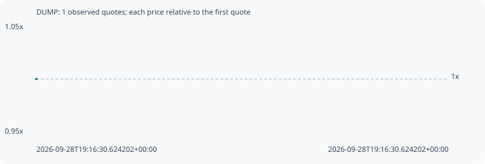

# DUMP

**solana** / `3gzcjJR1RAwTLg7dno3UgjYE2TfAJPve7hpDJfNmEAMh`

[All tokens](README.md) · [Market window](../README.md)

## Native assessments

This contract is in the quote cohort; it has no native model assessment in this window.

## Series bfa4cfbc56ac63215a7a

Pool: `not supplied`

[Complete series](../series/solana/bfa4cfbc56ac63215a7a.json)

Every dot is a captured quote. Lines connect observations; the curve ends at the last available quote.

Fewer than two quotes: return and drawdown are not calculated.

### Complete quote timeline

| Time (UTC) | Price (USD) | Multiple | Evidence |
| --- | ---: | ---: | --- |
| 2026-09-28T19:16:30.624202+00:00 | 3.4566e-05 | 1.0000x | `capture:0d391072-ec81-4bb7-9be0-0d6bbb801c70:rank:99` |

### Exit-policy timeline

Calculated from captured quotes under the window policy. Native assessments are linked separately above.

| Time (UTC) | Action | Price (USD) | Evidence |
| --- | --- | ---: | --- |
