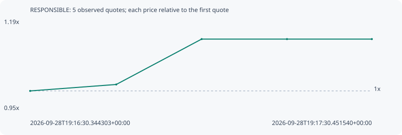

# RESPONSIBLE

**robinhood** / `0xb7dbd935c86c9ffea2f89171e033a1ec1d7f1e18`

[All tokens](README.md) · [Market window](../README.md)

## Native assessments

This contract is in the quote cohort; it has no native model assessment in this window.

## Series 7c458d71f0f5ba22ceae

Pool: `not supplied`

[Complete series](../series/robinhood/7c458d71f0f5ba22ceae.json)

Every dot is a captured quote. Lines connect observations; the curve ends at the last available quote.

| Peak | Final | Return | Maximum drawdown |
| ---: | ---: | ---: | ---: |
| 1.1358x | 1.1358x | +13.58% | 0.00% |

### Complete quote timeline

| Time (UTC) | Price (USD) | Multiple | Evidence |
| --- | ---: | ---: | --- |
| 2026-09-28T19:16:30.344303+00:00 | 3.2874e-05 | 1.0000x | `capture:18d587e7-b24d-4b8d-82f1-0ac2903a3303:rank:13` |
| 2026-09-28T19:16:45.486467+00:00 | 3.3429e-05 | 1.0169x | `capture:4ca26bf7-9d1e-455b-a63e-1b5df831b997:rank:13` |
| 2026-09-28T19:17:00.510014+00:00 | 3.73381e-05 | 1.1358x | `capture:d9309a4d-09d7-45ee-91ce-c4a055e8faac:rank:12` |
| 2026-09-28T19:17:15.523068+00:00 | 3.73381e-05 | 1.1358x | `capture:333d670d-dbd3-4656-95f9-1bc781b271db:rank:12` |
| 2026-09-28T19:17:30.451540+00:00 | 3.73381e-05 | 1.1358x | `capture:e161007c-0751-46e4-acc9-c8e28cd7190a:rank:12` |

### Exit-policy timeline

Calculated from captured quotes under the window policy. Native assessments are linked separately above.

| Time (UTC) | Action | Price (USD) | Evidence |
| --- | --- | ---: | --- |
| 2026-09-28T19:16:30.344303+00:00 | BUY | 3.2874e-05 | `capture:18d587e7-b24d-4b8d-82f1-0ac2903a3303:rank:13` |
| 2026-09-28T19:16:45.486467+00:00 | HOLD | 3.3429e-05 | `capture:4ca26bf7-9d1e-455b-a63e-1b5df831b997:rank:13` |
| 2026-09-28T19:17:00.510014+00:00 | HOLD | 3.73381e-05 | `capture:d9309a4d-09d7-45ee-91ce-c4a055e8faac:rank:12` |
| 2026-09-28T19:17:15.523068+00:00 | HOLD | 3.73381e-05 | `capture:333d670d-dbd3-4656-95f9-1bc781b271db:rank:12` |
| 2026-09-28T19:17:30.451540+00:00 | HOLD | 3.73381e-05 | `capture:e161007c-0751-46e4-acc9-c8e28cd7190a:rank:12` |
