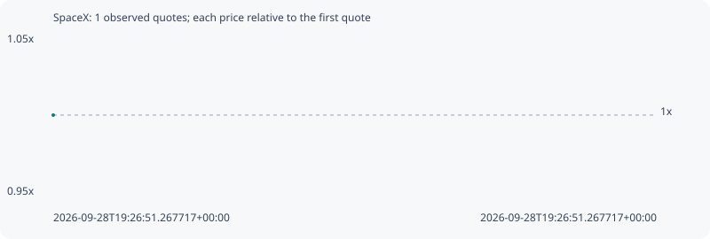

# SpaceX

**solana** / `AtfUWNGbNdwRVzVCmU3K9GwDdcQzzJ83QKQ7qrJFpump`

[All tokens](README.md) · [Market window](../README.md)

## Native assessments

This contract is in the quote cohort; it has no native model assessment in this window.

## Series c827cb4913fd2160e1a9

Pool: `not supplied`

[Complete series](../series/solana/c827cb4913fd2160e1a9.json)

Every dot is a captured quote. Lines connect observations; the curve ends at the last available quote.

Fewer than two quotes: return and drawdown are not calculated.

### Complete quote timeline

| Time (UTC) | Price (USD) | Multiple | Evidence |
| --- | ---: | ---: | --- |
| 2026-09-28T19:26:51.267717+00:00 | 0.000152188 | 1.0000x | `capture:4cc162c2-aa4a-403b-a901-4bb5058380d6:rank:89` |

### Exit-policy timeline

Calculated from captured quotes under the window policy. Native assessments are linked separately above.

| Time (UTC) | Action | Price (USD) | Evidence |
| --- | --- | ---: | --- |
