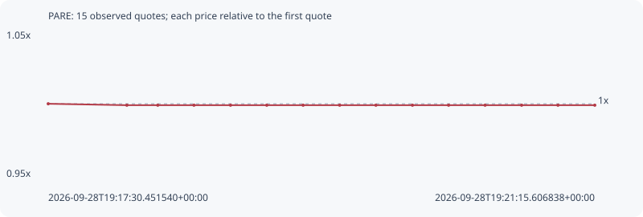

# PARE

**robinhood** / `0x15d36b6a28d8327abc7afabf0f106ae2c9af5c4d`

[All tokens](README.md) · [Market window](../README.md)

## Native assessments

- [2026-09-28T19:17:30.451540Z](../cases/5e2d3712e5e979e7.md): source parameters and model answers.

## Series 13c8a8776a9245cd47a3

Pool: `not supplied`

[Complete series](../series/robinhood/13c8a8776a9245cd47a3.json)

Every dot is a captured quote. Lines connect observations; the curve ends at the last available quote.

| Peak | Final | Return | Maximum drawdown |
| ---: | ---: | ---: | ---: |
| 1.0000x | 0.9990x | -0.10% | 0.10% |

### Complete quote timeline

| Time (UTC) | Price (USD) | Multiple | Evidence |
| --- | ---: | ---: | --- |
| 2026-09-28T19:17:30.451540+00:00 | 0.00442981 | 1.0000x | `capture:e161007c-0751-46e4-acc9-c8e28cd7190a:rank:99` |
| 2026-09-28T19:18:02.849542+00:00 | 0.0044254 | 0.9990x | `capture:53a348cd-74d6-4031-ba2b-02d70c63e42b:rank:68` |
| 2026-09-28T19:18:15.585380+00:00 | 0.0044254 | 0.9990x | `capture:ea19027f-d2c1-43cc-973f-0d8eb46ed64e:rank:72` |
| 2026-09-28T19:18:30.489414+00:00 | 0.0044254 | 0.9990x | `capture:c5cd70df-4ca4-4388-b3c5-f977fa86f8a2:rank:76` |
| 2026-09-28T19:18:45.550203+00:00 | 0.0044254 | 0.9990x | `capture:728d4974-5fe3-40a8-8e99-2139c59da3e3:rank:78` |
| 2026-09-28T19:19:00.487408+00:00 | 0.0044254 | 0.9990x | `capture:297e4fae-3bb5-49eb-b490-a4f34898851c:rank:91` |
| 2026-09-28T19:19:15.451095+00:00 | 0.0044254 | 0.9990x | `capture:0bcc0576-3637-4b2c-b0e4-f9e05871b187:rank:88` |
| 2026-09-28T19:19:30.512866+00:00 | 0.0044254 | 0.9990x | `capture:bb499bdc-159a-4072-a450-312045f32cef:rank:93` |
| 2026-09-28T19:19:45.438706+00:00 | 0.0044254 | 0.9990x | `capture:59b12f7b-2112-42c7-834a-a2eb9bcaee3d:rank:91` |
| 2026-09-28T19:20:00.494705+00:00 | 0.0044254 | 0.9990x | `capture:5b06d6b3-9eca-4487-82fb-6b28820c37d9:rank:93` |
| 2026-09-28T19:20:15.393373+00:00 | 0.0044254 | 0.9990x | `capture:17802da9-7cee-48c3-9f5b-5829781be3f6:rank:89` |
| 2026-09-28T19:20:30.417446+00:00 | 0.0044254 | 0.9990x | `capture:f2fe9ac4-89a0-4ad3-8f15-5a70d7e1d5f7:rank:91` |
| 2026-09-28T19:20:45.464282+00:00 | 0.0044254 | 0.9990x | `capture:26559b75-812f-4386-982b-eba5073faf44:rank:90` |
| 2026-09-28T19:21:00.449260+00:00 | 0.0044254 | 0.9990x | `capture:186445b2-8971-4639-85b9-26b2e8fb9d2c:rank:87` |
| 2026-09-28T19:21:15.606838+00:00 | 0.0044254 | 0.9990x | `capture:c2a8ab31-038e-42f4-8e33-852fee1b9a24:rank:89` |

### Exit-policy timeline

Calculated from captured quotes under the window policy. Native assessments are linked separately above.

| Time (UTC) | Action | Price (USD) | Evidence |
| --- | --- | ---: | --- |
| 2026-09-28T19:17:30.451540+00:00 | BUY | 0.00442981 | `capture:e161007c-0751-46e4-acc9-c8e28cd7190a:rank:99` |
| 2026-09-28T19:18:02.849542+00:00 | HOLD | 0.0044254 | `capture:53a348cd-74d6-4031-ba2b-02d70c63e42b:rank:68` |
| 2026-09-28T19:18:15.585380+00:00 | HOLD | 0.0044254 | `capture:ea19027f-d2c1-43cc-973f-0d8eb46ed64e:rank:72` |
| 2026-09-28T19:18:30.489414+00:00 | HOLD | 0.0044254 | `capture:c5cd70df-4ca4-4388-b3c5-f977fa86f8a2:rank:76` |
| 2026-09-28T19:18:45.550203+00:00 | HOLD | 0.0044254 | `capture:728d4974-5fe3-40a8-8e99-2139c59da3e3:rank:78` |
| 2026-09-28T19:19:00.487408+00:00 | HOLD | 0.0044254 | `capture:297e4fae-3bb5-49eb-b490-a4f34898851c:rank:91` |
| 2026-09-28T19:19:15.451095+00:00 | HOLD | 0.0044254 | `capture:0bcc0576-3637-4b2c-b0e4-f9e05871b187:rank:88` |
| 2026-09-28T19:19:30.512866+00:00 | HOLD | 0.0044254 | `capture:bb499bdc-159a-4072-a450-312045f32cef:rank:93` |
| 2026-09-28T19:19:45.438706+00:00 | HOLD | 0.0044254 | `capture:59b12f7b-2112-42c7-834a-a2eb9bcaee3d:rank:91` |
| 2026-09-28T19:20:00.494705+00:00 | HOLD | 0.0044254 | `capture:5b06d6b3-9eca-4487-82fb-6b28820c37d9:rank:93` |
| 2026-09-28T19:20:15.393373+00:00 | HOLD | 0.0044254 | `capture:17802da9-7cee-48c3-9f5b-5829781be3f6:rank:89` |
| 2026-09-28T19:20:30.417446+00:00 | HOLD | 0.0044254 | `capture:f2fe9ac4-89a0-4ad3-8f15-5a70d7e1d5f7:rank:91` |
| 2026-09-28T19:20:45.464282+00:00 | HOLD | 0.0044254 | `capture:26559b75-812f-4386-982b-eba5073faf44:rank:90` |
| 2026-09-28T19:21:00.449260+00:00 | HOLD | 0.0044254 | `capture:186445b2-8971-4639-85b9-26b2e8fb9d2c:rank:87` |
| 2026-09-28T19:21:15.606838+00:00 | HOLD | 0.0044254 | `capture:c2a8ab31-038e-42f4-8e33-852fee1b9a24:rank:89` |
