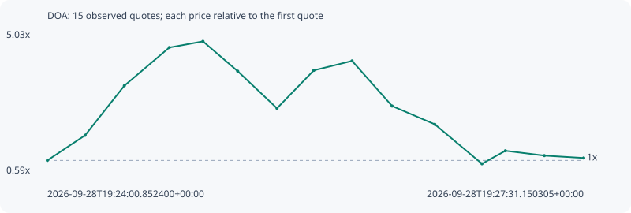

# DOA

**solana** / `6Y852xQ6PMeVVJSjNATMVdgh6hL2LMpsZjJ8KjGiR8ig`

[All tokens](README.md) · [Market window](../README.md)

## Native assessments

This contract is in the quote cohort; it has no native model assessment in this window.

## Series f40f954192dc74537b4b

Pool: `not supplied`

[Complete series](../series/solana/f40f954192dc74537b4b.json)

Every dot is a captured quote. Lines connect observations; the curve ends at the last available quote.

| Peak | Final | Return | Maximum drawdown |
| ---: | ---: | ---: | ---: |
| 4.7200x | 1.0756x | +7.56% | 81.03% |

### Complete quote timeline

| Time (UTC) | Price (USD) | Multiple | Evidence |
| --- | ---: | ---: | --- |
| 2026-09-28T19:24:00.852400+00:00 | 7.22486e-06 | 1.0000x | `capture:5205c587-4734-452c-b758-46c4814dded1:rank:84` |
| 2026-09-28T19:24:15.655418+00:00 | 1.28942e-05 | 1.7847x | `capture:5b9df0f6-51c0-4dbb-9de7-7df7a46bfee0:rank:52` |
| 2026-09-28T19:24:31.056437+00:00 | 2.40938e-05 | 3.3348x | `capture:971b5dda-397d-4fe7-b49e-94713bb088df:rank:38` |
| 2026-09-28T19:24:48.687179+00:00 | 3.27102e-05 | 4.5275x | `capture:feb72cbd-a170-4ba3-8a11-eb1df1686719:rank:25` |
| 2026-09-28T19:25:01.877958+00:00 | 3.41012e-05 | 4.7200x | `capture:fd6d01ae-d246-439e-ac58-27ae75880eb9:rank:23` |
| 2026-09-28T19:25:15.488701+00:00 | 2.7372e-05 | 3.7886x | `capture:b8fee87c-9981-475c-930b-99c255910a9f:rank:21` |
| 2026-09-28T19:25:30.900173+00:00 | 1.89914e-05 | 2.6286x | `capture:7f757769-25c3-429a-81d0-c6b2ee45ee15:rank:17` |
| 2026-09-28T19:25:45.342895+00:00 | 2.75579e-05 | 3.8143x | `capture:0ca3656d-ce8c-444b-8f77-acf34c08a1f4:rank:15` |
| 2026-09-28T19:26:00.340634+00:00 | 2.96863e-05 | 4.1089x | `capture:5b3728c5-aff9-43f3-bbb5-25b251825caa:rank:14` |
| 2026-09-28T19:26:16.031602+00:00 | 1.95038e-05 | 2.6995x | `capture:bb8d4bfc-85e1-4d55-a2ff-e47193bcce5f:rank:12` |
| 2026-09-28T19:26:32.771713+00:00 | 1.53725e-05 | 2.1277x | `capture:2fed7296-b3d1-4ba6-8398-799ee55f1f2b:rank:12` |
| 2026-09-28T19:26:51.267717+00:00 | 6.47034e-06 | 0.8956x | `capture:4cc162c2-aa4a-403b-a901-4bb5058380d6:rank:11` |
| 2026-09-28T19:27:00.453239+00:00 | 9.40321e-06 | 1.3015x | `capture:4273fbb8-5342-4e37-8d61-ced6b88e542d:rank:11` |
| 2026-09-28T19:27:15.715818+00:00 | 8.31377e-06 | 1.1507x | `capture:d04c9116-4617-4b61-8b98-5489321cd1cc:rank:10` |
| 2026-09-28T19:27:31.150305+00:00 | 7.77079e-06 | 1.0756x | `capture:7cad37e8-83d3-4438-8055-245db6707e2e:rank:11` |

### Exit-policy timeline

Calculated from captured quotes under the window policy. Native assessments are linked separately above.

| Time (UTC) | Action | Price (USD) | Evidence |
| --- | --- | ---: | --- |
| 2026-09-28T19:24:00.852400+00:00 | BUY | 7.22486e-06 | `capture:5205c587-4734-452c-b758-46c4814dded1:rank:84` |
| 2026-09-28T19:24:15.655418+00:00 | TP | 1.28942e-05 | `capture:5b9df0f6-51c0-4dbb-9de7-7df7a46bfee0:rank:52` |
