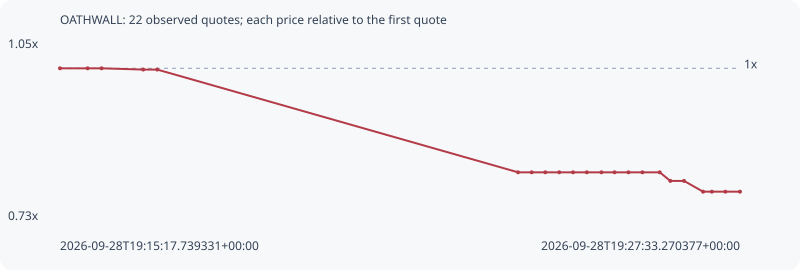

# OATHWALL

**bsc** / `0xeed22a9ef4ccd6a945aba4e21739708cb3227777`

[All tokens](README.md) · [Market window](../README.md)

## Native assessments

- [2026-09-28T19:15:17.739331Z](../cases/2c01e1a18f7bb3ab.md): source parameters and model answers.

## Series ffd4af529d799a8f0fe8

Pool: `not supplied`

[Complete series](../series/bsc/ffd4af529d799a8f0fe8.json)

Every dot is a captured quote. Lines connect observations; the curve ends at the last available quote.

| Peak | Final | Return | Maximum drawdown |
| ---: | ---: | ---: | ---: |
| 1.0000x | 0.7821x | -21.79% | 21.79% |

### Complete quote timeline

| Time (UTC) | Price (USD) | Multiple | Evidence |
| --- | ---: | ---: | --- |
| 2026-09-28T19:15:17.739331+00:00 | 3.10493e-05 | 1.0000x | `capture:08cc1e53-32bc-48e9-9abe-0b7caf40b440:rank:98` |
| 2026-09-28T19:15:47.591170+00:00 | 3.10493e-05 | 1.0000x | `capture:98b3c66b-c70a-4987-9342-10165ae058ec:rank:99` |
| 2026-09-28T19:16:02.665866+00:00 | 3.10493e-05 | 1.0000x | `capture:831c8e00-640d-4942-9ad6-ae68e842f3cf:rank:98` |
| 2026-09-28T19:16:47.751534+00:00 | 3.098e-05 | 0.9978x | `capture:39d9c9d0-d8a7-439e-86b7-5fff162807b9:rank:96` |
| 2026-09-28T19:17:02.908604+00:00 | 3.098e-05 | 0.9978x | `capture:16fde76e-cae4-4138-b96e-57b291931df8:rank:97` |
| 2026-09-28T19:23:33.140484+00:00 | 2.53465e-05 | 0.8163x | `capture:ef2304f7-c374-4b90-a3e4-d8976f05c226:rank:90` |
| 2026-09-28T19:23:47.927661+00:00 | 2.53465e-05 | 0.8163x | `capture:51aa913c-158f-4059-8727-ff1ace24834c:rank:88` |
| 2026-09-28T19:24:02.684719+00:00 | 2.53465e-05 | 0.8163x | `capture:77fa5264-b080-4409-8d15-3f5504293a7d:rank:86` |
| 2026-09-28T19:24:17.754261+00:00 | 2.53465e-05 | 0.8163x | `capture:9e642626-a894-4304-aad8-bfad3e85b1e6:rank:86` |
| 2026-09-28T19:24:32.694463+00:00 | 2.53465e-05 | 0.8163x | `capture:2934d705-4adf-40dc-b5ef-2f9f3edbbe61:rank:87` |
| 2026-09-28T19:24:47.591753+00:00 | 2.53465e-05 | 0.8163x | `capture:1cb45dcb-fe83-4fcc-8cfd-c5de8d369858:rank:88` |
| 2026-09-28T19:25:03.394485+00:00 | 2.53465e-05 | 0.8163x | `capture:f1b0620f-7caf-483d-8db4-440b4d786962:rank:88` |
| 2026-09-28T19:25:17.566680+00:00 | 2.53465e-05 | 0.8163x | `capture:89c3d45d-a145-4312-88dc-a4340e727616:rank:90` |
| 2026-09-28T19:25:32.640282+00:00 | 2.53465e-05 | 0.8163x | `capture:a41f01eb-b1b7-4ed5-a604-19b71e522502:rank:92` |
| 2026-09-28T19:25:47.745538+00:00 | 2.53465e-05 | 0.8163x | `capture:b20e5ea5-a03d-4b94-91ce-404a72f5de9b:rank:87` |
| 2026-09-28T19:26:06.431923+00:00 | 2.53465e-05 | 0.8163x | `capture:a3278748-b5f3-45be-a966-ab473520d9c2:rank:82` |
| 2026-09-28T19:26:17.917162+00:00 | 2.48742e-05 | 0.8011x | `capture:3b80c987-c82b-4a3e-8f0b-d3017a78edcb:rank:70` |
| 2026-09-28T19:26:32.687411+00:00 | 2.48742e-05 | 0.8011x | `capture:d1fef60a-e7ad-4594-a8e8-74ee96c47ae4:rank:70` |
| 2026-09-28T19:26:53.320509+00:00 | 2.42831e-05 | 0.7821x | `capture:5f09420c-1544-46ff-a2e4-39235f8f73a9:rank:68` |
| 2026-09-28T19:27:02.865937+00:00 | 2.42831e-05 | 0.7821x | `capture:bd21661a-974d-4bab-9276-4e2f7e7d279a:rank:64` |
| 2026-09-28T19:27:17.494949+00:00 | 2.42831e-05 | 0.7821x | `capture:c5d9da1a-7d95-4d7f-8cef-ffb660ac56d0:rank:69` |
| 2026-09-28T19:27:33.270377+00:00 | 2.42831e-05 | 0.7821x | `capture:1cb6d037-a95b-477e-be82-4cc75b729c8b:rank:74` |

### Exit-policy timeline

Calculated from captured quotes under the window policy. Native assessments are linked separately above.

| Time (UTC) | Action | Price (USD) | Evidence |
| --- | --- | ---: | --- |
| 2026-09-28T19:15:17.739331+00:00 | BUY | 3.10493e-05 | `capture:08cc1e53-32bc-48e9-9abe-0b7caf40b440:rank:98` |
| 2026-09-28T19:15:47.591170+00:00 | HOLD | 3.10493e-05 | `capture:98b3c66b-c70a-4987-9342-10165ae058ec:rank:99` |
| 2026-09-28T19:16:02.665866+00:00 | HOLD | 3.10493e-05 | `capture:831c8e00-640d-4942-9ad6-ae68e842f3cf:rank:98` |
| 2026-09-28T19:16:47.751534+00:00 | HOLD | 3.098e-05 | `capture:39d9c9d0-d8a7-439e-86b7-5fff162807b9:rank:96` |
| 2026-09-28T19:17:02.908604+00:00 | HOLD | 3.098e-05 | `capture:16fde76e-cae4-4138-b96e-57b291931df8:rank:97` |
| 2026-09-28T19:23:33.140484+00:00 | SL | 2.53465e-05 | `capture:ef2304f7-c374-4b90-a3e4-d8976f05c226:rank:90` |
