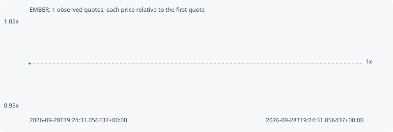

# EMBER

**solana** / `5dvXTZ5qwgafnHtwu3Ls3QrWx1U4LQsFeCuJgkk4QEC6`

[All tokens](README.md) · [Market window](../README.md)

## Native assessments

This contract is in the quote cohort; it has no native model assessment in this window.

## Series 65c5215b693c85440854

Pool: `not supplied`

[Complete series](../series/solana/65c5215b693c85440854.json)

Every dot is a captured quote. Lines connect observations; the curve ends at the last available quote.

Fewer than two quotes: return and drawdown are not calculated.

### Complete quote timeline

| Time (UTC) | Price (USD) | Multiple | Evidence |
| --- | ---: | ---: | --- |
| 2026-09-28T19:24:31.056437+00:00 | 0.00996521 | 1.0000x | `capture:971b5dda-397d-4fe7-b49e-94713bb088df:rank:98` |

### Exit-policy timeline

Calculated from captured quotes under the window policy. Native assessments are linked separately above.

| Time (UTC) | Action | Price (USD) | Evidence |
| --- | --- | ---: | --- |
