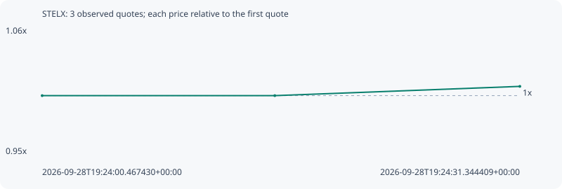

# STELX

**robinhood** / `0x7a8cda6a1cab3e5146cd13cb623a3bb284fb4ad1`

[All tokens](README.md) · [Market window](../README.md)

## Native assessments

This contract is in the quote cohort; it has no native model assessment in this window.

## Series e5cae6c89b8e45ac0ac9

Pool: `not supplied`

[Complete series](../series/robinhood/e5cae6c89b8e45ac0ac9.json)

Every dot is a captured quote. Lines connect observations; the curve ends at the last available quote.

| Peak | Final | Return | Maximum drawdown |
| ---: | ---: | ---: | ---: |
| 1.0079x | 1.0079x | +0.79% | 0.00% |

### Complete quote timeline

| Time (UTC) | Price (USD) | Multiple | Evidence |
| --- | ---: | ---: | --- |
| 2026-09-28T19:24:00.467430+00:00 | 0.000278993 | 1.0000x | `capture:4a231962-827e-445d-ab7d-bb974bfc841b:rank:95` |
| 2026-09-28T19:24:15.505143+00:00 | 0.000278993 | 1.0000x | `capture:b7273a78-8f87-4dcc-877e-f47f549e0fe8:rank:96` |
| 2026-09-28T19:24:31.344409+00:00 | 0.000281205 | 1.0079x | `capture:85f4db1c-c852-45c3-99aa-4320f3839031:rank:99` |

### Exit-policy timeline

Calculated from captured quotes under the window policy. Native assessments are linked separately above.

| Time (UTC) | Action | Price (USD) | Evidence |
| --- | --- | ---: | --- |
| 2026-09-28T19:24:00.467430+00:00 | BUY | 0.000278993 | `capture:4a231962-827e-445d-ab7d-bb974bfc841b:rank:95` |
| 2026-09-28T19:24:15.505143+00:00 | HOLD | 0.000278993 | `capture:b7273a78-8f87-4dcc-877e-f47f549e0fe8:rank:96` |
| 2026-09-28T19:24:31.344409+00:00 | HOLD | 0.000281205 | `capture:85f4db1c-c852-45c3-99aa-4320f3839031:rank:99` |
