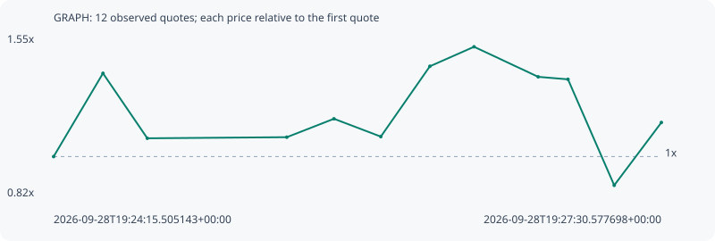

# GRAPH

**robinhood** / `0x48a0f9024cbe319cc51a5263d9edcdfd7228fc2d`

[All tokens](README.md) · [Market window](../README.md)

## Native assessments

This contract is in the quote cohort; it has no native model assessment in this window.

## Series 2b688e1c6656563a0e03

Pool: `not supplied`

[Complete series](../series/robinhood/2b688e1c6656563a0e03.json)

Every dot is a captured quote. Lines connect observations; the curve ends at the last available quote.

| Peak | Final | Return | Maximum drawdown |
| ---: | ---: | ---: | ---: |
| 1.4963x | 1.1541x | +15.41% | 41.85% |

### Complete quote timeline

| Time (UTC) | Price (USD) | Multiple | Evidence |
| --- | ---: | ---: | --- |
| 2026-09-28T19:24:15.505143+00:00 | 1.13538e-05 | 1.0000x | `capture:b7273a78-8f87-4dcc-877e-f47f549e0fe8:rank:18` |
| 2026-09-28T19:24:31.344409+00:00 | 1.56276e-05 | 1.3764x | `capture:85f4db1c-c852-45c3-99aa-4320f3839031:rank:11` |
| 2026-09-28T19:24:45.576445+00:00 | 1.22919e-05 | 1.0826x | `capture:da07dfaa-56d9-4a51-99df-1ad071803eb0:rank:7` |
| 2026-09-28T19:25:30.354898+00:00 | 1.23488e-05 | 1.0876x | `capture:d70b1f6a-3ec3-4ec2-8c88-db476beae4f9:rank:4` |
| 2026-09-28T19:25:45.483791+00:00 | 1.32931e-05 | 1.1708x | `capture:ebb21e05-3dc6-4a8f-a800-fa79ba147200:rank:4` |
| 2026-09-28T19:26:00.522113+00:00 | 1.23775e-05 | 1.0902x | `capture:a33301e4-8f37-4fb5-af69-629635c54fe6:rank:4` |
| 2026-09-28T19:26:16.279485+00:00 | 1.59893e-05 | 1.4083x | `capture:085b2ea9-3985-4608-a1cd-1eddc6b16122:rank:4` |
| 2026-09-28T19:26:30.447392+00:00 | 1.69888e-05 | 1.4963x | `capture:36fd4b46-5420-443d-b1ed-b86b98706671:rank:4` |
| 2026-09-28T19:26:51.039990+00:00 | 1.54464e-05 | 1.3605x | `capture:653b62fa-7a58-45fd-95e9-3b36912dc139:rank:4` |
| 2026-09-28T19:27:00.598930+00:00 | 1.53186e-05 | 1.3492x | `capture:8041f6b0-6188-445c-83ef-3a6fb7daf321:rank:4` |
| 2026-09-28T19:27:15.438746+00:00 | 9.87926e-06 | 0.8701x | `capture:b4c48612-e04d-4782-96a6-e80c2955d3b9:rank:4` |
| 2026-09-28T19:27:30.577698+00:00 | 1.31032e-05 | 1.1541x | `capture:ff6b3949-9c3c-4cdf-b48c-d4010666c140:rank:1` |

### Exit-policy timeline

Calculated from captured quotes under the window policy. Native assessments are linked separately above.

| Time (UTC) | Action | Price (USD) | Evidence |
| --- | --- | ---: | --- |
| 2026-09-28T19:24:15.505143+00:00 | BUY | 1.13538e-05 | `capture:b7273a78-8f87-4dcc-877e-f47f549e0fe8:rank:18` |
| 2026-09-28T19:24:31.344409+00:00 | PROFIT | 1.56276e-05 | `capture:85f4db1c-c852-45c3-99aa-4320f3839031:rank:11` |
| 2026-09-28T19:24:45.576445+00:00 | HOLD_BAG | 1.22919e-05 | `capture:da07dfaa-56d9-4a51-99df-1ad071803eb0:rank:7` |
| 2026-09-28T19:25:30.354898+00:00 | HOLD_BAG | 1.23488e-05 | `capture:d70b1f6a-3ec3-4ec2-8c88-db476beae4f9:rank:4` |
| 2026-09-28T19:25:45.483791+00:00 | HOLD_BAG | 1.32931e-05 | `capture:ebb21e05-3dc6-4a8f-a800-fa79ba147200:rank:4` |
| 2026-09-28T19:26:00.522113+00:00 | HOLD_BAG | 1.23775e-05 | `capture:a33301e4-8f37-4fb5-af69-629635c54fe6:rank:4` |
| 2026-09-28T19:26:16.279485+00:00 | HOLD_BAG | 1.59893e-05 | `capture:085b2ea9-3985-4608-a1cd-1eddc6b16122:rank:4` |
| 2026-09-28T19:26:30.447392+00:00 | HOLD_BAG | 1.69888e-05 | `capture:36fd4b46-5420-443d-b1ed-b86b98706671:rank:4` |
| 2026-09-28T19:26:51.039990+00:00 | HOLD_BAG | 1.54464e-05 | `capture:653b62fa-7a58-45fd-95e9-3b36912dc139:rank:4` |
| 2026-09-28T19:27:00.598930+00:00 | HOLD_BAG | 1.53186e-05 | `capture:8041f6b0-6188-445c-83ef-3a6fb7daf321:rank:4` |
| 2026-09-28T19:27:15.438746+00:00 | SL | 9.87926e-06 | `capture:b4c48612-e04d-4782-96a6-e80c2955d3b9:rank:4` |
