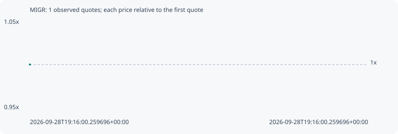

# MIGR

**solana** / `HNazMWySREpLBoyEdsXPPzvvc4eZ6avQDwqBko3vpump`

[All tokens](README.md) · [Market window](../README.md)

## Native assessments

- [2026-09-28T19:16:00.259696Z](../cases/f2427779f3e6714b.md): source parameters and model answers.

## Series bd33a6413cd94deeae17

Pool: `not supplied`

[Complete series](../series/solana/bd33a6413cd94deeae17.json)

Every dot is a captured quote. Lines connect observations; the curve ends at the last available quote.

Fewer than two quotes: return and drawdown are not calculated.

### Complete quote timeline

| Time (UTC) | Price (USD) | Multiple | Evidence |
| --- | ---: | ---: | --- |
| 2026-09-28T19:16:00.259696+00:00 | 2.73988e-05 | 1.0000x | `capture:4236f8d5-90c4-4c9b-a73e-d6443ae3bf32:rank:99` |

### Exit-policy timeline

Calculated from captured quotes under the window policy. Native assessments are linked separately above.

| Time (UTC) | Action | Price (USD) | Evidence |
| --- | --- | ---: | --- |
