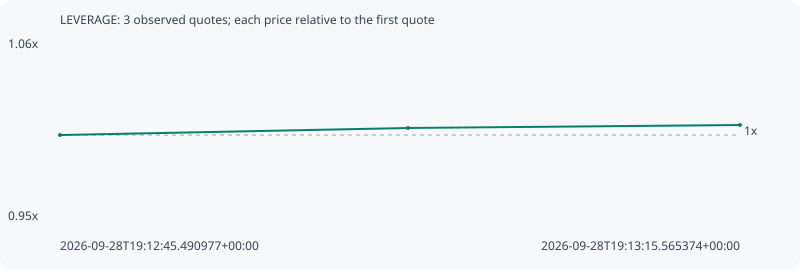

# LEVERAGE

**solana** / `BM2k8mJUbMthHoioykyUm2NjMrXvLBYhoXruwYLpump`

[All tokens](README.md) · [Market window](../README.md)

## Native assessments

This contract is in the quote cohort; it has no native model assessment in this window.

## Series 7a4c4a007db6c76da02e

Pool: `not supplied`

[Complete series](../series/solana/7a4c4a007db6c76da02e.json)

Every dot is a captured quote. Lines connect observations; the curve ends at the last available quote.

| Peak | Final | Return | Maximum drawdown |
| ---: | ---: | ---: | ---: |
| 1.0059x | 1.0059x | +0.59% | 0.00% |

### Complete quote timeline

| Time (UTC) | Price (USD) | Multiple | Evidence |
| --- | ---: | ---: | --- |
| 2026-09-28T19:12:45.490977+00:00 | 0.000103619 | 1.0000x | `capture:ac0279d6-7dd1-44b6-bf3e-910bf7b8eddf:rank:99` |
| 2026-09-28T19:13:00.884337+00:00 | 0.000104048 | 1.0041x | `capture:5867894f-39b4-4bcd-bd87-86394c63aab4:rank:98` |
| 2026-09-28T19:13:15.565374+00:00 | 0.000104231 | 1.0059x | `capture:ca31b3d4-ad60-4333-98b3-6d940a196f86:rank:99` |

### Exit-policy timeline

Calculated from captured quotes under the window policy. Native assessments are linked separately above.

| Time (UTC) | Action | Price (USD) | Evidence |
| --- | --- | ---: | --- |
| 2026-09-28T19:12:45.490977+00:00 | BUY | 0.000103619 | `capture:ac0279d6-7dd1-44b6-bf3e-910bf7b8eddf:rank:99` |
| 2026-09-28T19:13:00.884337+00:00 | HOLD | 0.000104048 | `capture:5867894f-39b4-4bcd-bd87-86394c63aab4:rank:98` |
| 2026-09-28T19:13:15.565374+00:00 | HOLD | 0.000104231 | `capture:ca31b3d4-ad60-4333-98b3-6d940a196f86:rank:99` |
