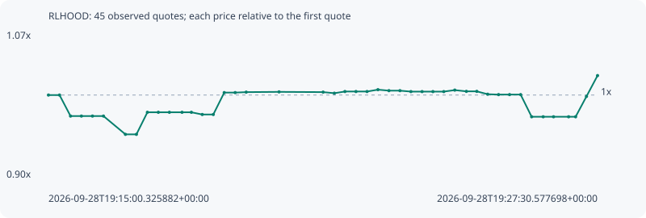

# RLHOOD

**robinhood** / `0x5c4d524ea1531b53a73f3cd0b7f75ae5b26913ba`

[All tokens](README.md) · [Market window](../README.md)

## Native assessments

- [2026-09-28T19:15:00.325882Z](../cases/e2f8d6680c97fd6b.md): source parameters and model answers.

## Series bde4b19cc520d38daa64

Pool: `not supplied`

[Complete series](../series/robinhood/bde4b19cc520d38daa64.json)

Every dot is a captured quote. Lines connect observations; the curve ends at the last available quote.

| Peak | Final | Return | Maximum drawdown |
| ---: | ---: | ---: | ---: |
| 1.0225x | 1.0225x | +2.25% | 4.54% |

### Complete quote timeline

| Time (UTC) | Price (USD) | Multiple | Evidence |
| --- | ---: | ---: | --- |
| 2026-09-28T19:15:00.325882+00:00 | 0.00149485 | 1.0000x | `capture:663c0420-2b9e-4a94-998b-531fa9202dee:rank:95` |
| 2026-09-28T19:15:15.449577+00:00 | 0.00149485 | 1.0000x | `capture:14452070-ab94-45a0-af6d-e6c54082daec:rank:94` |
| 2026-09-28T19:15:30.501058+00:00 | 0.00145854 | 0.9757x | `capture:4e680297-1e75-418b-b818-8b2903e8b923:rank:99` |
| 2026-09-28T19:15:45.353664+00:00 | 0.00145854 | 0.9757x | `capture:b9051b67-24e1-4469-9f82-bc08bd56807d:rank:95` |
| 2026-09-28T19:16:00.473367+00:00 | 0.00145854 | 0.9757x | `capture:cd404827-1073-4901-b09c-82ef1488855b:rank:96` |
| 2026-09-28T19:16:15.518445+00:00 | 0.00145854 | 0.9757x | `capture:c193221c-c80a-4a3b-ad88-59f12dcb1689:rank:99` |
| 2026-09-28T19:16:45.486467+00:00 | 0.001427 | 0.9546x | `capture:4ca26bf7-9d1e-455b-a63e-1b5df831b997:rank:92` |
| 2026-09-28T19:17:00.510014+00:00 | 0.001427 | 0.9546x | `capture:d9309a4d-09d7-45ee-91ce-c4a055e8faac:rank:93` |
| 2026-09-28T19:17:15.523068+00:00 | 0.00146509 | 0.9801x | `capture:333d670d-dbd3-4656-95f9-1bc781b271db:rank:95` |
| 2026-09-28T19:17:30.451540+00:00 | 0.00146509 | 0.9801x | `capture:e161007c-0751-46e4-acc9-c8e28cd7190a:rank:97` |
| 2026-09-28T19:17:45.582227+00:00 | 0.00146509 | 0.9801x | `capture:a3f98285-516a-4bd4-b2c4-63596c968a6b:rank:99` |
| 2026-09-28T19:18:02.849542+00:00 | 0.00146509 | 0.9801x | `capture:53a348cd-74d6-4031-ba2b-02d70c63e42b:rank:94` |
| 2026-09-28T19:18:15.585380+00:00 | 0.00146509 | 0.9801x | `capture:ea19027f-d2c1-43cc-973f-0d8eb46ed64e:rank:97` |
| 2026-09-28T19:18:30.489414+00:00 | 0.00146126 | 0.9775x | `capture:c5cd70df-4ca4-4388-b3c5-f977fa86f8a2:rank:88` |
| 2026-09-28T19:18:45.550203+00:00 | 0.00146126 | 0.9775x | `capture:728d4974-5fe3-40a8-8e99-2139c59da3e3:rank:95` |
| 2026-09-28T19:19:00.487408+00:00 | 0.00149906 | 1.0028x | `capture:297e4fae-3bb5-49eb-b490-a4f34898851c:rank:98` |
| 2026-09-28T19:19:15.451095+00:00 | 0.00149906 | 1.0028x | `capture:0bcc0576-3637-4b2c-b0e4-f9e05871b187:rank:97` |
| 2026-09-28T19:19:30.512866+00:00 | 0.00149988 | 1.0034x | `capture:bb499bdc-159a-4072-a450-312045f32cef:rank:99` |
| 2026-09-28T19:20:15.393373+00:00 | 0.00150032 | 1.0037x | `capture:17802da9-7cee-48c3-9f5b-5829781be3f6:rank:99` |
| 2026-09-28T19:21:15.606838+00:00 | 0.00149991 | 1.0034x | `capture:c2a8ab31-038e-42f4-8e33-852fee1b9a24:rank:99` |
| 2026-09-28T19:21:30.959683+00:00 | 0.00149804 | 1.0021x | `capture:300e0f35-12d4-46a9-a17e-17adbe8e1059:rank:92` |
| 2026-09-28T19:21:45.420062+00:00 | 0.00150092 | 1.0041x | `capture:ec22b61b-732a-44d2-be85-c577051928eb:rank:84` |
| 2026-09-28T19:22:00.489634+00:00 | 0.00150092 | 1.0041x | `capture:d6c64542-18c5-48a0-a6c9-f0e2a9c54b41:rank:96` |
| 2026-09-28T19:22:15.632268+00:00 | 0.00150092 | 1.0041x | `capture:13e6d33e-e854-4b87-b3da-49aedec6950e:rank:94` |
| 2026-09-28T19:22:30.535979+00:00 | 0.00150415 | 1.0062x | `capture:091fb4d2-10fc-4d5f-9c22-af9f55e90e4a:rank:99` |
| 2026-09-28T19:22:45.520851+00:00 | 0.00150243 | 1.0051x | `capture:128617a9-4055-4a8d-8b04-c8876bad9c70:rank:89` |
| 2026-09-28T19:23:00.594785+00:00 | 0.00150243 | 1.0051x | `capture:b6c633f1-3960-4db3-a2ca-34618f913368:rank:94` |
| 2026-09-28T19:23:15.534636+00:00 | 0.0015008 | 1.0040x | `capture:d5a0d1a4-a366-4985-80da-e34160e2f58c:rank:85` |
| 2026-09-28T19:23:30.815940+00:00 | 0.0015008 | 1.0040x | `capture:c6f23ed9-c47c-4f73-bf08-86a494a11aa2:rank:81` |
| 2026-09-28T19:23:45.643860+00:00 | 0.0015008 | 1.0040x | `capture:0b8bbeb9-cbaa-4cb2-a853-2bb146bd23e5:rank:93` |
| 2026-09-28T19:24:00.467430+00:00 | 0.0015008 | 1.0040x | `capture:4a231962-827e-445d-ab7d-bb974bfc841b:rank:86` |
| 2026-09-28T19:24:15.505143+00:00 | 0.00150338 | 1.0057x | `capture:b7273a78-8f87-4dcc-877e-f47f549e0fe8:rank:91` |
| 2026-09-28T19:24:31.344409+00:00 | 0.00150122 | 1.0043x | `capture:85f4db1c-c852-45c3-99aa-4320f3839031:rank:85` |
| 2026-09-28T19:24:45.576445+00:00 | 0.00150122 | 1.0043x | `capture:da07dfaa-56d9-4a51-99df-1ad071803eb0:rank:95` |
| 2026-09-28T19:25:00.412700+00:00 | 0.00149626 | 1.0009x | `capture:1dec2f8f-4694-4c32-8be8-eeec3980c853:rank:87` |
| 2026-09-28T19:25:15.316372+00:00 | 0.00149562 | 1.0005x | `capture:52eaf5a3-351e-4c29-b00b-a167107703e3:rank:91` |
| 2026-09-28T19:25:30.354898+00:00 | 0.00149562 | 1.0005x | `capture:d70b1f6a-3ec3-4ec2-8c88-db476beae4f9:rank:93` |
| 2026-09-28T19:25:45.483791+00:00 | 0.00149562 | 1.0005x | `capture:ebb21e05-3dc6-4a8f-a800-fa79ba147200:rank:93` |
| 2026-09-28T19:26:00.522113+00:00 | 0.00145733 | 0.9749x | `capture:a33301e4-8f37-4fb5-af69-629635c54fe6:rank:83` |
| 2026-09-28T19:26:16.279485+00:00 | 0.00145733 | 0.9749x | `capture:085b2ea9-3985-4608-a1cd-1eddc6b16122:rank:85` |
| 2026-09-28T19:26:30.447392+00:00 | 0.00145733 | 0.9749x | `capture:36fd4b46-5420-443d-b1ed-b86b98706671:rank:88` |
| 2026-09-28T19:26:51.039990+00:00 | 0.00145733 | 0.9749x | `capture:653b62fa-7a58-45fd-95e9-3b36912dc139:rank:97` |
| 2026-09-28T19:27:00.598930+00:00 | 0.00145733 | 0.9749x | `capture:8041f6b0-6188-445c-83ef-3a6fb7daf321:rank:98` |
| 2026-09-28T19:27:15.438746+00:00 | 0.0014925 | 0.9984x | `capture:b4c48612-e04d-4782-96a6-e80c2955d3b9:rank:92` |
| 2026-09-28T19:27:30.577698+00:00 | 0.00152845 | 1.0225x | `capture:ff6b3949-9c3c-4cdf-b48c-d4010666c140:rank:80` |

### Exit-policy timeline

Calculated from captured quotes under the window policy. Native assessments are linked separately above.

| Time (UTC) | Action | Price (USD) | Evidence |
| --- | --- | ---: | --- |
| 2026-09-28T19:15:00.325882+00:00 | BUY | 0.00149485 | `capture:663c0420-2b9e-4a94-998b-531fa9202dee:rank:95` |
| 2026-09-28T19:15:15.449577+00:00 | HOLD | 0.00149485 | `capture:14452070-ab94-45a0-af6d-e6c54082daec:rank:94` |
| 2026-09-28T19:15:30.501058+00:00 | HOLD | 0.00145854 | `capture:4e680297-1e75-418b-b818-8b2903e8b923:rank:99` |
| 2026-09-28T19:15:45.353664+00:00 | HOLD | 0.00145854 | `capture:b9051b67-24e1-4469-9f82-bc08bd56807d:rank:95` |
| 2026-09-28T19:16:00.473367+00:00 | HOLD | 0.00145854 | `capture:cd404827-1073-4901-b09c-82ef1488855b:rank:96` |
| 2026-09-28T19:16:15.518445+00:00 | HOLD | 0.00145854 | `capture:c193221c-c80a-4a3b-ad88-59f12dcb1689:rank:99` |
| 2026-09-28T19:16:45.486467+00:00 | HOLD | 0.001427 | `capture:4ca26bf7-9d1e-455b-a63e-1b5df831b997:rank:92` |
| 2026-09-28T19:17:00.510014+00:00 | HOLD | 0.001427 | `capture:d9309a4d-09d7-45ee-91ce-c4a055e8faac:rank:93` |
| 2026-09-28T19:17:15.523068+00:00 | HOLD | 0.00146509 | `capture:333d670d-dbd3-4656-95f9-1bc781b271db:rank:95` |
| 2026-09-28T19:17:30.451540+00:00 | HOLD | 0.00146509 | `capture:e161007c-0751-46e4-acc9-c8e28cd7190a:rank:97` |
| 2026-09-28T19:17:45.582227+00:00 | HOLD | 0.00146509 | `capture:a3f98285-516a-4bd4-b2c4-63596c968a6b:rank:99` |
| 2026-09-28T19:18:02.849542+00:00 | HOLD | 0.00146509 | `capture:53a348cd-74d6-4031-ba2b-02d70c63e42b:rank:94` |
| 2026-09-28T19:18:15.585380+00:00 | HOLD | 0.00146509 | `capture:ea19027f-d2c1-43cc-973f-0d8eb46ed64e:rank:97` |
| 2026-09-28T19:18:30.489414+00:00 | HOLD | 0.00146126 | `capture:c5cd70df-4ca4-4388-b3c5-f977fa86f8a2:rank:88` |
| 2026-09-28T19:18:45.550203+00:00 | HOLD | 0.00146126 | `capture:728d4974-5fe3-40a8-8e99-2139c59da3e3:rank:95` |
| 2026-09-28T19:19:00.487408+00:00 | HOLD | 0.00149906 | `capture:297e4fae-3bb5-49eb-b490-a4f34898851c:rank:98` |
| 2026-09-28T19:19:15.451095+00:00 | HOLD | 0.00149906 | `capture:0bcc0576-3637-4b2c-b0e4-f9e05871b187:rank:97` |
| 2026-09-28T19:19:30.512866+00:00 | HOLD | 0.00149988 | `capture:bb499bdc-159a-4072-a450-312045f32cef:rank:99` |
| 2026-09-28T19:20:15.393373+00:00 | HOLD | 0.00150032 | `capture:17802da9-7cee-48c3-9f5b-5829781be3f6:rank:99` |
| 2026-09-28T19:21:15.606838+00:00 | HOLD | 0.00149991 | `capture:c2a8ab31-038e-42f4-8e33-852fee1b9a24:rank:99` |
| 2026-09-28T19:21:30.959683+00:00 | HOLD | 0.00149804 | `capture:300e0f35-12d4-46a9-a17e-17adbe8e1059:rank:92` |
| 2026-09-28T19:21:45.420062+00:00 | HOLD | 0.00150092 | `capture:ec22b61b-732a-44d2-be85-c577051928eb:rank:84` |
| 2026-09-28T19:22:00.489634+00:00 | HOLD | 0.00150092 | `capture:d6c64542-18c5-48a0-a6c9-f0e2a9c54b41:rank:96` |
| 2026-09-28T19:22:15.632268+00:00 | HOLD | 0.00150092 | `capture:13e6d33e-e854-4b87-b3da-49aedec6950e:rank:94` |
| 2026-09-28T19:22:30.535979+00:00 | HOLD | 0.00150415 | `capture:091fb4d2-10fc-4d5f-9c22-af9f55e90e4a:rank:99` |
| 2026-09-28T19:22:45.520851+00:00 | HOLD | 0.00150243 | `capture:128617a9-4055-4a8d-8b04-c8876bad9c70:rank:89` |
| 2026-09-28T19:23:00.594785+00:00 | HOLD | 0.00150243 | `capture:b6c633f1-3960-4db3-a2ca-34618f913368:rank:94` |
| 2026-09-28T19:23:15.534636+00:00 | HOLD | 0.0015008 | `capture:d5a0d1a4-a366-4985-80da-e34160e2f58c:rank:85` |
| 2026-09-28T19:23:30.815940+00:00 | HOLD | 0.0015008 | `capture:c6f23ed9-c47c-4f73-bf08-86a494a11aa2:rank:81` |
| 2026-09-28T19:23:45.643860+00:00 | HOLD | 0.0015008 | `capture:0b8bbeb9-cbaa-4cb2-a853-2bb146bd23e5:rank:93` |
| 2026-09-28T19:24:00.467430+00:00 | HOLD | 0.0015008 | `capture:4a231962-827e-445d-ab7d-bb974bfc841b:rank:86` |
| 2026-09-28T19:24:15.505143+00:00 | HOLD | 0.00150338 | `capture:b7273a78-8f87-4dcc-877e-f47f549e0fe8:rank:91` |
| 2026-09-28T19:24:31.344409+00:00 | HOLD | 0.00150122 | `capture:85f4db1c-c852-45c3-99aa-4320f3839031:rank:85` |
| 2026-09-28T19:24:45.576445+00:00 | HOLD | 0.00150122 | `capture:da07dfaa-56d9-4a51-99df-1ad071803eb0:rank:95` |
| 2026-09-28T19:25:00.412700+00:00 | HOLD | 0.00149626 | `capture:1dec2f8f-4694-4c32-8be8-eeec3980c853:rank:87` |
| 2026-09-28T19:25:15.316372+00:00 | HOLD | 0.00149562 | `capture:52eaf5a3-351e-4c29-b00b-a167107703e3:rank:91` |
| 2026-09-28T19:25:30.354898+00:00 | HOLD | 0.00149562 | `capture:d70b1f6a-3ec3-4ec2-8c88-db476beae4f9:rank:93` |
| 2026-09-28T19:25:45.483791+00:00 | HOLD | 0.00149562 | `capture:ebb21e05-3dc6-4a8f-a800-fa79ba147200:rank:93` |
| 2026-09-28T19:26:00.522113+00:00 | HOLD | 0.00145733 | `capture:a33301e4-8f37-4fb5-af69-629635c54fe6:rank:83` |
| 2026-09-28T19:26:16.279485+00:00 | HOLD | 0.00145733 | `capture:085b2ea9-3985-4608-a1cd-1eddc6b16122:rank:85` |
| 2026-09-28T19:26:30.447392+00:00 | HOLD | 0.00145733 | `capture:36fd4b46-5420-443d-b1ed-b86b98706671:rank:88` |
| 2026-09-28T19:26:51.039990+00:00 | HOLD | 0.00145733 | `capture:653b62fa-7a58-45fd-95e9-3b36912dc139:rank:97` |
| 2026-09-28T19:27:00.598930+00:00 | HOLD | 0.00145733 | `capture:8041f6b0-6188-445c-83ef-3a6fb7daf321:rank:98` |
| 2026-09-28T19:27:15.438746+00:00 | HOLD | 0.0014925 | `capture:b4c48612-e04d-4782-96a6-e80c2955d3b9:rank:92` |
| 2026-09-28T19:27:30.577698+00:00 | HOLD | 0.00152845 | `capture:ff6b3949-9c3c-4cdf-b48c-d4010666c140:rank:80` |
