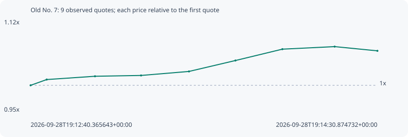

# Old No. 7

**solana** / `gCsv2hac3zRiyFZZnh8WX7zTT7Fw31x6ggFDMUrpump`

[All tokens](README.md) · [Market window](../README.md)

## Native assessments

This contract is in the quote cohort; it has no native model assessment in this window.

## Series 0545e69d67ed6fdd9fee

Pool: `not supplied`

[Complete series](../series/solana/0545e69d67ed6fdd9fee.json)

Every dot is a captured quote. Lines connect observations; the curve ends at the last available quote.

| Peak | Final | Return | Maximum drawdown |
| ---: | ---: | ---: | ---: |
| 1.0735x | 1.0655x | +6.55% | 0.75% |

### Complete quote timeline

| Time (UTC) | Price (USD) | Multiple | Evidence |
| --- | ---: | ---: | --- |
| 2026-09-28T19:12:40.365643+00:00 | 0.000185826 | 1.0000x | `capture:3af1faa1-2074-484e-893e-ed2c676e1576:rank:0` |
| 2026-09-28T19:12:45.490977+00:00 | 0.00018786 | 1.0109x | `capture:ac0279d6-7dd1-44b6-bf3e-910bf7b8eddf:rank:0` |
| 2026-09-28T19:13:00.884337+00:00 | 0.000189022 | 1.0172x | `capture:5867894f-39b4-4bcd-bd87-86394c63aab4:rank:0` |
| 2026-09-28T19:13:15.565374+00:00 | 0.000189308 | 1.0187x | `capture:ca31b3d4-ad60-4333-98b3-6d940a196f86:rank:0` |
| 2026-09-28T19:13:30.833894+00:00 | 0.000190727 | 1.0264x | `capture:2beb38a4-bfac-4502-bbc3-8c8c0f943007:rank:0` |
| 2026-09-28T19:13:45.640151+00:00 | 0.000194583 | 1.0471x | `capture:4d31b656-3ffe-4768-bef6-377adf019420:rank:0` |
| 2026-09-28T19:14:00.595194+00:00 | 0.00019859 | 1.0687x | `capture:2c78112b-48e7-4f74-8c2e-1cb8642a79dc:rank:0` |
| 2026-09-28T19:14:17.246316+00:00 | 0.000199489 | 1.0735x | `capture:7a923cde-d765-4388-a15c-4f47fde0a3b5:rank:0` |
| 2026-09-28T19:14:30.874732+00:00 | 0.000197998 | 1.0655x | `capture:fa585070-b1ae-4f9d-afbd-aa986f487793:rank:0` |

### Exit-policy timeline

Calculated from captured quotes under the window policy. Native assessments are linked separately above.

| Time (UTC) | Action | Price (USD) | Evidence |
| --- | --- | ---: | --- |
| 2026-09-28T19:12:40.365643+00:00 | BUY | 0.000185826 | `capture:3af1faa1-2074-484e-893e-ed2c676e1576:rank:0` |
| 2026-09-28T19:12:45.490977+00:00 | HOLD | 0.00018786 | `capture:ac0279d6-7dd1-44b6-bf3e-910bf7b8eddf:rank:0` |
| 2026-09-28T19:13:00.884337+00:00 | HOLD | 0.000189022 | `capture:5867894f-39b4-4bcd-bd87-86394c63aab4:rank:0` |
| 2026-09-28T19:13:15.565374+00:00 | HOLD | 0.000189308 | `capture:ca31b3d4-ad60-4333-98b3-6d940a196f86:rank:0` |
| 2026-09-28T19:13:30.833894+00:00 | HOLD | 0.000190727 | `capture:2beb38a4-bfac-4502-bbc3-8c8c0f943007:rank:0` |
| 2026-09-28T19:13:45.640151+00:00 | HOLD | 0.000194583 | `capture:4d31b656-3ffe-4768-bef6-377adf019420:rank:0` |
| 2026-09-28T19:14:00.595194+00:00 | HOLD | 0.00019859 | `capture:2c78112b-48e7-4f74-8c2e-1cb8642a79dc:rank:0` |
| 2026-09-28T19:14:17.246316+00:00 | HOLD | 0.000199489 | `capture:7a923cde-d765-4388-a15c-4f47fde0a3b5:rank:0` |
| 2026-09-28T19:14:30.874732+00:00 | HOLD | 0.000197998 | `capture:fa585070-b1ae-4f9d-afbd-aa986f487793:rank:0` |
