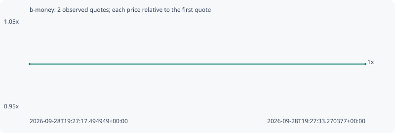

# b-money

**bsc** / `0xf49725118cb0707b8706ffffe895f3ab16da7777`

[All tokens](README.md) · [Market window](../README.md)

## Native assessments

This contract is in the quote cohort; it has no native model assessment in this window.

## Series 3403dd3e7e6df2cd3e8d

Pool: `not supplied`

[Complete series](../series/bsc/3403dd3e7e6df2cd3e8d.json)

Every dot is a captured quote. Lines connect observations; the curve ends at the last available quote.

| Peak | Final | Return | Maximum drawdown |
| ---: | ---: | ---: | ---: |
| 1.0000x | 1.0000x | +0.00% | 0.00% |

### Complete quote timeline

| Time (UTC) | Price (USD) | Multiple | Evidence |
| --- | ---: | ---: | --- |
| 2026-09-28T19:27:17.494949+00:00 | 0.00209208 | 1.0000x | `capture:c5d9da1a-7d95-4d7f-8cef-ffb660ac56d0:rank:94` |
| 2026-09-28T19:27:33.270377+00:00 | 0.00209208 | 1.0000x | `capture:1cb6d037-a95b-477e-be82-4cc75b729c8b:rank:95` |

### Exit-policy timeline

Calculated from captured quotes under the window policy. Native assessments are linked separately above.

| Time (UTC) | Action | Price (USD) | Evidence |
| --- | --- | ---: | --- |
| 2026-09-28T19:27:17.494949+00:00 | BUY | 0.00209208 | `capture:c5d9da1a-7d95-4d7f-8cef-ffb660ac56d0:rank:94` |
| 2026-09-28T19:27:33.270377+00:00 | HOLD | 0.00209208 | `capture:1cb6d037-a95b-477e-be82-4cc75b729c8b:rank:95` |
