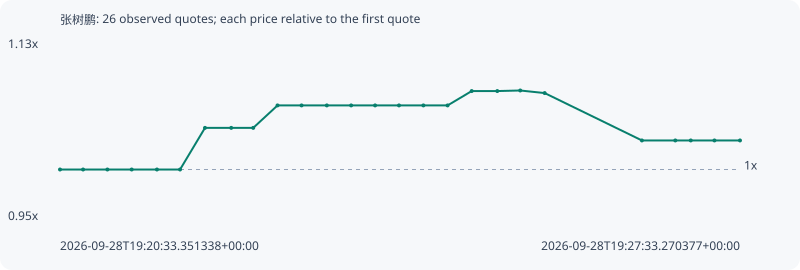

# 张树鹏

**bsc** / `0xad40d1de038a8214b8c77d3c821e7bb159107777`

[All tokens](README.md) · [Market window](../README.md)

## Native assessments

This contract is in the quote cohort; it has no native model assessment in this window.

## Series fa94e9d20dd62fed937b

Pool: `not supplied`

[Complete series](../series/bsc/fa94e9d20dd62fed937b.json)

Every dot is a captured quote. Lines connect observations; the curve ends at the last available quote.

| Peak | Final | Return | Maximum drawdown |
| ---: | ---: | ---: | ---: |
| 1.0783x | 1.0288x | +2.88% | 4.59% |

### Complete quote timeline

| Time (UTC) | Price (USD) | Multiple | Evidence |
| --- | ---: | ---: | --- |
| 2026-09-28T19:20:33.351338+00:00 | 8.25373e-06 | 1.0000x | `capture:5752259a-2bcb-4e27-ac90-6ef5a52d1cf7:rank:80` |
| 2026-09-28T19:20:47.599416+00:00 | 8.25373e-06 | 1.0000x | `capture:1ab71e23-e150-479b-a1fa-e2a362332d1e:rank:80` |
| 2026-09-28T19:21:02.616817+00:00 | 8.25373e-06 | 1.0000x | `capture:ec0d171f-d990-484a-94d1-c335d7f6e8fb:rank:81` |
| 2026-09-28T19:21:17.612081+00:00 | 8.25373e-06 | 1.0000x | `capture:cc46cbda-0be4-42ba-bcf4-4a03c9e7e894:rank:81` |
| 2026-09-28T19:21:33.217678+00:00 | 8.25373e-06 | 1.0000x | `capture:3a34cabb-e5ee-4ff6-9f92-f0839c39884f:rank:80` |
| 2026-09-28T19:21:47.485842+00:00 | 8.25373e-06 | 1.0000x | `capture:9e0730ff-182b-409c-b854-c06b993be570:rank:81` |
| 2026-09-28T19:22:02.883000+00:00 | 8.59409e-06 | 1.0412x | `capture:eb8228cb-dfba-443e-9576-ee214dcd3354:rank:69` |
| 2026-09-28T19:22:19.090071+00:00 | 8.59409e-06 | 1.0412x | `capture:30ef0b61-e0e1-4eba-95c6-de3dc48fe868:rank:70` |
| 2026-09-28T19:22:32.671189+00:00 | 8.59409e-06 | 1.0412x | `capture:5d031323-644d-4272-bacc-8a363d4b77cb:rank:73` |
| 2026-09-28T19:22:47.674643+00:00 | 8.7776e-06 | 1.0635x | `capture:c8838291-6f5a-42d9-9013-9d9421deb79e:rank:63` |
| 2026-09-28T19:23:02.516005+00:00 | 8.7776e-06 | 1.0635x | `capture:f8b60e63-80ce-442a-9ca7-659f2b5ca21d:rank:64` |
| 2026-09-28T19:23:18.123882+00:00 | 8.7776e-06 | 1.0635x | `capture:f689df34-2acf-42e7-a37b-1a7d50808302:rank:66` |
| 2026-09-28T19:23:33.140484+00:00 | 8.7776e-06 | 1.0635x | `capture:ef2304f7-c374-4b90-a3e4-d8976f05c226:rank:71` |
| 2026-09-28T19:23:47.927661+00:00 | 8.7776e-06 | 1.0635x | `capture:51aa913c-158f-4059-8727-ff1ace24834c:rank:72` |
| 2026-09-28T19:24:02.684719+00:00 | 8.7776e-06 | 1.0635x | `capture:77fa5264-b080-4409-8d15-3f5504293a7d:rank:73` |
| 2026-09-28T19:24:17.754261+00:00 | 8.7776e-06 | 1.0635x | `capture:9e642626-a894-4304-aad8-bfad3e85b1e6:rank:71` |
| 2026-09-28T19:24:32.694463+00:00 | 8.7776e-06 | 1.0635x | `capture:2934d705-4adf-40dc-b5ef-2f9f3edbbe61:rank:73` |
| 2026-09-28T19:24:47.591753+00:00 | 8.89495e-06 | 1.0777x | `capture:1cb45dcb-fe83-4fcc-8cfd-c5de8d369858:rank:87` |
| 2026-09-28T19:25:03.394485+00:00 | 8.89495e-06 | 1.0777x | `capture:f1b0620f-7caf-483d-8db4-440b4d786962:rank:85` |
| 2026-09-28T19:25:17.566680+00:00 | 8.89963e-06 | 1.0783x | `capture:89c3d45d-a145-4312-88dc-a4340e727616:rank:76` |
| 2026-09-28T19:25:32.640282+00:00 | 8.87856e-06 | 1.0757x | `capture:a41f01eb-b1b7-4ed5-a604-19b71e522502:rank:76` |
| 2026-09-28T19:26:32.687411+00:00 | 8.49122e-06 | 1.0288x | `capture:d1fef60a-e7ad-4594-a8e8-74ee96c47ae4:rank:60` |
| 2026-09-28T19:26:53.320509+00:00 | 8.49122e-06 | 1.0288x | `capture:5f09420c-1544-46ff-a2e4-39235f8f73a9:rank:59` |
| 2026-09-28T19:27:02.865937+00:00 | 8.49122e-06 | 1.0288x | `capture:bd21661a-974d-4bab-9276-4e2f7e7d279a:rank:63` |
| 2026-09-28T19:27:17.494949+00:00 | 8.49122e-06 | 1.0288x | `capture:c5d9da1a-7d95-4d7f-8cef-ffb660ac56d0:rank:65` |
| 2026-09-28T19:27:33.270377+00:00 | 8.49122e-06 | 1.0288x | `capture:1cb6d037-a95b-477e-be82-4cc75b729c8b:rank:68` |

### Exit-policy timeline

Calculated from captured quotes under the window policy. Native assessments are linked separately above.

| Time (UTC) | Action | Price (USD) | Evidence |
| --- | --- | ---: | --- |
| 2026-09-28T19:20:33.351338+00:00 | BUY | 8.25373e-06 | `capture:5752259a-2bcb-4e27-ac90-6ef5a52d1cf7:rank:80` |
| 2026-09-28T19:20:47.599416+00:00 | HOLD | 8.25373e-06 | `capture:1ab71e23-e150-479b-a1fa-e2a362332d1e:rank:80` |
| 2026-09-28T19:21:02.616817+00:00 | HOLD | 8.25373e-06 | `capture:ec0d171f-d990-484a-94d1-c335d7f6e8fb:rank:81` |
| 2026-09-28T19:21:17.612081+00:00 | HOLD | 8.25373e-06 | `capture:cc46cbda-0be4-42ba-bcf4-4a03c9e7e894:rank:81` |
| 2026-09-28T19:21:33.217678+00:00 | HOLD | 8.25373e-06 | `capture:3a34cabb-e5ee-4ff6-9f92-f0839c39884f:rank:80` |
| 2026-09-28T19:21:47.485842+00:00 | HOLD | 8.25373e-06 | `capture:9e0730ff-182b-409c-b854-c06b993be570:rank:81` |
| 2026-09-28T19:22:02.883000+00:00 | HOLD | 8.59409e-06 | `capture:eb8228cb-dfba-443e-9576-ee214dcd3354:rank:69` |
| 2026-09-28T19:22:19.090071+00:00 | HOLD | 8.59409e-06 | `capture:30ef0b61-e0e1-4eba-95c6-de3dc48fe868:rank:70` |
| 2026-09-28T19:22:32.671189+00:00 | HOLD | 8.59409e-06 | `capture:5d031323-644d-4272-bacc-8a363d4b77cb:rank:73` |
| 2026-09-28T19:22:47.674643+00:00 | HOLD | 8.7776e-06 | `capture:c8838291-6f5a-42d9-9013-9d9421deb79e:rank:63` |
| 2026-09-28T19:23:02.516005+00:00 | HOLD | 8.7776e-06 | `capture:f8b60e63-80ce-442a-9ca7-659f2b5ca21d:rank:64` |
| 2026-09-28T19:23:18.123882+00:00 | HOLD | 8.7776e-06 | `capture:f689df34-2acf-42e7-a37b-1a7d50808302:rank:66` |
| 2026-09-28T19:23:33.140484+00:00 | HOLD | 8.7776e-06 | `capture:ef2304f7-c374-4b90-a3e4-d8976f05c226:rank:71` |
| 2026-09-28T19:23:47.927661+00:00 | HOLD | 8.7776e-06 | `capture:51aa913c-158f-4059-8727-ff1ace24834c:rank:72` |
| 2026-09-28T19:24:02.684719+00:00 | HOLD | 8.7776e-06 | `capture:77fa5264-b080-4409-8d15-3f5504293a7d:rank:73` |
| 2026-09-28T19:24:17.754261+00:00 | HOLD | 8.7776e-06 | `capture:9e642626-a894-4304-aad8-bfad3e85b1e6:rank:71` |
| 2026-09-28T19:24:32.694463+00:00 | HOLD | 8.7776e-06 | `capture:2934d705-4adf-40dc-b5ef-2f9f3edbbe61:rank:73` |
| 2026-09-28T19:24:47.591753+00:00 | HOLD | 8.89495e-06 | `capture:1cb45dcb-fe83-4fcc-8cfd-c5de8d369858:rank:87` |
| 2026-09-28T19:25:03.394485+00:00 | HOLD | 8.89495e-06 | `capture:f1b0620f-7caf-483d-8db4-440b4d786962:rank:85` |
| 2026-09-28T19:25:17.566680+00:00 | HOLD | 8.89963e-06 | `capture:89c3d45d-a145-4312-88dc-a4340e727616:rank:76` |
| 2026-09-28T19:25:32.640282+00:00 | HOLD | 8.87856e-06 | `capture:a41f01eb-b1b7-4ed5-a604-19b71e522502:rank:76` |
| 2026-09-28T19:26:32.687411+00:00 | HOLD | 8.49122e-06 | `capture:d1fef60a-e7ad-4594-a8e8-74ee96c47ae4:rank:60` |
| 2026-09-28T19:26:53.320509+00:00 | HOLD | 8.49122e-06 | `capture:5f09420c-1544-46ff-a2e4-39235f8f73a9:rank:59` |
| 2026-09-28T19:27:02.865937+00:00 | HOLD | 8.49122e-06 | `capture:bd21661a-974d-4bab-9276-4e2f7e7d279a:rank:63` |
| 2026-09-28T19:27:17.494949+00:00 | HOLD | 8.49122e-06 | `capture:c5d9da1a-7d95-4d7f-8cef-ffb660ac56d0:rank:65` |
| 2026-09-28T19:27:33.270377+00:00 | HOLD | 8.49122e-06 | `capture:1cb6d037-a95b-477e-be82-4cc75b729c8b:rank:68` |
