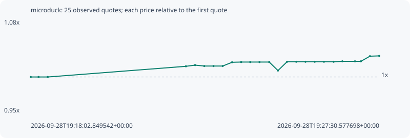

# microduck

**robinhood** / `0xd5f1afea47b1a9eab414d2ee740cf1d6d039e725`

[All tokens](README.md) · [Market window](../README.md)

## Native assessments

This contract is in the quote cohort; it has no native model assessment in this window.

## Series ae28972412f4bf1c2761

Pool: `not supplied`

[Complete series](../series/robinhood/ae28972412f4bf1c2761.json)

Every dot is a captured quote. Lines connect observations; the curve ends at the last available quote.

| Peak | Final | Return | Maximum drawdown |
| ---: | ---: | ---: | ---: |
| 1.0297x | 1.0297x | +2.97% | 1.18% |

### Complete quote timeline

| Time (UTC) | Price (USD) | Multiple | Evidence |
| --- | ---: | ---: | --- |
| 2026-09-28T19:18:02.849542+00:00 | 0.0037954 | 1.0000x | `capture:53a348cd-74d6-4031-ba2b-02d70c63e42b:rank:89` |
| 2026-09-28T19:18:15.585380+00:00 | 0.0037954 | 1.0000x | `capture:ea19027f-d2c1-43cc-973f-0d8eb46ed64e:rank:93` |
| 2026-09-28T19:18:30.489414+00:00 | 0.0037954 | 1.0000x | `capture:c5cd70df-4ca4-4388-b3c5-f977fa86f8a2:rank:95` |
| 2026-09-28T19:22:15.632268+00:00 | 0.00385255 | 1.0151x | `capture:13e6d33e-e854-4b87-b3da-49aedec6950e:rank:50` |
| 2026-09-28T19:22:30.535979+00:00 | 0.00385891 | 1.0167x | `capture:091fb4d2-10fc-4d5f-9c22-af9f55e90e4a:rank:47` |
| 2026-09-28T19:22:45.520851+00:00 | 0.003854 | 1.0154x | `capture:128617a9-4055-4a8d-8b04-c8876bad9c70:rank:43` |
| 2026-09-28T19:23:00.594785+00:00 | 0.003854 | 1.0154x | `capture:b6c633f1-3960-4db3-a2ca-34618f913368:rank:43` |
| 2026-09-28T19:23:15.534636+00:00 | 0.003854 | 1.0154x | `capture:d5a0d1a4-a366-4985-80da-e34160e2f58c:rank:43` |
| 2026-09-28T19:23:30.815940+00:00 | 0.00387412 | 1.0207x | `capture:c6f23ed9-c47c-4f73-bf08-86a494a11aa2:rank:35` |
| 2026-09-28T19:23:45.643860+00:00 | 0.00387539 | 1.0211x | `capture:0b8bbeb9-cbaa-4cb2-a853-2bb146bd23e5:rank:29` |
| 2026-09-28T19:24:00.467430+00:00 | 0.00387539 | 1.0211x | `capture:4a231962-827e-445d-ab7d-bb974bfc841b:rank:29` |
| 2026-09-28T19:24:15.505143+00:00 | 0.00387539 | 1.0211x | `capture:b7273a78-8f87-4dcc-877e-f47f549e0fe8:rank:28` |
| 2026-09-28T19:24:31.344409+00:00 | 0.00387539 | 1.0211x | `capture:85f4db1c-c852-45c3-99aa-4320f3839031:rank:26` |
| 2026-09-28T19:24:45.576445+00:00 | 0.00382985 | 1.0091x | `capture:da07dfaa-56d9-4a51-99df-1ad071803eb0:rank:26` |
| 2026-09-28T19:25:00.412700+00:00 | 0.00387693 | 1.0215x | `capture:1dec2f8f-4694-4c32-8be8-eeec3980c853:rank:24` |
| 2026-09-28T19:25:15.316372+00:00 | 0.00387693 | 1.0215x | `capture:52eaf5a3-351e-4c29-b00b-a167107703e3:rank:24` |
| 2026-09-28T19:25:30.354898+00:00 | 0.00387693 | 1.0215x | `capture:d70b1f6a-3ec3-4ec2-8c88-db476beae4f9:rank:23` |
| 2026-09-28T19:25:45.483791+00:00 | 0.00387693 | 1.0215x | `capture:ebb21e05-3dc6-4a8f-a800-fa79ba147200:rank:24` |
| 2026-09-28T19:26:00.522113+00:00 | 0.00387693 | 1.0215x | `capture:a33301e4-8f37-4fb5-af69-629635c54fe6:rank:22` |
| 2026-09-28T19:26:16.279485+00:00 | 0.00387693 | 1.0215x | `capture:085b2ea9-3985-4608-a1cd-1eddc6b16122:rank:22` |
| 2026-09-28T19:26:30.447392+00:00 | 0.0038792 | 1.0221x | `capture:36fd4b46-5420-443d-b1ed-b86b98706671:rank:22` |
| 2026-09-28T19:26:51.039990+00:00 | 0.0038792 | 1.0221x | `capture:653b62fa-7a58-45fd-95e9-3b36912dc139:rank:20` |
| 2026-09-28T19:27:00.598930+00:00 | 0.0038792 | 1.0221x | `capture:8041f6b0-6188-445c-83ef-3a6fb7daf321:rank:20` |
| 2026-09-28T19:27:15.438746+00:00 | 0.00390664 | 1.0293x | `capture:b4c48612-e04d-4782-96a6-e80c2955d3b9:rank:15` |
| 2026-09-28T19:27:30.577698+00:00 | 0.00390826 | 1.0297x | `capture:ff6b3949-9c3c-4cdf-b48c-d4010666c140:rank:22` |

### Exit-policy timeline

Calculated from captured quotes under the window policy. Native assessments are linked separately above.

| Time (UTC) | Action | Price (USD) | Evidence |
| --- | --- | ---: | --- |
| 2026-09-28T19:18:02.849542+00:00 | BUY | 0.0037954 | `capture:53a348cd-74d6-4031-ba2b-02d70c63e42b:rank:89` |
| 2026-09-28T19:18:15.585380+00:00 | HOLD | 0.0037954 | `capture:ea19027f-d2c1-43cc-973f-0d8eb46ed64e:rank:93` |
| 2026-09-28T19:18:30.489414+00:00 | HOLD | 0.0037954 | `capture:c5cd70df-4ca4-4388-b3c5-f977fa86f8a2:rank:95` |
| 2026-09-28T19:22:15.632268+00:00 | HOLD | 0.00385255 | `capture:13e6d33e-e854-4b87-b3da-49aedec6950e:rank:50` |
| 2026-09-28T19:22:30.535979+00:00 | HOLD | 0.00385891 | `capture:091fb4d2-10fc-4d5f-9c22-af9f55e90e4a:rank:47` |
| 2026-09-28T19:22:45.520851+00:00 | HOLD | 0.003854 | `capture:128617a9-4055-4a8d-8b04-c8876bad9c70:rank:43` |
| 2026-09-28T19:23:00.594785+00:00 | HOLD | 0.003854 | `capture:b6c633f1-3960-4db3-a2ca-34618f913368:rank:43` |
| 2026-09-28T19:23:15.534636+00:00 | HOLD | 0.003854 | `capture:d5a0d1a4-a366-4985-80da-e34160e2f58c:rank:43` |
| 2026-09-28T19:23:30.815940+00:00 | HOLD | 0.00387412 | `capture:c6f23ed9-c47c-4f73-bf08-86a494a11aa2:rank:35` |
| 2026-09-28T19:23:45.643860+00:00 | HOLD | 0.00387539 | `capture:0b8bbeb9-cbaa-4cb2-a853-2bb146bd23e5:rank:29` |
| 2026-09-28T19:24:00.467430+00:00 | HOLD | 0.00387539 | `capture:4a231962-827e-445d-ab7d-bb974bfc841b:rank:29` |
| 2026-09-28T19:24:15.505143+00:00 | HOLD | 0.00387539 | `capture:b7273a78-8f87-4dcc-877e-f47f549e0fe8:rank:28` |
| 2026-09-28T19:24:31.344409+00:00 | HOLD | 0.00387539 | `capture:85f4db1c-c852-45c3-99aa-4320f3839031:rank:26` |
| 2026-09-28T19:24:45.576445+00:00 | HOLD | 0.00382985 | `capture:da07dfaa-56d9-4a51-99df-1ad071803eb0:rank:26` |
| 2026-09-28T19:25:00.412700+00:00 | HOLD | 0.00387693 | `capture:1dec2f8f-4694-4c32-8be8-eeec3980c853:rank:24` |
| 2026-09-28T19:25:15.316372+00:00 | HOLD | 0.00387693 | `capture:52eaf5a3-351e-4c29-b00b-a167107703e3:rank:24` |
| 2026-09-28T19:25:30.354898+00:00 | HOLD | 0.00387693 | `capture:d70b1f6a-3ec3-4ec2-8c88-db476beae4f9:rank:23` |
| 2026-09-28T19:25:45.483791+00:00 | HOLD | 0.00387693 | `capture:ebb21e05-3dc6-4a8f-a800-fa79ba147200:rank:24` |
| 2026-09-28T19:26:00.522113+00:00 | HOLD | 0.00387693 | `capture:a33301e4-8f37-4fb5-af69-629635c54fe6:rank:22` |
| 2026-09-28T19:26:16.279485+00:00 | HOLD | 0.00387693 | `capture:085b2ea9-3985-4608-a1cd-1eddc6b16122:rank:22` |
| 2026-09-28T19:26:30.447392+00:00 | HOLD | 0.0038792 | `capture:36fd4b46-5420-443d-b1ed-b86b98706671:rank:22` |
| 2026-09-28T19:26:51.039990+00:00 | HOLD | 0.0038792 | `capture:653b62fa-7a58-45fd-95e9-3b36912dc139:rank:20` |
| 2026-09-28T19:27:00.598930+00:00 | HOLD | 0.0038792 | `capture:8041f6b0-6188-445c-83ef-3a6fb7daf321:rank:20` |
| 2026-09-28T19:27:15.438746+00:00 | HOLD | 0.00390664 | `capture:b4c48612-e04d-4782-96a6-e80c2955d3b9:rank:15` |
| 2026-09-28T19:27:30.577698+00:00 | HOLD | 0.00390826 | `capture:ff6b3949-9c3c-4cdf-b48c-d4010666c140:rank:22` |
