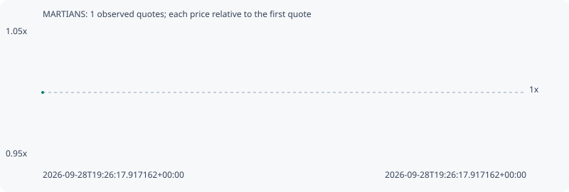

# MARTIANS

**bsc** / `0x8c5cfe14cf4fa710b7d2245a9e7d989980c37777`

[All tokens](README.md) · [Market window](../README.md)

## Native assessments

This contract is in the quote cohort; it has no native model assessment in this window.

## Series 63b7b85e46db20d3f9a9

Pool: `not supplied`

[Complete series](../series/bsc/63b7b85e46db20d3f9a9.json)

Every dot is a captured quote. Lines connect observations; the curve ends at the last available quote.

Fewer than two quotes: return and drawdown are not calculated.

### Complete quote timeline

| Time (UTC) | Price (USD) | Multiple | Evidence |
| --- | ---: | ---: | --- |
| 2026-09-28T19:26:17.917162+00:00 | 0.000744974 | 1.0000x | `capture:3b80c987-c82b-4a3e-8f0b-d3017a78edcb:rank:99` |

### Exit-policy timeline

Calculated from captured quotes under the window policy. Native assessments are linked separately above.

| Time (UTC) | Action | Price (USD) | Evidence |
| --- | --- | ---: | --- |
