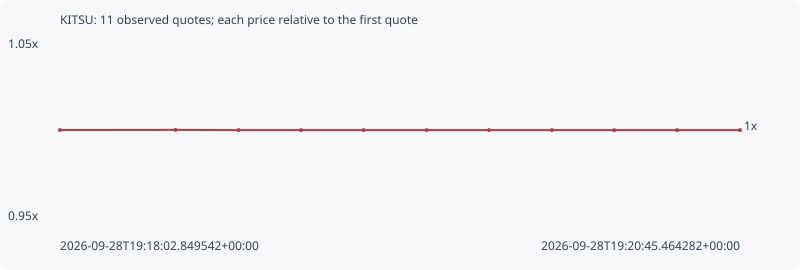

# KITSU

**robinhood** / `0x8d4dfaaa4198b6486e0293fec914c2b6a821d4dc`

[All tokens](README.md) · [Market window](../README.md)

## Native assessments

This contract is in the quote cohort; it has no native model assessment in this window.

## Series e815d3df879e687e10fc

Pool: `not supplied`

[Complete series](../series/robinhood/e815d3df879e687e10fc.json)

Every dot is a captured quote. Lines connect observations; the curve ends at the last available quote.

| Peak | Final | Return | Maximum drawdown |
| ---: | ---: | ---: | ---: |
| 1.0001x | 1.0000x | -0.00% | 0.01% |

### Complete quote timeline

| Time (UTC) | Price (USD) | Multiple | Evidence |
| --- | ---: | ---: | --- |
| 2026-09-28T19:18:02.849542+00:00 | 0.00109662 | 1.0000x | `capture:53a348cd-74d6-4031-ba2b-02d70c63e42b:rank:97` |
| 2026-09-28T19:18:30.489414+00:00 | 0.00109672 | 1.0001x | `capture:c5cd70df-4ca4-4388-b3c5-f977fa86f8a2:rank:96` |
| 2026-09-28T19:18:45.550203+00:00 | 0.00109657 | 1.0000x | `capture:728d4974-5fe3-40a8-8e99-2139c59da3e3:rank:91` |
| 2026-09-28T19:19:00.487408+00:00 | 0.00109657 | 1.0000x | `capture:297e4fae-3bb5-49eb-b490-a4f34898851c:rank:93` |
| 2026-09-28T19:19:15.451095+00:00 | 0.00109657 | 1.0000x | `capture:0bcc0576-3637-4b2c-b0e4-f9e05871b187:rank:91` |
| 2026-09-28T19:19:30.512866+00:00 | 0.00109657 | 1.0000x | `capture:bb499bdc-159a-4072-a450-312045f32cef:rank:97` |
| 2026-09-28T19:19:45.438706+00:00 | 0.00109657 | 1.0000x | `capture:59b12f7b-2112-42c7-834a-a2eb9bcaee3d:rank:94` |
| 2026-09-28T19:20:00.494705+00:00 | 0.00109657 | 1.0000x | `capture:5b06d6b3-9eca-4487-82fb-6b28820c37d9:rank:96` |
| 2026-09-28T19:20:15.393373+00:00 | 0.00109657 | 1.0000x | `capture:17802da9-7cee-48c3-9f5b-5829781be3f6:rank:91` |
| 2026-09-28T19:20:30.417446+00:00 | 0.00109657 | 1.0000x | `capture:f2fe9ac4-89a0-4ad3-8f15-5a70d7e1d5f7:rank:93` |
| 2026-09-28T19:20:45.464282+00:00 | 0.00109657 | 1.0000x | `capture:26559b75-812f-4386-982b-eba5073faf44:rank:91` |

### Exit-policy timeline

Calculated from captured quotes under the window policy. Native assessments are linked separately above.

| Time (UTC) | Action | Price (USD) | Evidence |
| --- | --- | ---: | --- |
| 2026-09-28T19:18:02.849542+00:00 | BUY | 0.00109662 | `capture:53a348cd-74d6-4031-ba2b-02d70c63e42b:rank:97` |
| 2026-09-28T19:18:30.489414+00:00 | HOLD | 0.00109672 | `capture:c5cd70df-4ca4-4388-b3c5-f977fa86f8a2:rank:96` |
| 2026-09-28T19:18:45.550203+00:00 | HOLD | 0.00109657 | `capture:728d4974-5fe3-40a8-8e99-2139c59da3e3:rank:91` |
| 2026-09-28T19:19:00.487408+00:00 | HOLD | 0.00109657 | `capture:297e4fae-3bb5-49eb-b490-a4f34898851c:rank:93` |
| 2026-09-28T19:19:15.451095+00:00 | HOLD | 0.00109657 | `capture:0bcc0576-3637-4b2c-b0e4-f9e05871b187:rank:91` |
| 2026-09-28T19:19:30.512866+00:00 | HOLD | 0.00109657 | `capture:bb499bdc-159a-4072-a450-312045f32cef:rank:97` |
| 2026-09-28T19:19:45.438706+00:00 | HOLD | 0.00109657 | `capture:59b12f7b-2112-42c7-834a-a2eb9bcaee3d:rank:94` |
| 2026-09-28T19:20:00.494705+00:00 | HOLD | 0.00109657 | `capture:5b06d6b3-9eca-4487-82fb-6b28820c37d9:rank:96` |
| 2026-09-28T19:20:15.393373+00:00 | HOLD | 0.00109657 | `capture:17802da9-7cee-48c3-9f5b-5829781be3f6:rank:91` |
| 2026-09-28T19:20:30.417446+00:00 | HOLD | 0.00109657 | `capture:f2fe9ac4-89a0-4ad3-8f15-5a70d7e1d5f7:rank:93` |
| 2026-09-28T19:20:45.464282+00:00 | HOLD | 0.00109657 | `capture:26559b75-812f-4386-982b-eba5073faf44:rank:91` |
