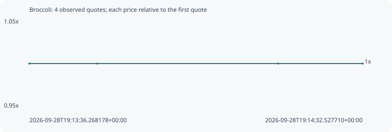

# Broccoli

**bsc** / `0x12b4356c65340fb02cdff01293f95febb1512f3b`

[All tokens](README.md) · [Market window](../README.md)

## Native assessments

This contract is in the quote cohort; it has no native model assessment in this window.

## Series c2076a730724aadc407c

Pool: `not supplied`

[Complete series](../series/bsc/c2076a730724aadc407c.json)

Every dot is a captured quote. Lines connect observations; the curve ends at the last available quote.

| Peak | Final | Return | Maximum drawdown |
| ---: | ---: | ---: | ---: |
| 1.0000x | 1.0000x | +0.00% | 0.00% |

### Complete quote timeline

| Time (UTC) | Price (USD) | Multiple | Evidence |
| --- | ---: | ---: | --- |
| 2026-09-28T19:13:36.268178+00:00 | 0.00750426 | 1.0000x | `capture:577859f6-aadc-4653-b269-a860dbe8c41c:rank:96` |
| 2026-09-28T19:13:47.694462+00:00 | 0.00750426 | 1.0000x | `capture:4e60f1a9-1927-46db-ae10-f1b1530de61d:rank:98` |
| 2026-09-28T19:14:18.283251+00:00 | 0.00750426 | 1.0000x | `capture:68440f72-d36c-4c27-867d-03a757db141f:rank:99` |
| 2026-09-28T19:14:32.527710+00:00 | 0.00750426 | 1.0000x | `capture:4f6a3c72-f6f0-49d7-97fe-a760f1872e88:rank:98` |

### Exit-policy timeline

Calculated from captured quotes under the window policy. Native assessments are linked separately above.

| Time (UTC) | Action | Price (USD) | Evidence |
| --- | --- | ---: | --- |
| 2026-09-28T19:13:36.268178+00:00 | BUY | 0.00750426 | `capture:577859f6-aadc-4653-b269-a860dbe8c41c:rank:96` |
| 2026-09-28T19:13:47.694462+00:00 | HOLD | 0.00750426 | `capture:4e60f1a9-1927-46db-ae10-f1b1530de61d:rank:98` |
| 2026-09-28T19:14:18.283251+00:00 | HOLD | 0.00750426 | `capture:68440f72-d36c-4c27-867d-03a757db141f:rank:99` |
| 2026-09-28T19:14:32.527710+00:00 | HOLD | 0.00750426 | `capture:4f6a3c72-f6f0-49d7-97fe-a760f1872e88:rank:98` |
