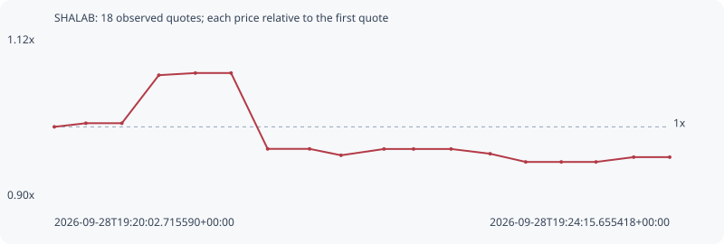

# SHALAB

**solana** / `83td5rsKFF1Hg7zb1GF2pKAx8TzDnAMQ4zSyxMrwpump`

[All tokens](README.md) · [Market window](../README.md)

## Native assessments

This contract is in the quote cohort; it has no native model assessment in this window.

## Series 3dfc3023cb9b47f58315

Pool: `not supplied`

[Complete series](../series/solana/3dfc3023cb9b47f58315.json)

Every dot is a captured quote. Lines connect observations; the curve ends at the last available quote.

| Peak | Final | Return | Maximum drawdown |
| ---: | ---: | ---: | ---: |
| 1.0729x | 0.9589x | -4.11% | 11.23% |

### Complete quote timeline

| Time (UTC) | Price (USD) | Multiple | Evidence |
| --- | ---: | ---: | --- |
| 2026-09-28T19:20:02.715590+00:00 | 1.35419e-05 | 1.0000x | `capture:60ff17d8-3b18-4f61-9bc7-006afd324cf2:rank:91` |
| 2026-09-28T19:20:15.699547+00:00 | 1.36081e-05 | 1.0049x | `capture:10a94828-637f-4580-a9f7-2fbd34d8589a:rank:89` |
| 2026-09-28T19:20:30.480194+00:00 | 1.36081e-05 | 1.0049x | `capture:54722132-db1d-4a2b-8c1c-2b0e71d01430:rank:88` |
| 2026-09-28T19:20:45.683165+00:00 | 1.44902e-05 | 1.0700x | `capture:17963a37-fd65-46b6-8e1c-350082721f8c:rank:88` |
| 2026-09-28T19:21:00.690136+00:00 | 1.4529e-05 | 1.0729x | `capture:f2ff842d-38e9-4cbe-a281-98c17d5a5672:rank:84` |
| 2026-09-28T19:21:15.372716+00:00 | 1.4529e-05 | 1.0729x | `capture:a923b968-a768-495e-ae33-6de2042c551f:rank:81` |
| 2026-09-28T19:21:30.402460+00:00 | 1.3137e-05 | 0.9701x | `capture:d926629b-2050-4e50-a602-1638c6205870:rank:68` |
| 2026-09-28T19:21:47.649380+00:00 | 1.3137e-05 | 0.9701x | `capture:0799ec6d-0e89-46b5-ae88-5695bf6c5fc3:rank:71` |
| 2026-09-28T19:22:00.569928+00:00 | 1.30199e-05 | 0.9615x | `capture:263cda40-4b31-4b2d-b168-fa4310edb46d:rank:68` |
| 2026-09-28T19:22:18.240717+00:00 | 1.31352e-05 | 0.9700x | `capture:546b2c55-1845-4da7-bc9c-4439cd0ccdba:rank:66` |
| 2026-09-28T19:22:30.371968+00:00 | 1.31352e-05 | 0.9700x | `capture:507d17cb-af67-4a81-a2b2-d5ddfbc40021:rank:67` |
| 2026-09-28T19:22:45.783808+00:00 | 1.31352e-05 | 0.9700x | `capture:9558d322-c429-480b-885f-82f4481c8506:rank:70` |
| 2026-09-28T19:23:01.833252+00:00 | 1.30482e-05 | 0.9635x | `capture:c5462412-2da1-4432-8949-8fcd1492c57f:rank:69` |
| 2026-09-28T19:23:16.460099+00:00 | 1.2898e-05 | 0.9525x | `capture:2d456a2a-6755-4e1d-9a80-b6e3b2d44ec1:rank:69` |
| 2026-09-28T19:23:31.092727+00:00 | 1.2898e-05 | 0.9525x | `capture:0e687519-8b01-4d7e-b48c-e2ec34135d17:rank:68` |
| 2026-09-28T19:23:45.375171+00:00 | 1.2898e-05 | 0.9525x | `capture:1b404fa0-870b-4e7c-bafd-c3ef241c5093:rank:68` |
| 2026-09-28T19:24:00.852400+00:00 | 1.2986e-05 | 0.9589x | `capture:5205c587-4734-452c-b758-46c4814dded1:rank:76` |
| 2026-09-28T19:24:15.655418+00:00 | 1.2986e-05 | 0.9589x | `capture:5b9df0f6-51c0-4dbb-9de7-7df7a46bfee0:rank:83` |

### Exit-policy timeline

Calculated from captured quotes under the window policy. Native assessments are linked separately above.

| Time (UTC) | Action | Price (USD) | Evidence |
| --- | --- | ---: | --- |
| 2026-09-28T19:20:02.715590+00:00 | BUY | 1.35419e-05 | `capture:60ff17d8-3b18-4f61-9bc7-006afd324cf2:rank:91` |
| 2026-09-28T19:20:15.699547+00:00 | HOLD | 1.36081e-05 | `capture:10a94828-637f-4580-a9f7-2fbd34d8589a:rank:89` |
| 2026-09-28T19:20:30.480194+00:00 | HOLD | 1.36081e-05 | `capture:54722132-db1d-4a2b-8c1c-2b0e71d01430:rank:88` |
| 2026-09-28T19:20:45.683165+00:00 | HOLD | 1.44902e-05 | `capture:17963a37-fd65-46b6-8e1c-350082721f8c:rank:88` |
| 2026-09-28T19:21:00.690136+00:00 | HOLD | 1.4529e-05 | `capture:f2ff842d-38e9-4cbe-a281-98c17d5a5672:rank:84` |
| 2026-09-28T19:21:15.372716+00:00 | HOLD | 1.4529e-05 | `capture:a923b968-a768-495e-ae33-6de2042c551f:rank:81` |
| 2026-09-28T19:21:30.402460+00:00 | HOLD | 1.3137e-05 | `capture:d926629b-2050-4e50-a602-1638c6205870:rank:68` |
| 2026-09-28T19:21:47.649380+00:00 | HOLD | 1.3137e-05 | `capture:0799ec6d-0e89-46b5-ae88-5695bf6c5fc3:rank:71` |
| 2026-09-28T19:22:00.569928+00:00 | HOLD | 1.30199e-05 | `capture:263cda40-4b31-4b2d-b168-fa4310edb46d:rank:68` |
| 2026-09-28T19:22:18.240717+00:00 | HOLD | 1.31352e-05 | `capture:546b2c55-1845-4da7-bc9c-4439cd0ccdba:rank:66` |
| 2026-09-28T19:22:30.371968+00:00 | HOLD | 1.31352e-05 | `capture:507d17cb-af67-4a81-a2b2-d5ddfbc40021:rank:67` |
| 2026-09-28T19:22:45.783808+00:00 | HOLD | 1.31352e-05 | `capture:9558d322-c429-480b-885f-82f4481c8506:rank:70` |
| 2026-09-28T19:23:01.833252+00:00 | HOLD | 1.30482e-05 | `capture:c5462412-2da1-4432-8949-8fcd1492c57f:rank:69` |
| 2026-09-28T19:23:16.460099+00:00 | HOLD | 1.2898e-05 | `capture:2d456a2a-6755-4e1d-9a80-b6e3b2d44ec1:rank:69` |
| 2026-09-28T19:23:31.092727+00:00 | HOLD | 1.2898e-05 | `capture:0e687519-8b01-4d7e-b48c-e2ec34135d17:rank:68` |
| 2026-09-28T19:23:45.375171+00:00 | HOLD | 1.2898e-05 | `capture:1b404fa0-870b-4e7c-bafd-c3ef241c5093:rank:68` |
| 2026-09-28T19:24:00.852400+00:00 | HOLD | 1.2986e-05 | `capture:5205c587-4734-452c-b758-46c4814dded1:rank:76` |
| 2026-09-28T19:24:15.655418+00:00 | HOLD | 1.2986e-05 | `capture:5b9df0f6-51c0-4dbb-9de7-7df7a46bfee0:rank:83` |
