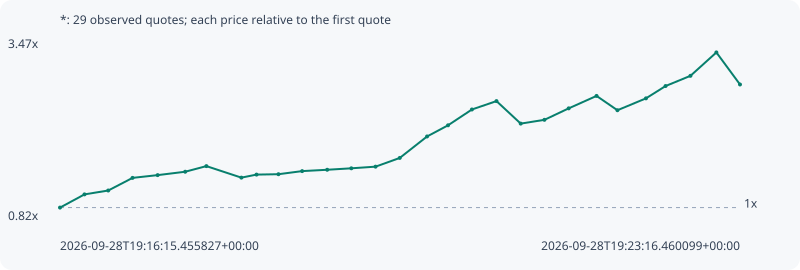

# *

**solana** / `7XEqj3KrRESniCnFbLgkcoykyP348MYYCi35FWdgpump`

[All tokens](README.md) · [Market window](../README.md)

## Native assessments

This contract is in the quote cohort; it has no native model assessment in this window.

## Series 077169fb72802e679540

Pool: `not supplied`

[Complete series](../series/solana/077169fb72802e679540.json)

Every dot is a captured quote. Lines connect observations; the curve ends at the last available quote.

| Peak | Final | Return | Maximum drawdown |
| ---: | ---: | ---: | ---: |
| 3.2835x | 2.8115x | +181.15% | 14.37% |

### Complete quote timeline

| Time (UTC) | Price (USD) | Multiple | Evidence |
| --- | ---: | ---: | --- |
| 2026-09-28T19:16:15.455827+00:00 | 6.56905e-06 | 1.0000x | `capture:acc657c6-9a43-46bf-986e-7b907c831cba:rank:65` |
| 2026-09-28T19:16:30.624202+00:00 | 7.84564e-06 | 1.1943x | `capture:0d391072-ec81-4bb7-9be0-0d6bbb801c70:rank:34` |
| 2026-09-28T19:16:45.311485+00:00 | 8.21979e-06 | 1.2513x | `capture:72cccbac-c3fe-4991-8f62-08c53849b146:rank:24` |
| 2026-09-28T19:17:00.368914+00:00 | 9.4413e-06 | 1.4372x | `capture:1232cf18-7088-40a1-9f55-ad9ae22b44f5:rank:20` |
| 2026-09-28T19:17:15.914647+00:00 | 9.70753e-06 | 1.4778x | `capture:9792e199-c0c2-4272-ac95-24501e4a3f79:rank:12` |
| 2026-09-28T19:17:32.965607+00:00 | 1.00343e-05 | 1.5275x | `capture:0f04cfe5-88a0-4a83-ae8d-85c5cb3cdc89:rank:12` |
| 2026-09-28T19:17:46.087880+00:00 | 1.05782e-05 | 1.6103x | `capture:ee91a1c6-bc99-4c7a-9cdc-bd6cb5478a9b:rank:14` |
| 2026-09-28T19:18:07.749963+00:00 | 9.46449e-06 | 1.4408x | `capture:b0fb1b47-4973-472f-9619-8480bc7d294e:rank:16` |
| 2026-09-28T19:18:17.126008+00:00 | 9.75738e-06 | 1.4854x | `capture:5ed98f51-d1e1-422a-81df-4186a8b0a0a2:rank:17` |
| 2026-09-28T19:18:30.722167+00:00 | 9.79614e-06 | 1.4913x | `capture:9f88d118-9108-4dff-bbfc-246eaed5ce38:rank:16` |
| 2026-09-28T19:18:45.386687+00:00 | 1.0095e-05 | 1.5368x | `capture:f533100a-ce62-4457-9107-42e7601ea5d7:rank:16` |
| 2026-09-28T19:19:00.883835+00:00 | 1.02253e-05 | 1.5566x | `capture:a2495d99-5671-4c7e-b87c-48f48d90f2f2:rank:14` |
| 2026-09-28T19:19:15.826416+00:00 | 1.03661e-05 | 1.5780x | `capture:ba1dc6a3-b8b7-461a-8110-8490f03539a5:rank:13` |
| 2026-09-28T19:19:30.814098+00:00 | 1.05255e-05 | 1.6023x | `capture:b25d90dc-c8db-4388-8a2b-d06541e5320f:rank:13` |
| 2026-09-28T19:19:45.817199+00:00 | 1.13707e-05 | 1.7310x | `capture:722d1b7b-ef4f-4ac5-883c-0557bae2b60b:rank:12` |
| 2026-09-28T19:20:02.715590+00:00 | 1.34454e-05 | 2.0468x | `capture:60ff17d8-3b18-4f61-9bc7-006afd324cf2:rank:11` |
| 2026-09-28T19:20:15.699547+00:00 | 1.45227e-05 | 2.2108x | `capture:10a94828-637f-4580-a9f7-2fbd34d8589a:rank:10` |
| 2026-09-28T19:20:30.480194+00:00 | 1.6052e-05 | 2.4436x | `capture:54722132-db1d-4a2b-8c1c-2b0e71d01430:rank:9` |
| 2026-09-28T19:20:45.683165+00:00 | 1.68637e-05 | 2.5671x | `capture:17963a37-fd65-46b6-8e1c-350082721f8c:rank:8` |
| 2026-09-28T19:21:00.690136+00:00 | 1.46873e-05 | 2.2358x | `capture:f2ff842d-38e9-4cbe-a281-98c17d5a5672:rank:8` |
| 2026-09-28T19:21:15.372716+00:00 | 1.50533e-05 | 2.2915x | `capture:a923b968-a768-495e-ae33-6de2042c551f:rank:8` |
| 2026-09-28T19:21:30.402460+00:00 | 1.61614e-05 | 2.4602x | `capture:d926629b-2050-4e50-a602-1638c6205870:rank:8` |
| 2026-09-28T19:21:47.649380+00:00 | 1.73646e-05 | 2.6434x | `capture:0799ec6d-0e89-46b5-ae88-5695bf6c5fc3:rank:10` |
| 2026-09-28T19:22:00.569928+00:00 | 1.59795e-05 | 2.4325x | `capture:263cda40-4b31-4b2d-b168-fa4310edb46d:rank:9` |
| 2026-09-28T19:22:18.240717+00:00 | 1.71279e-05 | 2.6074x | `capture:546b2c55-1845-4da7-bc9c-4439cd0ccdba:rank:9` |
| 2026-09-28T19:22:30.371968+00:00 | 1.83191e-05 | 2.7887x | `capture:507d17cb-af67-4a81-a2b2-d5ddfbc40021:rank:8` |
| 2026-09-28T19:22:45.783808+00:00 | 1.9308e-05 | 2.9392x | `capture:9558d322-c429-480b-885f-82f4481c8506:rank:9` |
| 2026-09-28T19:23:01.833252+00:00 | 2.15694e-05 | 3.2835x | `capture:c5462412-2da1-4432-8949-8fcd1492c57f:rank:9` |
| 2026-09-28T19:23:16.460099+00:00 | 1.84689e-05 | 2.8115x | `capture:2d456a2a-6755-4e1d-9a80-b6e3b2d44ec1:rank:7` |

### Exit-policy timeline

Calculated from captured quotes under the window policy. Native assessments are linked separately above.

| Time (UTC) | Action | Price (USD) | Evidence |
| --- | --- | ---: | --- |
| 2026-09-28T19:16:15.455827+00:00 | BUY | 6.56905e-06 | `capture:acc657c6-9a43-46bf-986e-7b907c831cba:rank:65` |
| 2026-09-28T19:16:30.624202+00:00 | HOLD | 7.84564e-06 | `capture:0d391072-ec81-4bb7-9be0-0d6bbb801c70:rank:34` |
| 2026-09-28T19:16:45.311485+00:00 | PROFIT | 8.21979e-06 | `capture:72cccbac-c3fe-4991-8f62-08c53849b146:rank:24` |
| 2026-09-28T19:17:00.368914+00:00 | HOLD_BAG | 9.4413e-06 | `capture:1232cf18-7088-40a1-9f55-ad9ae22b44f5:rank:20` |
| 2026-09-28T19:17:15.914647+00:00 | HOLD_BAG | 9.70753e-06 | `capture:9792e199-c0c2-4272-ac95-24501e4a3f79:rank:12` |
| 2026-09-28T19:17:32.965607+00:00 | TP | 1.00343e-05 | `capture:0f04cfe5-88a0-4a83-ae8d-85c5cb3cdc89:rank:12` |
