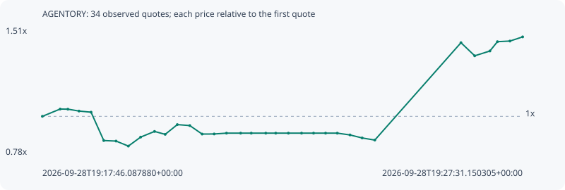

# AGENTORY

**solana** / `cPW1Zrx1zqEVb21pcQrzfjNkhS4Dz6fyztKooh6xfEX`

[All tokens](README.md) · [Market window](../README.md)

## Native assessments

- [2026-09-28T19:17:46.087880Z](../cases/3ea234634922fb21.md): source parameters and model answers.

## Series 40e50128941e696263e8

Pool: `not supplied`

[Complete series](../series/solana/40e50128941e696263e8.json)

Every dot is a captured quote. Lines connect observations; the curve ends at the last available quote.

| Peak | Final | Return | Maximum drawdown |
| ---: | ---: | ---: | ---: |
| 1.4559x | 1.4559x | +45.59% | 20.40% |

### Complete quote timeline

| Time (UTC) | Price (USD) | Multiple | Evidence |
| --- | ---: | ---: | --- |
| 2026-09-28T19:17:46.087880+00:00 | 1.02314e-05 | 1.0000x | `capture:ee91a1c6-bc99-4c7a-9cdc-bd6cb5478a9b:rank:96` |
| 2026-09-28T19:18:07.749963+00:00 | 1.06587e-05 | 1.0418x | `capture:b0fb1b47-4973-472f-9619-8480bc7d294e:rank:74` |
| 2026-09-28T19:18:17.126008+00:00 | 1.06526e-05 | 1.0412x | `capture:5ed98f51-d1e1-422a-81df-4186a8b0a0a2:rank:71` |
| 2026-09-28T19:18:30.722167+00:00 | 1.05411e-05 | 1.0303x | `capture:9f88d118-9108-4dff-bbfc-246eaed5ce38:rank:70` |
| 2026-09-28T19:18:45.386687+00:00 | 1.04748e-05 | 1.0238x | `capture:f533100a-ce62-4457-9107-42e7601ea5d7:rank:71` |
| 2026-09-28T19:19:00.883835+00:00 | 8.80915e-06 | 0.8610x | `capture:a2495d99-5671-4c7e-b87c-48f48d90f2f2:rank:70` |
| 2026-09-28T19:19:15.826416+00:00 | 8.77811e-06 | 0.8580x | `capture:ba1dc6a3-b8b7-461a-8110-8490f03539a5:rank:72` |
| 2026-09-28T19:19:30.814098+00:00 | 8.48435e-06 | 0.8292x | `capture:b25d90dc-c8db-4388-8a2b-d06541e5320f:rank:70` |
| 2026-09-28T19:19:45.817199+00:00 | 9.01135e-06 | 0.8808x | `capture:722d1b7b-ef4f-4ac5-883c-0557bae2b60b:rank:66` |
| 2026-09-28T19:20:02.715590+00:00 | 9.34412e-06 | 0.9133x | `capture:60ff17d8-3b18-4f61-9bc7-006afd324cf2:rank:66` |
| 2026-09-28T19:20:15.699547+00:00 | 9.17328e-06 | 0.8966x | `capture:10a94828-637f-4580-a9f7-2fbd34d8589a:rank:61` |
| 2026-09-28T19:20:30.480194+00:00 | 9.74543e-06 | 0.9525x | `capture:54722132-db1d-4a2b-8c1c-2b0e71d01430:rank:55` |
| 2026-09-28T19:20:45.683165+00:00 | 9.68812e-06 | 0.9469x | `capture:17963a37-fd65-46b6-8e1c-350082721f8c:rank:57` |
| 2026-09-28T19:21:00.690136+00:00 | 9.18956e-06 | 0.8982x | `capture:f2ff842d-38e9-4cbe-a281-98c17d5a5672:rank:51` |
| 2026-09-28T19:21:15.372716+00:00 | 9.19518e-06 | 0.8987x | `capture:a923b968-a768-495e-ae33-6de2042c551f:rank:50` |
| 2026-09-28T19:21:30.402460+00:00 | 9.24339e-06 | 0.9034x | `capture:d926629b-2050-4e50-a602-1638c6205870:rank:45` |
| 2026-09-28T19:21:47.649380+00:00 | 9.24339e-06 | 0.9034x | `capture:0799ec6d-0e89-46b5-ae88-5695bf6c5fc3:rank:47` |
| 2026-09-28T19:22:00.569928+00:00 | 9.24339e-06 | 0.9034x | `capture:263cda40-4b31-4b2d-b168-fa4310edb46d:rank:47` |
| 2026-09-28T19:22:18.240717+00:00 | 9.24339e-06 | 0.9034x | `capture:546b2c55-1845-4da7-bc9c-4439cd0ccdba:rank:45` |
| 2026-09-28T19:22:30.371968+00:00 | 9.24339e-06 | 0.9034x | `capture:507d17cb-af67-4a81-a2b2-d5ddfbc40021:rank:47` |
| 2026-09-28T19:22:45.783808+00:00 | 9.24339e-06 | 0.9034x | `capture:9558d322-c429-480b-885f-82f4481c8506:rank:52` |
| 2026-09-28T19:23:01.833252+00:00 | 9.24339e-06 | 0.9034x | `capture:c5462412-2da1-4432-8949-8fcd1492c57f:rank:63` |
| 2026-09-28T19:23:16.460099+00:00 | 9.24339e-06 | 0.9034x | `capture:2d456a2a-6755-4e1d-9a80-b6e3b2d44ec1:rank:72` |
| 2026-09-28T19:23:31.092727+00:00 | 9.24339e-06 | 0.9034x | `capture:0e687519-8b01-4d7e-b48c-e2ec34135d17:rank:85` |
| 2026-09-28T19:23:45.375171+00:00 | 9.24339e-06 | 0.9034x | `capture:1b404fa0-870b-4e7c-bafd-c3ef241c5093:rank:91` |
| 2026-09-28T19:24:00.852400+00:00 | 9.13885e-06 | 0.8932x | `capture:5205c587-4734-452c-b758-46c4814dded1:rank:86` |
| 2026-09-28T19:24:15.655418+00:00 | 8.9611e-06 | 0.8758x | `capture:5b9df0f6-51c0-4dbb-9de7-7df7a46bfee0:rank:92` |
| 2026-09-28T19:24:31.056437+00:00 | 8.83682e-06 | 0.8637x | `capture:971b5dda-397d-4fe7-b49e-94713bb088df:rank:89` |
| 2026-09-28T19:26:16.031602+00:00 | 1.45538e-05 | 1.4225x | `capture:bb8d4bfc-85e1-4d55-a2ff-e47193bcce5f:rank:77` |
| 2026-09-28T19:26:32.771713+00:00 | 1.37857e-05 | 1.3474x | `capture:2fed7296-b3d1-4ba6-8398-799ee55f1f2b:rank:87` |
| 2026-09-28T19:26:51.267717+00:00 | 1.40676e-05 | 1.3749x | `capture:4cc162c2-aa4a-403b-a901-4bb5058380d6:rank:82` |
| 2026-09-28T19:27:00.453239+00:00 | 1.46145e-05 | 1.4284x | `capture:4273fbb8-5342-4e37-8d61-ced6b88e542d:rank:81` |
| 2026-09-28T19:27:15.715818+00:00 | 1.4651e-05 | 1.4320x | `capture:d04c9116-4617-4b61-8b98-5489321cd1cc:rank:76` |
| 2026-09-28T19:27:31.150305+00:00 | 1.4896e-05 | 1.4559x | `capture:7cad37e8-83d3-4438-8055-245db6707e2e:rank:73` |

### Exit-policy timeline

Calculated from captured quotes under the window policy. Native assessments are linked separately above.

| Time (UTC) | Action | Price (USD) | Evidence |
| --- | --- | ---: | --- |
| 2026-09-28T19:17:46.087880+00:00 | BUY | 1.02314e-05 | `capture:ee91a1c6-bc99-4c7a-9cdc-bd6cb5478a9b:rank:96` |
| 2026-09-28T19:18:07.749963+00:00 | HOLD | 1.06587e-05 | `capture:b0fb1b47-4973-472f-9619-8480bc7d294e:rank:74` |
| 2026-09-28T19:18:17.126008+00:00 | HOLD | 1.06526e-05 | `capture:5ed98f51-d1e1-422a-81df-4186a8b0a0a2:rank:71` |
| 2026-09-28T19:18:30.722167+00:00 | HOLD | 1.05411e-05 | `capture:9f88d118-9108-4dff-bbfc-246eaed5ce38:rank:70` |
| 2026-09-28T19:18:45.386687+00:00 | HOLD | 1.04748e-05 | `capture:f533100a-ce62-4457-9107-42e7601ea5d7:rank:71` |
| 2026-09-28T19:19:00.883835+00:00 | SL | 8.80915e-06 | `capture:a2495d99-5671-4c7e-b87c-48f48d90f2f2:rank:70` |
