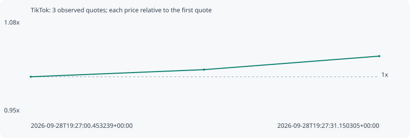

# TikTok

**solana** / `95iWWUfkSwbqr1NaEXo6aKiNE7aPXKVd5EyDcyjkpump`

[All tokens](README.md) · [Market window](../README.md)

## Native assessments

This contract is in the quote cohort; it has no native model assessment in this window.

## Series b4e5e76a6d9a69e06c7e

Pool: `not supplied`

[Complete series](../series/solana/b4e5e76a6d9a69e06c7e.json)

Every dot is a captured quote. Lines connect observations; the curve ends at the last available quote.

| Peak | Final | Return | Maximum drawdown |
| ---: | ---: | ---: | ---: |
| 1.0289x | 1.0289x | +2.89% | 0.00% |

### Complete quote timeline

| Time (UTC) | Price (USD) | Multiple | Evidence |
| --- | ---: | ---: | --- |
| 2026-09-28T19:27:00.453239+00:00 | 0.000330648 | 1.0000x | `capture:4273fbb8-5342-4e37-8d61-ced6b88e542d:rank:21` |
| 2026-09-28T19:27:15.715818+00:00 | 0.000333946 | 1.0100x | `capture:d04c9116-4617-4b61-8b98-5489321cd1cc:rank:16` |
| 2026-09-28T19:27:31.150305+00:00 | 0.000340206 | 1.0289x | `capture:7cad37e8-83d3-4438-8055-245db6707e2e:rank:10` |

### Exit-policy timeline

Calculated from captured quotes under the window policy. Native assessments are linked separately above.

| Time (UTC) | Action | Price (USD) | Evidence |
| --- | --- | ---: | --- |
| 2026-09-28T19:27:00.453239+00:00 | BUY | 0.000330648 | `capture:4273fbb8-5342-4e37-8d61-ced6b88e542d:rank:21` |
| 2026-09-28T19:27:15.715818+00:00 | HOLD | 0.000333946 | `capture:d04c9116-4617-4b61-8b98-5489321cd1cc:rank:16` |
| 2026-09-28T19:27:31.150305+00:00 | HOLD | 0.000340206 | `capture:7cad37e8-83d3-4438-8055-245db6707e2e:rank:10` |
