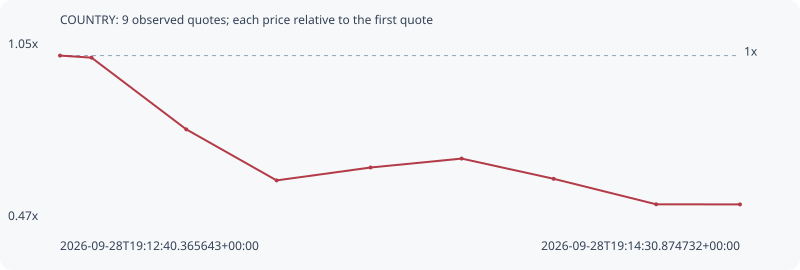

# COUNTRY

**solana** / `7dLKp8RVPk4sooF4L3pgm9zTzKQ8mMxUJagEDNFRmPBJ`

[All tokens](README.md) · [Market window](../README.md)

## Native assessments

This contract is in the quote cohort; it has no native model assessment in this window.

## Series 1e8e96a749867b1faa26

Pool: `not supplied`

[Complete series](../series/solana/1e8e96a749867b1faa26.json)

Every dot is a captured quote. Lines connect observations; the curve ends at the last available quote.

| Peak | Final | Return | Maximum drawdown |
| ---: | ---: | ---: | ---: |
| 1.0000x | 0.5225x | -47.75% | 47.75% |

### Complete quote timeline

| Time (UTC) | Price (USD) | Multiple | Evidence |
| --- | ---: | ---: | --- |
| 2026-09-28T19:12:40.365643+00:00 | 7.59989e-06 | 1.0000x | `capture:3af1faa1-2074-484e-893e-ed2c676e1576:rank:43` |
| 2026-09-28T19:12:45.490977+00:00 | 7.54931e-06 | 0.9933x | `capture:ac0279d6-7dd1-44b6-bf3e-910bf7b8eddf:rank:42` |
| 2026-09-28T19:13:00.884337+00:00 | 5.80144e-06 | 0.7634x | `capture:5867894f-39b4-4bcd-bd87-86394c63aab4:rank:40` |
| 2026-09-28T19:13:15.565374+00:00 | 4.55689e-06 | 0.5996x | `capture:ca31b3d4-ad60-4333-98b3-6d940a196f86:rank:39` |
| 2026-09-28T19:13:30.833894+00:00 | 4.87109e-06 | 0.6409x | `capture:2beb38a4-bfac-4502-bbc3-8c8c0f943007:rank:40` |
| 2026-09-28T19:13:45.640151+00:00 | 5.08871e-06 | 0.6696x | `capture:4d31b656-3ffe-4768-bef6-377adf019420:rank:39` |
| 2026-09-28T19:14:00.595194+00:00 | 4.59576e-06 | 0.6047x | `capture:2c78112b-48e7-4f74-8c2e-1cb8642a79dc:rank:38` |
| 2026-09-28T19:14:17.246316+00:00 | 3.9741e-06 | 0.5229x | `capture:7a923cde-d765-4388-a15c-4f47fde0a3b5:rank:37` |
| 2026-09-28T19:14:30.874732+00:00 | 3.97128e-06 | 0.5225x | `capture:fa585070-b1ae-4f9d-afbd-aa986f487793:rank:37` |

### Exit-policy timeline

Calculated from captured quotes under the window policy. Native assessments are linked separately above.

| Time (UTC) | Action | Price (USD) | Evidence |
| --- | --- | ---: | --- |
| 2026-09-28T19:12:40.365643+00:00 | BUY | 7.59989e-06 | `capture:3af1faa1-2074-484e-893e-ed2c676e1576:rank:43` |
| 2026-09-28T19:12:45.490977+00:00 | HOLD | 7.54931e-06 | `capture:ac0279d6-7dd1-44b6-bf3e-910bf7b8eddf:rank:42` |
| 2026-09-28T19:13:00.884337+00:00 | SL | 5.80144e-06 | `capture:5867894f-39b4-4bcd-bd87-86394c63aab4:rank:40` |
