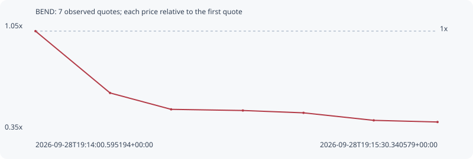

# BEND

**solana** / `HpSdozkc6ypvBf9hpPvCaZ6cJBarutL8kTuQx2HjqkeJ`

[All tokens](README.md) · [Market window](../README.md)

## Native assessments

This contract is in the quote cohort; it has no native model assessment in this window.

## Series 52772cad5e702a168d2d

Pool: `not supplied`

[Complete series](../series/solana/52772cad5e702a168d2d.json)

Every dot is a captured quote. Lines connect observations; the curve ends at the last available quote.

| Peak | Final | Return | Maximum drawdown |
| ---: | ---: | ---: | ---: |
| 1.0000x | 0.3989x | -60.11% | 60.11% |

### Complete quote timeline

| Time (UTC) | Price (USD) | Multiple | Evidence |
| --- | ---: | ---: | --- |
| 2026-09-28T19:14:00.595194+00:00 | 1.08255e-05 | 1.0000x | `capture:2c78112b-48e7-4f74-8c2e-1cb8642a79dc:rank:47` |
| 2026-09-28T19:14:17.246316+00:00 | 6.39702e-06 | 0.5909x | `capture:7a923cde-d765-4388-a15c-4f47fde0a3b5:rank:28` |
| 2026-09-28T19:14:30.874732+00:00 | 5.22432e-06 | 0.4826x | `capture:fa585070-b1ae-4f9d-afbd-aa986f487793:rank:23` |
| 2026-09-28T19:14:46.892387+00:00 | 5.14136e-06 | 0.4749x | `capture:7d9e3e65-8bda-4696-b6d1-7a86825bd98c:rank:22` |
| 2026-09-28T19:15:00.432009+00:00 | 4.974e-06 | 0.4595x | `capture:797f9a41-958a-44ba-ac57-3b9cacf5d06b:rank:21` |
| 2026-09-28T19:15:16.098308+00:00 | 4.43636e-06 | 0.4098x | `capture:ab2becb9-3f94-4a57-b9e8-472ad0998012:rank:21` |
| 2026-09-28T19:15:30.340579+00:00 | 4.31836e-06 | 0.3989x | `capture:564db5fc-5586-41d3-88fb-a9a955708f1d:rank:20` |

### Exit-policy timeline

Calculated from captured quotes under the window policy. Native assessments are linked separately above.

| Time (UTC) | Action | Price (USD) | Evidence |
| --- | --- | ---: | --- |
| 2026-09-28T19:14:00.595194+00:00 | BUY | 1.08255e-05 | `capture:2c78112b-48e7-4f74-8c2e-1cb8642a79dc:rank:47` |
| 2026-09-28T19:14:17.246316+00:00 | SL | 6.39702e-06 | `capture:7a923cde-d765-4388-a15c-4f47fde0a3b5:rank:28` |
