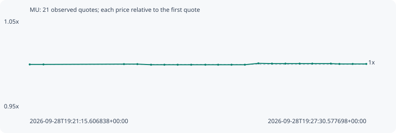

# MU

**robinhood** / `0xff080c8ce2e5feadaca0da81314ae59d232d4afd`

[All tokens](README.md) · [Market window](../README.md)

## Native assessments

This contract is in the quote cohort; it has no native model assessment in this window.

## Series efa5e99f70afb2fa65e5

Pool: `not supplied`

[Complete series](../series/robinhood/efa5e99f70afb2fa65e5.json)

Every dot is a captured quote. Lines connect observations; the curve ends at the last available quote.

| Peak | Final | Return | Maximum drawdown |
| ---: | ---: | ---: | ---: |
| 1.0012x | 1.0005x | +0.05% | 0.07% |

### Complete quote timeline

| Time (UTC) | Price (USD) | Multiple | Evidence |
| --- | ---: | ---: | --- |
| 2026-09-28T19:21:15.606838+00:00 | 1054.66 | 1.0000x | `capture:c2a8ab31-038e-42f4-8e33-852fee1b9a24:rank:94` |
| 2026-09-28T19:21:30.959683+00:00 | 1054.66 | 1.0000x | `capture:300e0f35-12d4-46a9-a17e-17adbe8e1059:rank:97` |
| 2026-09-28T19:23:00.594785+00:00 | 1055.04 | 1.0004x | `capture:b6c633f1-3960-4db3-a2ca-34618f913368:rank:79` |
| 2026-09-28T19:23:15.534636+00:00 | 1055.04 | 1.0004x | `capture:d5a0d1a4-a366-4985-80da-e34160e2f58c:rank:75` |
| 2026-09-28T19:23:30.815940+00:00 | 1054.31 | 0.9997x | `capture:c6f23ed9-c47c-4f73-bf08-86a494a11aa2:rank:69` |
| 2026-09-28T19:23:45.643860+00:00 | 1054.31 | 0.9997x | `capture:0b8bbeb9-cbaa-4cb2-a853-2bb146bd23e5:rank:72` |
| 2026-09-28T19:24:00.467430+00:00 | 1054.31 | 0.9997x | `capture:4a231962-827e-445d-ab7d-bb974bfc841b:rank:70` |
| 2026-09-28T19:24:15.505143+00:00 | 1054.31 | 0.9997x | `capture:b7273a78-8f87-4dcc-877e-f47f549e0fe8:rank:71` |
| 2026-09-28T19:24:31.344409+00:00 | 1054.31 | 0.9997x | `capture:85f4db1c-c852-45c3-99aa-4320f3839031:rank:74` |
| 2026-09-28T19:24:45.576445+00:00 | 1054.31 | 0.9997x | `capture:da07dfaa-56d9-4a51-99df-1ad071803eb0:rank:77` |
| 2026-09-28T19:25:00.412700+00:00 | 1054.31 | 0.9997x | `capture:1dec2f8f-4694-4c32-8be8-eeec3980c853:rank:73` |
| 2026-09-28T19:25:15.316372+00:00 | 1054.31 | 0.9997x | `capture:52eaf5a3-351e-4c29-b00b-a167107703e3:rank:74` |
| 2026-09-28T19:25:30.354898+00:00 | 1055.95 | 1.0012x | `capture:d70b1f6a-3ec3-4ec2-8c88-db476beae4f9:rank:84` |
| 2026-09-28T19:25:45.483791+00:00 | 1055.65 | 1.0009x | `capture:ebb21e05-3dc6-4a8f-a800-fa79ba147200:rank:77` |
| 2026-09-28T19:26:00.522113+00:00 | 1055.65 | 1.0009x | `capture:a33301e4-8f37-4fb5-af69-629635c54fe6:rank:79` |
| 2026-09-28T19:26:16.279485+00:00 | 1055.65 | 1.0009x | `capture:085b2ea9-3985-4608-a1cd-1eddc6b16122:rank:81` |
| 2026-09-28T19:26:30.447392+00:00 | 1055.65 | 1.0009x | `capture:36fd4b46-5420-443d-b1ed-b86b98706671:rank:86` |
| 2026-09-28T19:26:51.039990+00:00 | 1055.65 | 1.0009x | `capture:653b62fa-7a58-45fd-95e9-3b36912dc139:rank:84` |
| 2026-09-28T19:27:00.598930+00:00 | 1055.24 | 1.0005x | `capture:8041f6b0-6188-445c-83ef-3a6fb7daf321:rank:73` |
| 2026-09-28T19:27:15.438746+00:00 | 1055.24 | 1.0005x | `capture:b4c48612-e04d-4782-96a6-e80c2955d3b9:rank:70` |
| 2026-09-28T19:27:30.577698+00:00 | 1055.24 | 1.0005x | `capture:ff6b3949-9c3c-4cdf-b48c-d4010666c140:rank:71` |

### Exit-policy timeline

Calculated from captured quotes under the window policy. Native assessments are linked separately above.

| Time (UTC) | Action | Price (USD) | Evidence |
| --- | --- | ---: | --- |
| 2026-09-28T19:21:15.606838+00:00 | BUY | 1054.66 | `capture:c2a8ab31-038e-42f4-8e33-852fee1b9a24:rank:94` |
| 2026-09-28T19:21:30.959683+00:00 | HOLD | 1054.66 | `capture:300e0f35-12d4-46a9-a17e-17adbe8e1059:rank:97` |
| 2026-09-28T19:23:00.594785+00:00 | HOLD | 1055.04 | `capture:b6c633f1-3960-4db3-a2ca-34618f913368:rank:79` |
| 2026-09-28T19:23:15.534636+00:00 | HOLD | 1055.04 | `capture:d5a0d1a4-a366-4985-80da-e34160e2f58c:rank:75` |
| 2026-09-28T19:23:30.815940+00:00 | HOLD | 1054.31 | `capture:c6f23ed9-c47c-4f73-bf08-86a494a11aa2:rank:69` |
| 2026-09-28T19:23:45.643860+00:00 | HOLD | 1054.31 | `capture:0b8bbeb9-cbaa-4cb2-a853-2bb146bd23e5:rank:72` |
| 2026-09-28T19:24:00.467430+00:00 | HOLD | 1054.31 | `capture:4a231962-827e-445d-ab7d-bb974bfc841b:rank:70` |
| 2026-09-28T19:24:15.505143+00:00 | HOLD | 1054.31 | `capture:b7273a78-8f87-4dcc-877e-f47f549e0fe8:rank:71` |
| 2026-09-28T19:24:31.344409+00:00 | HOLD | 1054.31 | `capture:85f4db1c-c852-45c3-99aa-4320f3839031:rank:74` |
| 2026-09-28T19:24:45.576445+00:00 | HOLD | 1054.31 | `capture:da07dfaa-56d9-4a51-99df-1ad071803eb0:rank:77` |
| 2026-09-28T19:25:00.412700+00:00 | HOLD | 1054.31 | `capture:1dec2f8f-4694-4c32-8be8-eeec3980c853:rank:73` |
| 2026-09-28T19:25:15.316372+00:00 | HOLD | 1054.31 | `capture:52eaf5a3-351e-4c29-b00b-a167107703e3:rank:74` |
| 2026-09-28T19:25:30.354898+00:00 | HOLD | 1055.95 | `capture:d70b1f6a-3ec3-4ec2-8c88-db476beae4f9:rank:84` |
| 2026-09-28T19:25:45.483791+00:00 | HOLD | 1055.65 | `capture:ebb21e05-3dc6-4a8f-a800-fa79ba147200:rank:77` |
| 2026-09-28T19:26:00.522113+00:00 | HOLD | 1055.65 | `capture:a33301e4-8f37-4fb5-af69-629635c54fe6:rank:79` |
| 2026-09-28T19:26:16.279485+00:00 | HOLD | 1055.65 | `capture:085b2ea9-3985-4608-a1cd-1eddc6b16122:rank:81` |
| 2026-09-28T19:26:30.447392+00:00 | HOLD | 1055.65 | `capture:36fd4b46-5420-443d-b1ed-b86b98706671:rank:86` |
| 2026-09-28T19:26:51.039990+00:00 | HOLD | 1055.65 | `capture:653b62fa-7a58-45fd-95e9-3b36912dc139:rank:84` |
| 2026-09-28T19:27:00.598930+00:00 | HOLD | 1055.24 | `capture:8041f6b0-6188-445c-83ef-3a6fb7daf321:rank:73` |
| 2026-09-28T19:27:15.438746+00:00 | HOLD | 1055.24 | `capture:b4c48612-e04d-4782-96a6-e80c2955d3b9:rank:70` |
| 2026-09-28T19:27:30.577698+00:00 | HOLD | 1055.24 | `capture:ff6b3949-9c3c-4cdf-b48c-d4010666c140:rank:71` |
