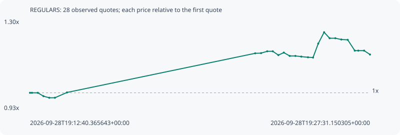

# REGULARS

**solana** / `8HnLRKJ6XkeGq1tpmKPqn3yB5ruqbSR5LR5nVCNAshop`

[All tokens](README.md) · [Market window](../README.md)

## Native assessments

This contract is in the quote cohort; it has no native model assessment in this window.

## Series 340242b045120e6ab050

Pool: `not supplied`

[Complete series](../series/solana/340242b045120e6ab050.json)

Every dot is a captured quote. Lines connect observations; the curve ends at the last available quote.

| Peak | Final | Return | Maximum drawdown |
| ---: | ---: | ---: | ---: |
| 1.2472x | 1.1563x | +15.63% | 7.29% |

### Complete quote timeline

| Time (UTC) | Price (USD) | Multiple | Evidence |
| --- | ---: | ---: | --- |
| 2026-09-28T19:12:40.365643+00:00 | 0.000187149 | 1.0000x | `capture:3af1faa1-2074-484e-893e-ed2c676e1576:rank:92` |
| 2026-09-28T19:12:45.490977+00:00 | 0.000187149 | 1.0000x | `capture:ac0279d6-7dd1-44b6-bf3e-910bf7b8eddf:rank:91` |
| 2026-09-28T19:13:00.884337+00:00 | 0.000187149 | 1.0000x | `capture:5867894f-39b4-4bcd-bd87-86394c63aab4:rank:89` |
| 2026-09-28T19:13:15.565374+00:00 | 0.000184579 | 0.9863x | `capture:ca31b3d4-ad60-4333-98b3-6d940a196f86:rank:86` |
| 2026-09-28T19:13:30.833894+00:00 | 0.000183373 | 0.9798x | `capture:2beb38a4-bfac-4502-bbc3-8c8c0f943007:rank:89` |
| 2026-09-28T19:13:45.640151+00:00 | 0.000183373 | 0.9798x | `capture:4d31b656-3ffe-4768-bef6-377adf019420:rank:93` |
| 2026-09-28T19:14:17.246316+00:00 | 0.000187433 | 1.0015x | `capture:7a923cde-d765-4388-a15c-4f47fde0a3b5:rank:99` |
| 2026-09-28T19:22:30.371968+00:00 | 0.000217323 | 1.1612x | `capture:507d17cb-af67-4a81-a2b2-d5ddfbc40021:rank:90` |
| 2026-09-28T19:22:45.783808+00:00 | 0.000217464 | 1.1620x | `capture:9558d322-c429-480b-885f-82f4481c8506:rank:92` |
| 2026-09-28T19:23:01.833252+00:00 | 0.000218867 | 1.1695x | `capture:c5462412-2da1-4432-8949-8fcd1492c57f:rank:87` |
| 2026-09-28T19:23:16.460099+00:00 | 0.000218867 | 1.1695x | `capture:2d456a2a-6755-4e1d-9a80-b6e3b2d44ec1:rank:91` |
| 2026-09-28T19:23:31.092727+00:00 | 0.000215946 | 1.1539x | `capture:0e687519-8b01-4d7e-b48c-e2ec34135d17:rank:83` |
| 2026-09-28T19:23:45.375171+00:00 | 0.000217872 | 1.1642x | `capture:1b404fa0-870b-4e7c-bafd-c3ef241c5093:rank:82` |
| 2026-09-28T19:24:00.852400+00:00 | 0.000215312 | 1.1505x | `capture:5205c587-4734-452c-b758-46c4814dded1:rank:81` |
| 2026-09-28T19:24:15.655418+00:00 | 0.000215312 | 1.1505x | `capture:5b9df0f6-51c0-4dbb-9de7-7df7a46bfee0:rank:84` |
| 2026-09-28T19:24:31.056437+00:00 | 0.000214818 | 1.1478x | `capture:971b5dda-397d-4fe7-b49e-94713bb088df:rank:82` |
| 2026-09-28T19:24:48.687179+00:00 | 0.000214303 | 1.1451x | `capture:feb72cbd-a170-4ba3-8a11-eb1df1686719:rank:92` |
| 2026-09-28T19:25:01.877958+00:00 | 0.000214102 | 1.1440x | `capture:fd6d01ae-d246-439e-ac58-27ae75880eb9:rank:88` |
| 2026-09-28T19:25:15.488701+00:00 | 0.000224713 | 1.2007x | `capture:b8fee87c-9981-475c-930b-99c255910a9f:rank:85` |
| 2026-09-28T19:25:30.900173+00:00 | 0.000233416 | 1.2472x | `capture:7f757769-25c3-429a-81d0-c6b2ee45ee15:rank:70` |
| 2026-09-28T19:25:45.342895+00:00 | 0.000228847 | 1.2228x | `capture:0ca3656d-ce8c-444b-8f77-acf34c08a1f4:rank:68` |
| 2026-09-28T19:26:00.340634+00:00 | 0.000228847 | 1.2228x | `capture:5b3728c5-aff9-43f3-bbb5-25b251825caa:rank:70` |
| 2026-09-28T19:26:16.031602+00:00 | 0.000227872 | 1.2176x | `capture:bb8d4bfc-85e1-4d55-a2ff-e47193bcce5f:rank:66` |
| 2026-09-28T19:26:32.771713+00:00 | 0.000227623 | 1.2163x | `capture:2fed7296-b3d1-4ba6-8398-799ee55f1f2b:rank:62` |
| 2026-09-28T19:26:51.267717+00:00 | 0.000219377 | 1.1722x | `capture:4cc162c2-aa4a-403b-a901-4bb5058380d6:rank:63` |
| 2026-09-28T19:27:00.453239+00:00 | 0.000219377 | 1.1722x | `capture:4273fbb8-5342-4e37-8d61-ced6b88e542d:rank:67` |
| 2026-09-28T19:27:15.715818+00:00 | 0.000219377 | 1.1722x | `capture:d04c9116-4617-4b61-8b98-5489321cd1cc:rank:69` |
| 2026-09-28T19:27:31.150305+00:00 | 0.000216404 | 1.1563x | `capture:7cad37e8-83d3-4438-8055-245db6707e2e:rank:68` |

### Exit-policy timeline

Calculated from captured quotes under the window policy. Native assessments are linked separately above.

| Time (UTC) | Action | Price (USD) | Evidence |
| --- | --- | ---: | --- |
| 2026-09-28T19:12:40.365643+00:00 | BUY | 0.000187149 | `capture:3af1faa1-2074-484e-893e-ed2c676e1576:rank:92` |
| 2026-09-28T19:12:45.490977+00:00 | HOLD | 0.000187149 | `capture:ac0279d6-7dd1-44b6-bf3e-910bf7b8eddf:rank:91` |
| 2026-09-28T19:13:00.884337+00:00 | HOLD | 0.000187149 | `capture:5867894f-39b4-4bcd-bd87-86394c63aab4:rank:89` |
| 2026-09-28T19:13:15.565374+00:00 | HOLD | 0.000184579 | `capture:ca31b3d4-ad60-4333-98b3-6d940a196f86:rank:86` |
| 2026-09-28T19:13:30.833894+00:00 | HOLD | 0.000183373 | `capture:2beb38a4-bfac-4502-bbc3-8c8c0f943007:rank:89` |
| 2026-09-28T19:13:45.640151+00:00 | HOLD | 0.000183373 | `capture:4d31b656-3ffe-4768-bef6-377adf019420:rank:93` |
| 2026-09-28T19:14:17.246316+00:00 | HOLD | 0.000187433 | `capture:7a923cde-d765-4388-a15c-4f47fde0a3b5:rank:99` |
| 2026-09-28T19:22:30.371968+00:00 | HOLD | 0.000217323 | `capture:507d17cb-af67-4a81-a2b2-d5ddfbc40021:rank:90` |
| 2026-09-28T19:22:45.783808+00:00 | HOLD | 0.000217464 | `capture:9558d322-c429-480b-885f-82f4481c8506:rank:92` |
| 2026-09-28T19:23:01.833252+00:00 | HOLD | 0.000218867 | `capture:c5462412-2da1-4432-8949-8fcd1492c57f:rank:87` |
| 2026-09-28T19:23:16.460099+00:00 | HOLD | 0.000218867 | `capture:2d456a2a-6755-4e1d-9a80-b6e3b2d44ec1:rank:91` |
| 2026-09-28T19:23:31.092727+00:00 | HOLD | 0.000215946 | `capture:0e687519-8b01-4d7e-b48c-e2ec34135d17:rank:83` |
| 2026-09-28T19:23:45.375171+00:00 | HOLD | 0.000217872 | `capture:1b404fa0-870b-4e7c-bafd-c3ef241c5093:rank:82` |
| 2026-09-28T19:24:00.852400+00:00 | HOLD | 0.000215312 | `capture:5205c587-4734-452c-b758-46c4814dded1:rank:81` |
| 2026-09-28T19:24:15.655418+00:00 | HOLD | 0.000215312 | `capture:5b9df0f6-51c0-4dbb-9de7-7df7a46bfee0:rank:84` |
| 2026-09-28T19:24:31.056437+00:00 | HOLD | 0.000214818 | `capture:971b5dda-397d-4fe7-b49e-94713bb088df:rank:82` |
| 2026-09-28T19:24:48.687179+00:00 | HOLD | 0.000214303 | `capture:feb72cbd-a170-4ba3-8a11-eb1df1686719:rank:92` |
| 2026-09-28T19:25:01.877958+00:00 | HOLD | 0.000214102 | `capture:fd6d01ae-d246-439e-ac58-27ae75880eb9:rank:88` |
| 2026-09-28T19:25:15.488701+00:00 | HOLD | 0.000224713 | `capture:b8fee87c-9981-475c-930b-99c255910a9f:rank:85` |
| 2026-09-28T19:25:30.900173+00:00 | HOLD | 0.000233416 | `capture:7f757769-25c3-429a-81d0-c6b2ee45ee15:rank:70` |
| 2026-09-28T19:25:45.342895+00:00 | HOLD | 0.000228847 | `capture:0ca3656d-ce8c-444b-8f77-acf34c08a1f4:rank:68` |
| 2026-09-28T19:26:00.340634+00:00 | HOLD | 0.000228847 | `capture:5b3728c5-aff9-43f3-bbb5-25b251825caa:rank:70` |
| 2026-09-28T19:26:16.031602+00:00 | HOLD | 0.000227872 | `capture:bb8d4bfc-85e1-4d55-a2ff-e47193bcce5f:rank:66` |
| 2026-09-28T19:26:32.771713+00:00 | HOLD | 0.000227623 | `capture:2fed7296-b3d1-4ba6-8398-799ee55f1f2b:rank:62` |
| 2026-09-28T19:26:51.267717+00:00 | HOLD | 0.000219377 | `capture:4cc162c2-aa4a-403b-a901-4bb5058380d6:rank:63` |
| 2026-09-28T19:27:00.453239+00:00 | HOLD | 0.000219377 | `capture:4273fbb8-5342-4e37-8d61-ced6b88e542d:rank:67` |
| 2026-09-28T19:27:15.715818+00:00 | HOLD | 0.000219377 | `capture:d04c9116-4617-4b61-8b98-5489321cd1cc:rank:69` |
| 2026-09-28T19:27:31.150305+00:00 | HOLD | 0.000216404 | `capture:7cad37e8-83d3-4438-8055-245db6707e2e:rank:68` |
