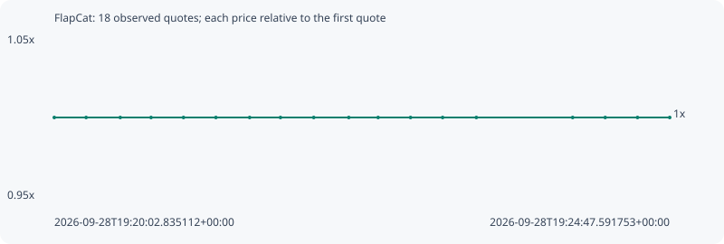

# FlapCat

**bsc** / `0x36a03f41df3e6d3fad7bc81b4d14fe57c08e7777`

[All tokens](README.md) · [Market window](../README.md)

## Native assessments

This contract is in the quote cohort; it has no native model assessment in this window.

## Series daf889e8043c292b648f

Pool: `not supplied`

[Complete series](../series/bsc/daf889e8043c292b648f.json)

Every dot is a captured quote. Lines connect observations; the curve ends at the last available quote.

| Peak | Final | Return | Maximum drawdown |
| ---: | ---: | ---: | ---: |
| 1.0000x | 1.0000x | +0.00% | 0.00% |

### Complete quote timeline

| Time (UTC) | Price (USD) | Multiple | Evidence |
| --- | ---: | ---: | --- |
| 2026-09-28T19:20:02.835112+00:00 | 1.46674e-05 | 1.0000x | `capture:adbb19f8-5a81-4d70-8990-a6ffd414f250:rank:92` |
| 2026-09-28T19:20:17.561225+00:00 | 1.46674e-05 | 1.0000x | `capture:0feecf05-56c0-4db7-a137-f63b427a7830:rank:87` |
| 2026-09-28T19:20:33.351338+00:00 | 1.46674e-05 | 1.0000x | `capture:5752259a-2bcb-4e27-ac90-6ef5a52d1cf7:rank:78` |
| 2026-09-28T19:20:47.599416+00:00 | 1.46674e-05 | 1.0000x | `capture:1ab71e23-e150-479b-a1fa-e2a362332d1e:rank:79` |
| 2026-09-28T19:21:02.616817+00:00 | 1.46674e-05 | 1.0000x | `capture:ec0d171f-d990-484a-94d1-c335d7f6e8fb:rank:80` |
| 2026-09-28T19:21:17.612081+00:00 | 1.46674e-05 | 1.0000x | `capture:cc46cbda-0be4-42ba-bcf4-4a03c9e7e894:rank:80` |
| 2026-09-28T19:21:33.217678+00:00 | 1.46674e-05 | 1.0000x | `capture:3a34cabb-e5ee-4ff6-9f92-f0839c39884f:rank:76` |
| 2026-09-28T19:21:47.485842+00:00 | 1.46674e-05 | 1.0000x | `capture:9e0730ff-182b-409c-b854-c06b993be570:rank:79` |
| 2026-09-28T19:22:02.883000+00:00 | 1.46674e-05 | 1.0000x | `capture:eb8228cb-dfba-443e-9576-ee214dcd3354:rank:81` |
| 2026-09-28T19:22:19.090071+00:00 | 1.46674e-05 | 1.0000x | `capture:30ef0b61-e0e1-4eba-95c6-de3dc48fe868:rank:80` |
| 2026-09-28T19:22:32.671189+00:00 | 1.46674e-05 | 1.0000x | `capture:5d031323-644d-4272-bacc-8a363d4b77cb:rank:83` |
| 2026-09-28T19:22:47.674643+00:00 | 1.46674e-05 | 1.0000x | `capture:c8838291-6f5a-42d9-9013-9d9421deb79e:rank:95` |
| 2026-09-28T19:23:02.516005+00:00 | 1.46674e-05 | 1.0000x | `capture:f8b60e63-80ce-442a-9ca7-659f2b5ca21d:rank:95` |
| 2026-09-28T19:23:18.123882+00:00 | 1.46674e-05 | 1.0000x | `capture:f689df34-2acf-42e7-a37b-1a7d50808302:rank:97` |
| 2026-09-28T19:24:02.684719+00:00 | 1.46674e-05 | 1.0000x | `capture:77fa5264-b080-4409-8d15-3f5504293a7d:rank:95` |
| 2026-09-28T19:24:17.754261+00:00 | 1.46674e-05 | 1.0000x | `capture:9e642626-a894-4304-aad8-bfad3e85b1e6:rank:98` |
| 2026-09-28T19:24:32.694463+00:00 | 1.46674e-05 | 1.0000x | `capture:2934d705-4adf-40dc-b5ef-2f9f3edbbe61:rank:98` |
| 2026-09-28T19:24:47.591753+00:00 | 1.46674e-05 | 1.0000x | `capture:1cb45dcb-fe83-4fcc-8cfd-c5de8d369858:rank:99` |

### Exit-policy timeline

Calculated from captured quotes under the window policy. Native assessments are linked separately above.

| Time (UTC) | Action | Price (USD) | Evidence |
| --- | --- | ---: | --- |
| 2026-09-28T19:20:02.835112+00:00 | BUY | 1.46674e-05 | `capture:adbb19f8-5a81-4d70-8990-a6ffd414f250:rank:92` |
| 2026-09-28T19:20:17.561225+00:00 | HOLD | 1.46674e-05 | `capture:0feecf05-56c0-4db7-a137-f63b427a7830:rank:87` |
| 2026-09-28T19:20:33.351338+00:00 | HOLD | 1.46674e-05 | `capture:5752259a-2bcb-4e27-ac90-6ef5a52d1cf7:rank:78` |
| 2026-09-28T19:20:47.599416+00:00 | HOLD | 1.46674e-05 | `capture:1ab71e23-e150-479b-a1fa-e2a362332d1e:rank:79` |
| 2026-09-28T19:21:02.616817+00:00 | HOLD | 1.46674e-05 | `capture:ec0d171f-d990-484a-94d1-c335d7f6e8fb:rank:80` |
| 2026-09-28T19:21:17.612081+00:00 | HOLD | 1.46674e-05 | `capture:cc46cbda-0be4-42ba-bcf4-4a03c9e7e894:rank:80` |
| 2026-09-28T19:21:33.217678+00:00 | HOLD | 1.46674e-05 | `capture:3a34cabb-e5ee-4ff6-9f92-f0839c39884f:rank:76` |
| 2026-09-28T19:21:47.485842+00:00 | HOLD | 1.46674e-05 | `capture:9e0730ff-182b-409c-b854-c06b993be570:rank:79` |
| 2026-09-28T19:22:02.883000+00:00 | HOLD | 1.46674e-05 | `capture:eb8228cb-dfba-443e-9576-ee214dcd3354:rank:81` |
| 2026-09-28T19:22:19.090071+00:00 | HOLD | 1.46674e-05 | `capture:30ef0b61-e0e1-4eba-95c6-de3dc48fe868:rank:80` |
| 2026-09-28T19:22:32.671189+00:00 | HOLD | 1.46674e-05 | `capture:5d031323-644d-4272-bacc-8a363d4b77cb:rank:83` |
| 2026-09-28T19:22:47.674643+00:00 | HOLD | 1.46674e-05 | `capture:c8838291-6f5a-42d9-9013-9d9421deb79e:rank:95` |
| 2026-09-28T19:23:02.516005+00:00 | HOLD | 1.46674e-05 | `capture:f8b60e63-80ce-442a-9ca7-659f2b5ca21d:rank:95` |
| 2026-09-28T19:23:18.123882+00:00 | HOLD | 1.46674e-05 | `capture:f689df34-2acf-42e7-a37b-1a7d50808302:rank:97` |
| 2026-09-28T19:24:02.684719+00:00 | HOLD | 1.46674e-05 | `capture:77fa5264-b080-4409-8d15-3f5504293a7d:rank:95` |
| 2026-09-28T19:24:17.754261+00:00 | HOLD | 1.46674e-05 | `capture:9e642626-a894-4304-aad8-bfad3e85b1e6:rank:98` |
| 2026-09-28T19:24:32.694463+00:00 | HOLD | 1.46674e-05 | `capture:2934d705-4adf-40dc-b5ef-2f9f3edbbe61:rank:98` |
| 2026-09-28T19:24:47.591753+00:00 | HOLD | 1.46674e-05 | `capture:1cb45dcb-fe83-4fcc-8cfd-c5de8d369858:rank:99` |
