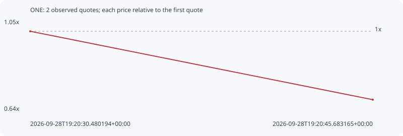

# ONE

**solana** / `Fu9bXCVogNHy5V1w8jebse4teRBPCYts3ht9yp4ipump`

[All tokens](README.md) · [Market window](../README.md)

## Native assessments

This contract is in the quote cohort; it has no native model assessment in this window.

## Series 0c676eaaecf7db8d0825

Pool: `not supplied`

[Complete series](../series/solana/0c676eaaecf7db8d0825.json)

Every dot is a captured quote. Lines connect observations; the curve ends at the last available quote.

| Peak | Final | Return | Maximum drawdown |
| ---: | ---: | ---: | ---: |
| 1.0000x | 0.6927x | -30.73% | 30.73% |

### Complete quote timeline

| Time (UTC) | Price (USD) | Multiple | Evidence |
| --- | ---: | ---: | --- |
| 2026-09-28T19:20:30.480194+00:00 | 5.63097e-06 | 1.0000x | `capture:54722132-db1d-4a2b-8c1c-2b0e71d01430:rank:60` |
| 2026-09-28T19:20:45.683165+00:00 | 3.90053e-06 | 0.6927x | `capture:17963a37-fd65-46b6-8e1c-350082721f8c:rank:53` |

### Exit-policy timeline

Calculated from captured quotes under the window policy. Native assessments are linked separately above.

| Time (UTC) | Action | Price (USD) | Evidence |
| --- | --- | ---: | --- |
| 2026-09-28T19:20:30.480194+00:00 | BUY | 5.63097e-06 | `capture:54722132-db1d-4a2b-8c1c-2b0e71d01430:rank:60` |
| 2026-09-28T19:20:45.683165+00:00 | SL | 3.90053e-06 | `capture:17963a37-fd65-46b6-8e1c-350082721f8c:rank:53` |
