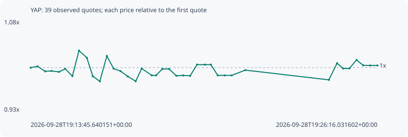

# YAP

**solana** / `jLz71QZfjnZZMLjUaCBw7KmUyftkkNq8NkWi2u9dyap`

[All tokens](README.md) · [Market window](../README.md)

## Native assessments

This contract is in the quote cohort; it has no native model assessment in this window.

## Series 5618cfbae75fcca475d2

Pool: `not supplied`

[Complete series](../series/solana/5618cfbae75fcca475d2.json)

Every dot is a captured quote. Lines connect observations; the curve ends at the last available quote.

| Peak | Final | Return | Maximum drawdown |
| ---: | ---: | ---: | ---: |
| 1.0281x | 1.0036x | +0.36% | 4.93% |

### Complete quote timeline

| Time (UTC) | Price (USD) | Multiple | Evidence |
| --- | ---: | ---: | --- |
| 2026-09-28T19:13:45.640151+00:00 | 0.00150902 | 1.0000x | `capture:4d31b656-3ffe-4768-bef6-377adf019420:rank:94` |
| 2026-09-28T19:14:00.595194+00:00 | 0.0015122 | 1.0021x | `capture:2c78112b-48e7-4f74-8c2e-1cb8642a79dc:rank:91` |
| 2026-09-28T19:14:17.246316+00:00 | 0.00149979 | 0.9939x | `capture:7a923cde-d765-4388-a15c-4f47fde0a3b5:rank:82` |
| 2026-09-28T19:14:30.874732+00:00 | 0.0015008 | 0.9946x | `capture:fa585070-b1ae-4f9d-afbd-aa986f487793:rank:83` |
| 2026-09-28T19:14:46.892387+00:00 | 0.00149842 | 0.9930x | `capture:7d9e3e65-8bda-4696-b6d1-7a86825bd98c:rank:78` |
| 2026-09-28T19:15:00.432009+00:00 | 0.00150602 | 0.9980x | `capture:797f9a41-958a-44ba-ac57-3b9cacf5d06b:rank:62` |
| 2026-09-28T19:15:16.098308+00:00 | 0.00148815 | 0.9862x | `capture:ab2becb9-3f94-4a57-b9e8-472ad0998012:rank:60` |
| 2026-09-28T19:15:30.340579+00:00 | 0.00155144 | 1.0281x | `capture:564db5fc-5586-41d3-88fb-a9a955708f1d:rank:57` |
| 2026-09-28T19:15:47.323285+00:00 | 0.00153348 | 1.0162x | `capture:65003429-a569-4442-8d4f-b2c93db69061:rank:50` |
| 2026-09-28T19:16:00.259696+00:00 | 0.00148759 | 0.9858x | `capture:4236f8d5-90c4-4c9b-a73e-d6443ae3bf32:rank:51` |
| 2026-09-28T19:16:15.455827+00:00 | 0.00147495 | 0.9774x | `capture:acc657c6-9a43-46bf-986e-7b907c831cba:rank:51` |
| 2026-09-28T19:16:30.624202+00:00 | 0.00153801 | 1.0192x | `capture:0d391072-ec81-4bb7-9be0-0d6bbb801c70:rank:51` |
| 2026-09-28T19:16:45.311485+00:00 | 0.0015065 | 0.9983x | `capture:72cccbac-c3fe-4991-8f62-08c53849b146:rank:49` |
| 2026-09-28T19:17:00.368914+00:00 | 0.00150027 | 0.9942x | `capture:1232cf18-7088-40a1-9f55-ad9ae22b44f5:rank:49` |
| 2026-09-28T19:17:15.914647+00:00 | 0.00148714 | 0.9855x | `capture:9792e199-c0c2-4272-ac95-24501e4a3f79:rank:49` |
| 2026-09-28T19:17:32.965607+00:00 | 0.00147524 | 0.9776x | `capture:0f04cfe5-88a0-4a83-ae8d-85c5cb3cdc89:rank:47` |
| 2026-09-28T19:17:46.087880+00:00 | 0.00150682 | 0.9985x | `capture:ee91a1c6-bc99-4c7a-9cdc-bd6cb5478a9b:rank:49` |
| 2026-09-28T19:18:07.749963+00:00 | 0.00148975 | 0.9872x | `capture:b0fb1b47-4973-472f-9619-8480bc7d294e:rank:53` |
| 2026-09-28T19:18:17.126008+00:00 | 0.00148975 | 0.9872x | `capture:5ed98f51-d1e1-422a-81df-4186a8b0a0a2:rank:54` |
| 2026-09-28T19:18:30.722167+00:00 | 0.00150576 | 0.9978x | `capture:9f88d118-9108-4dff-bbfc-246eaed5ce38:rank:53` |
| 2026-09-28T19:18:45.386687+00:00 | 0.00150576 | 0.9978x | `capture:f533100a-ce62-4457-9107-42e7601ea5d7:rank:55` |
| 2026-09-28T19:19:00.883835+00:00 | 0.00148875 | 0.9866x | `capture:a2495d99-5671-4c7e-b87c-48f48d90f2f2:rank:55` |
| 2026-09-28T19:19:15.826416+00:00 | 0.00148964 | 0.9872x | `capture:ba1dc6a3-b8b7-461a-8110-8490f03539a5:rank:53` |
| 2026-09-28T19:19:30.814098+00:00 | 0.0014887 | 0.9865x | `capture:b25d90dc-c8db-4388-8a2b-d06541e5320f:rank:58` |
| 2026-09-28T19:19:45.817199+00:00 | 0.00151645 | 1.0049x | `capture:722d1b7b-ef4f-4ac5-883c-0557bae2b60b:rank:56` |
| 2026-09-28T19:20:02.715590+00:00 | 0.00151645 | 1.0049x | `capture:60ff17d8-3b18-4f61-9bc7-006afd324cf2:rank:53` |
| 2026-09-28T19:20:15.699547+00:00 | 0.00151645 | 1.0049x | `capture:10a94828-637f-4580-a9f7-2fbd34d8589a:rank:70` |
| 2026-09-28T19:20:30.480194+00:00 | 0.00148976 | 0.9872x | `capture:54722132-db1d-4a2b-8c1c-2b0e71d01430:rank:77` |
| 2026-09-28T19:20:45.683165+00:00 | 0.00148976 | 0.9872x | `capture:17963a37-fd65-46b6-8e1c-350082721f8c:rank:90` |
| 2026-09-28T19:21:00.690136+00:00 | 0.00148976 | 0.9872x | `capture:f2ff842d-38e9-4cbe-a281-98c17d5a5672:rank:98` |
| 2026-09-28T19:21:30.402460+00:00 | 0.00150283 | 0.9959x | `capture:d926629b-2050-4e50-a602-1638c6205870:rank:99` |
| 2026-09-28T19:24:31.056437+00:00 | 0.00147862 | 0.9799x | `capture:971b5dda-397d-4fe7-b49e-94713bb088df:rank:94` |
| 2026-09-28T19:24:48.687179+00:00 | 0.00151996 | 1.0072x | `capture:feb72cbd-a170-4ba3-8a11-eb1df1686719:rank:98` |
| 2026-09-28T19:25:01.877958+00:00 | 0.001507 | 0.9987x | `capture:fd6d01ae-d246-439e-ac58-27ae75880eb9:rank:93` |
| 2026-09-28T19:25:15.488701+00:00 | 0.001507 | 0.9987x | `capture:b8fee87c-9981-475c-930b-99c255910a9f:rank:96` |
| 2026-09-28T19:25:30.900173+00:00 | 0.00152826 | 1.0127x | `capture:7f757769-25c3-429a-81d0-c6b2ee45ee15:rank:92` |
| 2026-09-28T19:25:45.342895+00:00 | 0.00151473 | 1.0038x | `capture:0ca3656d-ce8c-444b-8f77-acf34c08a1f4:rank:91` |
| 2026-09-28T19:26:00.340634+00:00 | 0.00151442 | 1.0036x | `capture:5b3728c5-aff9-43f3-bbb5-25b251825caa:rank:90` |
| 2026-09-28T19:26:16.031602+00:00 | 0.00151442 | 1.0036x | `capture:bb8d4bfc-85e1-4d55-a2ff-e47193bcce5f:rank:93` |

### Exit-policy timeline

Calculated from captured quotes under the window policy. Native assessments are linked separately above.

| Time (UTC) | Action | Price (USD) | Evidence |
| --- | --- | ---: | --- |
| 2026-09-28T19:13:45.640151+00:00 | BUY | 0.00150902 | `capture:4d31b656-3ffe-4768-bef6-377adf019420:rank:94` |
| 2026-09-28T19:14:00.595194+00:00 | HOLD | 0.0015122 | `capture:2c78112b-48e7-4f74-8c2e-1cb8642a79dc:rank:91` |
| 2026-09-28T19:14:17.246316+00:00 | HOLD | 0.00149979 | `capture:7a923cde-d765-4388-a15c-4f47fde0a3b5:rank:82` |
| 2026-09-28T19:14:30.874732+00:00 | HOLD | 0.0015008 | `capture:fa585070-b1ae-4f9d-afbd-aa986f487793:rank:83` |
| 2026-09-28T19:14:46.892387+00:00 | HOLD | 0.00149842 | `capture:7d9e3e65-8bda-4696-b6d1-7a86825bd98c:rank:78` |
| 2026-09-28T19:15:00.432009+00:00 | HOLD | 0.00150602 | `capture:797f9a41-958a-44ba-ac57-3b9cacf5d06b:rank:62` |
| 2026-09-28T19:15:16.098308+00:00 | HOLD | 0.00148815 | `capture:ab2becb9-3f94-4a57-b9e8-472ad0998012:rank:60` |
| 2026-09-28T19:15:30.340579+00:00 | HOLD | 0.00155144 | `capture:564db5fc-5586-41d3-88fb-a9a955708f1d:rank:57` |
| 2026-09-28T19:15:47.323285+00:00 | HOLD | 0.00153348 | `capture:65003429-a569-4442-8d4f-b2c93db69061:rank:50` |
| 2026-09-28T19:16:00.259696+00:00 | HOLD | 0.00148759 | `capture:4236f8d5-90c4-4c9b-a73e-d6443ae3bf32:rank:51` |
| 2026-09-28T19:16:15.455827+00:00 | HOLD | 0.00147495 | `capture:acc657c6-9a43-46bf-986e-7b907c831cba:rank:51` |
| 2026-09-28T19:16:30.624202+00:00 | HOLD | 0.00153801 | `capture:0d391072-ec81-4bb7-9be0-0d6bbb801c70:rank:51` |
| 2026-09-28T19:16:45.311485+00:00 | HOLD | 0.0015065 | `capture:72cccbac-c3fe-4991-8f62-08c53849b146:rank:49` |
| 2026-09-28T19:17:00.368914+00:00 | HOLD | 0.00150027 | `capture:1232cf18-7088-40a1-9f55-ad9ae22b44f5:rank:49` |
| 2026-09-28T19:17:15.914647+00:00 | HOLD | 0.00148714 | `capture:9792e199-c0c2-4272-ac95-24501e4a3f79:rank:49` |
| 2026-09-28T19:17:32.965607+00:00 | HOLD | 0.00147524 | `capture:0f04cfe5-88a0-4a83-ae8d-85c5cb3cdc89:rank:47` |
| 2026-09-28T19:17:46.087880+00:00 | HOLD | 0.00150682 | `capture:ee91a1c6-bc99-4c7a-9cdc-bd6cb5478a9b:rank:49` |
| 2026-09-28T19:18:07.749963+00:00 | HOLD | 0.00148975 | `capture:b0fb1b47-4973-472f-9619-8480bc7d294e:rank:53` |
| 2026-09-28T19:18:17.126008+00:00 | HOLD | 0.00148975 | `capture:5ed98f51-d1e1-422a-81df-4186a8b0a0a2:rank:54` |
| 2026-09-28T19:18:30.722167+00:00 | HOLD | 0.00150576 | `capture:9f88d118-9108-4dff-bbfc-246eaed5ce38:rank:53` |
| 2026-09-28T19:18:45.386687+00:00 | HOLD | 0.00150576 | `capture:f533100a-ce62-4457-9107-42e7601ea5d7:rank:55` |
| 2026-09-28T19:19:00.883835+00:00 | HOLD | 0.00148875 | `capture:a2495d99-5671-4c7e-b87c-48f48d90f2f2:rank:55` |
| 2026-09-28T19:19:15.826416+00:00 | HOLD | 0.00148964 | `capture:ba1dc6a3-b8b7-461a-8110-8490f03539a5:rank:53` |
| 2026-09-28T19:19:30.814098+00:00 | HOLD | 0.0014887 | `capture:b25d90dc-c8db-4388-8a2b-d06541e5320f:rank:58` |
| 2026-09-28T19:19:45.817199+00:00 | HOLD | 0.00151645 | `capture:722d1b7b-ef4f-4ac5-883c-0557bae2b60b:rank:56` |
| 2026-09-28T19:20:02.715590+00:00 | HOLD | 0.00151645 | `capture:60ff17d8-3b18-4f61-9bc7-006afd324cf2:rank:53` |
| 2026-09-28T19:20:15.699547+00:00 | HOLD | 0.00151645 | `capture:10a94828-637f-4580-a9f7-2fbd34d8589a:rank:70` |
| 2026-09-28T19:20:30.480194+00:00 | HOLD | 0.00148976 | `capture:54722132-db1d-4a2b-8c1c-2b0e71d01430:rank:77` |
| 2026-09-28T19:20:45.683165+00:00 | HOLD | 0.00148976 | `capture:17963a37-fd65-46b6-8e1c-350082721f8c:rank:90` |
| 2026-09-28T19:21:00.690136+00:00 | HOLD | 0.00148976 | `capture:f2ff842d-38e9-4cbe-a281-98c17d5a5672:rank:98` |
| 2026-09-28T19:21:30.402460+00:00 | HOLD | 0.00150283 | `capture:d926629b-2050-4e50-a602-1638c6205870:rank:99` |
| 2026-09-28T19:24:31.056437+00:00 | HOLD | 0.00147862 | `capture:971b5dda-397d-4fe7-b49e-94713bb088df:rank:94` |
| 2026-09-28T19:24:48.687179+00:00 | HOLD | 0.00151996 | `capture:feb72cbd-a170-4ba3-8a11-eb1df1686719:rank:98` |
| 2026-09-28T19:25:01.877958+00:00 | HOLD | 0.001507 | `capture:fd6d01ae-d246-439e-ac58-27ae75880eb9:rank:93` |
| 2026-09-28T19:25:15.488701+00:00 | HOLD | 0.001507 | `capture:b8fee87c-9981-475c-930b-99c255910a9f:rank:96` |
| 2026-09-28T19:25:30.900173+00:00 | HOLD | 0.00152826 | `capture:7f757769-25c3-429a-81d0-c6b2ee45ee15:rank:92` |
| 2026-09-28T19:25:45.342895+00:00 | HOLD | 0.00151473 | `capture:0ca3656d-ce8c-444b-8f77-acf34c08a1f4:rank:91` |
| 2026-09-28T19:26:00.340634+00:00 | HOLD | 0.00151442 | `capture:5b3728c5-aff9-43f3-bbb5-25b251825caa:rank:90` |
| 2026-09-28T19:26:16.031602+00:00 | HOLD | 0.00151442 | `capture:bb8d4bfc-85e1-4d55-a2ff-e47193bcce5f:rank:93` |
