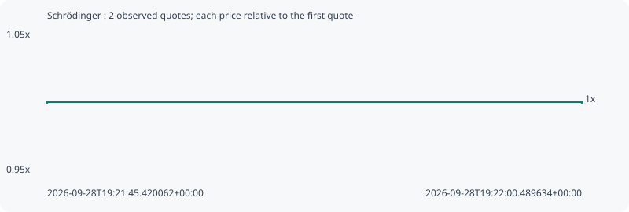

# Schrödinger

**robinhood** / `0x7638d07e58e875a8b6e91cf50dbcac270e664b73`

[All tokens](README.md) · [Market window](../README.md)

## Native assessments

This contract is in the quote cohort; it has no native model assessment in this window.

## Series 51b082e08c6565688b0f

Pool: `not supplied`

[Complete series](../series/robinhood/51b082e08c6565688b0f.json)

Every dot is a captured quote. Lines connect observations; the curve ends at the last available quote.

| Peak | Final | Return | Maximum drawdown |
| ---: | ---: | ---: | ---: |
| 1.0000x | 1.0000x | +0.00% | 0.00% |

### Complete quote timeline

| Time (UTC) | Price (USD) | Multiple | Evidence |
| --- | ---: | ---: | --- |
| 2026-09-28T19:21:45.420062+00:00 | 4.95574e-05 | 1.0000x | `capture:ec22b61b-732a-44d2-be85-c577051928eb:rank:94` |
| 2026-09-28T19:22:00.489634+00:00 | 4.95574e-05 | 1.0000x | `capture:d6c64542-18c5-48a0-a6c9-f0e2a9c54b41:rank:93` |

### Exit-policy timeline

Calculated from captured quotes under the window policy. Native assessments are linked separately above.

| Time (UTC) | Action | Price (USD) | Evidence |
| --- | --- | ---: | --- |
| 2026-09-28T19:21:45.420062+00:00 | BUY | 4.95574e-05 | `capture:ec22b61b-732a-44d2-be85-c577051928eb:rank:94` |
| 2026-09-28T19:22:00.489634+00:00 | HOLD | 4.95574e-05 | `capture:d6c64542-18c5-48a0-a6c9-f0e2a9c54b41:rank:93` |
