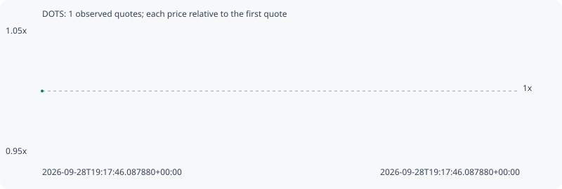

# DOTS

**solana** / `D4SjUtPFJ5H6WZnBdkXpbnqFf6K6NxSw23hm8CDW9xGa`

[All tokens](README.md) · [Market window](../README.md)

## Native assessments

This contract is in the quote cohort; it has no native model assessment in this window.

## Series f3fce75cfea80600b7ee

Pool: `not supplied`

[Complete series](../series/solana/f3fce75cfea80600b7ee.json)

Every dot is a captured quote. Lines connect observations; the curve ends at the last available quote.

Fewer than two quotes: return and drawdown are not calculated.

### Complete quote timeline

| Time (UTC) | Price (USD) | Multiple | Evidence |
| --- | ---: | ---: | --- |
| 2026-09-28T19:17:46.087880+00:00 | 4.35369e-06 | 1.0000x | `capture:ee91a1c6-bc99-4c7a-9cdc-bd6cb5478a9b:rank:73` |

### Exit-policy timeline

Calculated from captured quotes under the window policy. Native assessments are linked separately above.

| Time (UTC) | Action | Price (USD) | Evidence |
| --- | --- | ---: | --- |
