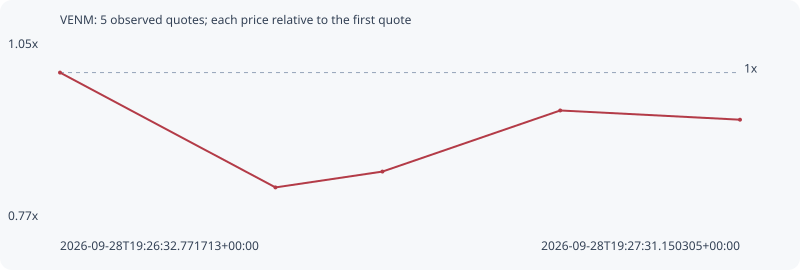

# VENM

**solana** / `DMYgPtPrRJx5cvpH9EQhXhHdMyxKVaizWvXyn712CpBw`

[All tokens](README.md) · [Market window](../README.md)

## Native assessments

This contract is in the quote cohort; it has no native model assessment in this window.

## Series 45fdffbd08a8fe0d2105

Pool: `not supplied`

[Complete series](../series/solana/45fdffbd08a8fe0d2105.json)

Every dot is a captured quote. Lines connect observations; the curve ends at the last available quote.

| Peak | Final | Return | Maximum drawdown |
| ---: | ---: | ---: | ---: |
| 1.0000x | 0.9277x | -7.23% | 17.62% |

### Complete quote timeline

| Time (UTC) | Price (USD) | Multiple | Evidence |
| --- | ---: | ---: | --- |
| 2026-09-28T19:26:32.771713+00:00 | 1.3548e-05 | 1.0000x | `capture:2fed7296-b3d1-4ba6-8398-799ee55f1f2b:rank:42` |
| 2026-09-28T19:26:51.267717+00:00 | 1.11607e-05 | 0.8238x | `capture:4cc162c2-aa4a-403b-a901-4bb5058380d6:rank:38` |
| 2026-09-28T19:27:00.453239+00:00 | 1.14902e-05 | 0.8481x | `capture:4273fbb8-5342-4e37-8d61-ced6b88e542d:rank:38` |
| 2026-09-28T19:27:15.715818+00:00 | 1.27603e-05 | 0.9419x | `capture:d04c9116-4617-4b61-8b98-5489321cd1cc:rank:38` |
| 2026-09-28T19:27:31.150305+00:00 | 1.25684e-05 | 0.9277x | `capture:7cad37e8-83d3-4438-8055-245db6707e2e:rank:36` |

### Exit-policy timeline

Calculated from captured quotes under the window policy. Native assessments are linked separately above.

| Time (UTC) | Action | Price (USD) | Evidence |
| --- | --- | ---: | --- |
| 2026-09-28T19:26:32.771713+00:00 | BUY | 1.3548e-05 | `capture:2fed7296-b3d1-4ba6-8398-799ee55f1f2b:rank:42` |
| 2026-09-28T19:26:51.267717+00:00 | SL | 1.11607e-05 | `capture:4cc162c2-aa4a-403b-a901-4bb5058380d6:rank:38` |
