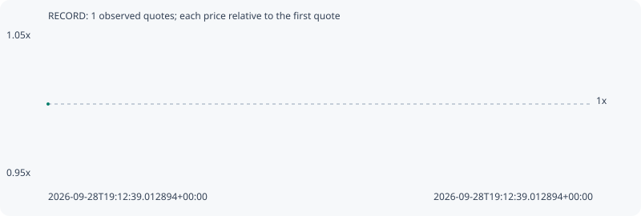

# RECORD

**robinhood** / `0x54babe7eab0516889aae26563a537c0a756f6ec3`

[All tokens](README.md) · [Market window](../README.md)

## Native assessments

This contract is in the quote cohort; it has no native model assessment in this window.

## Series 89d1ed8184f0d3a18f95

Pool: `not supplied`

[Complete series](../series/robinhood/89d1ed8184f0d3a18f95.json)

Every dot is a captured quote. Lines connect observations; the curve ends at the last available quote.

Fewer than two quotes: return and drawdown are not calculated.

### Complete quote timeline

| Time (UTC) | Price (USD) | Multiple | Evidence |
| --- | ---: | ---: | --- |
| 2026-09-28T19:12:39.012894+00:00 | 0.000685226 | 1.0000x | `capture:fe8ad944-154e-4481-bd56-8ab821bfbfe1:rank:97` |

### Exit-policy timeline

Calculated from captured quotes under the window policy. Native assessments are linked separately above.

| Time (UTC) | Action | Price (USD) | Evidence |
| --- | --- | ---: | --- |
