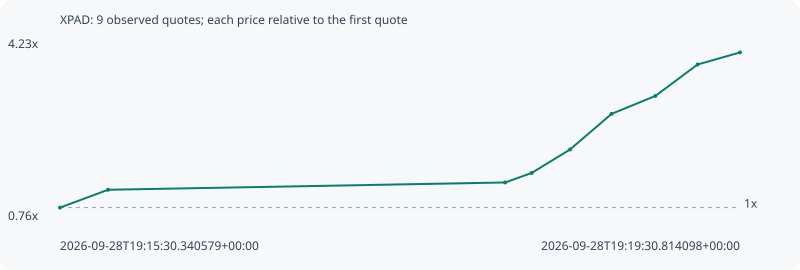

# XPAD

**solana** / `FFzTy32bZbPA8zRLbbiWoNzW2emGv86tUxaoqhz1pump`

[All tokens](README.md) · [Market window](../README.md)

## Native assessments

This contract is in the quote cohort; it has no native model assessment in this window.

## Series 9a034990d7968e2d276f

Pool: `not supplied`

[Complete series](../series/solana/9a034990d7968e2d276f.json)

Every dot is a captured quote. Lines connect observations; the curve ends at the last available quote.

| Peak | Final | Return | Maximum drawdown |
| ---: | ---: | ---: | ---: |
| 3.9952x | 3.9952x | +299.52% | 0.00% |

### Complete quote timeline

| Time (UTC) | Price (USD) | Multiple | Evidence |
| --- | ---: | ---: | --- |
| 2026-09-28T19:15:30.340579+00:00 | 0.000199324 | 1.0000x | `capture:564db5fc-5586-41d3-88fb-a9a955708f1d:rank:11` |
| 2026-09-28T19:15:47.323285+00:00 | 0.000267889 | 1.3440x | `capture:65003429-a569-4442-8d4f-b2c93db69061:rank:11` |
| 2026-09-28T19:18:07.749963+00:00 | 0.000295968 | 1.4849x | `capture:b0fb1b47-4973-472f-9619-8480bc7d294e:rank:7` |
| 2026-09-28T19:18:17.126008+00:00 | 0.000332592 | 1.6686x | `capture:5ed98f51-d1e1-422a-81df-4186a8b0a0a2:rank:7` |
| 2026-09-28T19:18:30.722167+00:00 | 0.000422987 | 2.1221x | `capture:9f88d118-9108-4dff-bbfc-246eaed5ce38:rank:7` |
| 2026-09-28T19:18:45.386687+00:00 | 0.000559858 | 2.8088x | `capture:f533100a-ce62-4457-9107-42e7601ea5d7:rank:8` |
| 2026-09-28T19:19:00.883835+00:00 | 0.000629077 | 3.1561x | `capture:a2495d99-5671-4c7e-b87c-48f48d90f2f2:rank:7` |
| 2026-09-28T19:19:15.826416+00:00 | 0.000749917 | 3.7623x | `capture:ba1dc6a3-b8b7-461a-8110-8490f03539a5:rank:8` |
| 2026-09-28T19:19:30.814098+00:00 | 0.000796346 | 3.9952x | `capture:b25d90dc-c8db-4388-8a2b-d06541e5320f:rank:8` |

### Exit-policy timeline

Calculated from captured quotes under the window policy. Native assessments are linked separately above.

| Time (UTC) | Action | Price (USD) | Evidence |
| --- | --- | ---: | --- |
| 2026-09-28T19:15:30.340579+00:00 | BUY | 0.000199324 | `capture:564db5fc-5586-41d3-88fb-a9a955708f1d:rank:11` |
| 2026-09-28T19:15:47.323285+00:00 | PROFIT | 0.000267889 | `capture:65003429-a569-4442-8d4f-b2c93db69061:rank:11` |
| 2026-09-28T19:18:07.749963+00:00 | HOLD_BAG | 0.000295968 | `capture:b0fb1b47-4973-472f-9619-8480bc7d294e:rank:7` |
| 2026-09-28T19:18:17.126008+00:00 | TP | 0.000332592 | `capture:5ed98f51-d1e1-422a-81df-4186a8b0a0a2:rank:7` |
