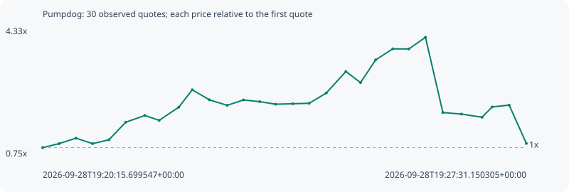

# Pumpdog

**solana** / `F518B5yf33Yed4HPp2akNzfr11xLbPE83CnBa19Upump`

[All tokens](README.md) · [Market window](../README.md)

## Native assessments

This contract is in the quote cohort; it has no native model assessment in this window.

## Series adc3adb020eb2c59f104

Pool: `not supplied`

[Complete series](../series/solana/adc3adb020eb2c59f104.json)

Every dot is a captured quote. Lines connect observations; the curve ends at the last available quote.

| Peak | Final | Return | Maximum drawdown |
| ---: | ---: | ---: | ---: |
| 4.0821x | 1.1171x | +11.71% | 72.63% |

### Complete quote timeline

| Time (UTC) | Price (USD) | Multiple | Evidence |
| --- | ---: | ---: | --- |
| 2026-09-28T19:20:15.699547+00:00 | 1.13017e-05 | 1.0000x | `capture:10a94828-637f-4580-a9f7-2fbd34d8589a:rank:35` |
| 2026-09-28T19:20:30.480194+00:00 | 1.25686e-05 | 1.1121x | `capture:54722132-db1d-4a2b-8c1c-2b0e71d01430:rank:34` |
| 2026-09-28T19:20:45.683165+00:00 | 1.42792e-05 | 1.2635x | `capture:17963a37-fd65-46b6-8e1c-350082721f8c:rank:31` |
| 2026-09-28T19:21:00.690136+00:00 | 1.25588e-05 | 1.1112x | `capture:f2ff842d-38e9-4cbe-a281-98c17d5a5672:rank:28` |
| 2026-09-28T19:21:15.372716+00:00 | 1.37881e-05 | 1.2200x | `capture:a923b968-a768-495e-ae33-6de2042c551f:rank:27` |
| 2026-09-28T19:21:30.402460+00:00 | 1.93075e-05 | 1.7084x | `capture:d926629b-2050-4e50-a602-1638c6205870:rank:22` |
| 2026-09-28T19:21:47.649380+00:00 | 2.14527e-05 | 1.8982x | `capture:0799ec6d-0e89-46b5-ae88-5695bf6c5fc3:rank:19` |
| 2026-09-28T19:22:00.569928+00:00 | 1.99073e-05 | 1.7614x | `capture:263cda40-4b31-4b2d-b168-fa4310edb46d:rank:17` |
| 2026-09-28T19:22:18.240717+00:00 | 2.40724e-05 | 2.1300x | `capture:546b2c55-1845-4da7-bc9c-4439cd0ccdba:rank:15` |
| 2026-09-28T19:22:30.371968+00:00 | 2.95499e-05 | 2.6146x | `capture:507d17cb-af67-4a81-a2b2-d5ddfbc40021:rank:13` |
| 2026-09-28T19:22:45.783808+00:00 | 2.63857e-05 | 2.3347x | `capture:9558d322-c429-480b-885f-82f4481c8506:rank:12` |
| 2026-09-28T19:23:01.833252+00:00 | 2.46504e-05 | 2.1811x | `capture:c5462412-2da1-4432-8949-8fcd1492c57f:rank:11` |
| 2026-09-28T19:23:16.460099+00:00 | 2.63461e-05 | 2.3312x | `capture:2d456a2a-6755-4e1d-9a80-b6e3b2d44ec1:rank:9` |
| 2026-09-28T19:23:31.092727+00:00 | 2.581e-05 | 2.2837x | `capture:0e687519-8b01-4d7e-b48c-e2ec34135d17:rank:9` |
| 2026-09-28T19:23:45.375171+00:00 | 2.50081e-05 | 2.2128x | `capture:1b404fa0-870b-4e7c-bafd-c3ef241c5093:rank:12` |
| 2026-09-28T19:24:00.852400+00:00 | 2.51516e-05 | 2.2255x | `capture:5205c587-4734-452c-b758-46c4814dded1:rank:12` |
| 2026-09-28T19:24:15.655418+00:00 | 2.52923e-05 | 2.2379x | `capture:5b9df0f6-51c0-4dbb-9de7-7df7a46bfee0:rank:12` |
| 2026-09-28T19:24:31.056437+00:00 | 2.85421e-05 | 2.5255x | `capture:971b5dda-397d-4fe7-b49e-94713bb088df:rank:12` |
| 2026-09-28T19:24:48.687179+00:00 | 3.53251e-05 | 3.1256x | `capture:feb72cbd-a170-4ba3-8a11-eb1df1686719:rank:12` |
| 2026-09-28T19:25:01.877958+00:00 | 3.18154e-05 | 2.8151x | `capture:fd6d01ae-d246-439e-ac58-27ae75880eb9:rank:11` |
| 2026-09-28T19:25:15.488701+00:00 | 3.90018e-05 | 3.4510x | `capture:b8fee87c-9981-475c-930b-99c255910a9f:rank:9` |
| 2026-09-28T19:25:30.900173+00:00 | 4.24754e-05 | 3.7583x | `capture:7f757769-25c3-429a-81d0-c6b2ee45ee15:rank:8` |
| 2026-09-28T19:25:45.342895+00:00 | 4.24377e-05 | 3.7550x | `capture:0ca3656d-ce8c-444b-8f77-acf34c08a1f4:rank:8` |
| 2026-09-28T19:26:00.340634+00:00 | 4.61342e-05 | 4.0821x | `capture:5b3728c5-aff9-43f3-bbb5-25b251825caa:rank:7` |
| 2026-09-28T19:26:16.031602+00:00 | 2.23754e-05 | 1.9798x | `capture:bb8d4bfc-85e1-4d55-a2ff-e47193bcce5f:rank:6` |
| 2026-09-28T19:26:32.771713+00:00 | 2.18894e-05 | 1.9368x | `capture:2fed7296-b3d1-4ba6-8398-799ee55f1f2b:rank:4` |
| 2026-09-28T19:26:51.267717+00:00 | 2.08941e-05 | 1.8488x | `capture:4cc162c2-aa4a-403b-a901-4bb5058380d6:rank:4` |
| 2026-09-28T19:27:00.453239+00:00 | 2.41481e-05 | 2.1367x | `capture:4273fbb8-5342-4e37-8d61-ced6b88e542d:rank:4` |
| 2026-09-28T19:27:15.715818+00:00 | 2.4718e-05 | 2.1871x | `capture:d04c9116-4617-4b61-8b98-5489321cd1cc:rank:4` |
| 2026-09-28T19:27:31.150305+00:00 | 1.26247e-05 | 1.1171x | `capture:7cad37e8-83d3-4438-8055-245db6707e2e:rank:3` |

### Exit-policy timeline

Calculated from captured quotes under the window policy. Native assessments are linked separately above.

| Time (UTC) | Action | Price (USD) | Evidence |
| --- | --- | ---: | --- |
| 2026-09-28T19:20:15.699547+00:00 | BUY | 1.13017e-05 | `capture:10a94828-637f-4580-a9f7-2fbd34d8589a:rank:35` |
| 2026-09-28T19:20:30.480194+00:00 | HOLD | 1.25686e-05 | `capture:54722132-db1d-4a2b-8c1c-2b0e71d01430:rank:34` |
| 2026-09-28T19:20:45.683165+00:00 | PROFIT | 1.42792e-05 | `capture:17963a37-fd65-46b6-8e1c-350082721f8c:rank:31` |
| 2026-09-28T19:21:00.690136+00:00 | HOLD_BAG | 1.25588e-05 | `capture:f2ff842d-38e9-4cbe-a281-98c17d5a5672:rank:28` |
| 2026-09-28T19:21:15.372716+00:00 | HOLD_BAG | 1.37881e-05 | `capture:a923b968-a768-495e-ae33-6de2042c551f:rank:27` |
| 2026-09-28T19:21:30.402460+00:00 | TP | 1.93075e-05 | `capture:d926629b-2050-4e50-a602-1638c6205870:rank:22` |
