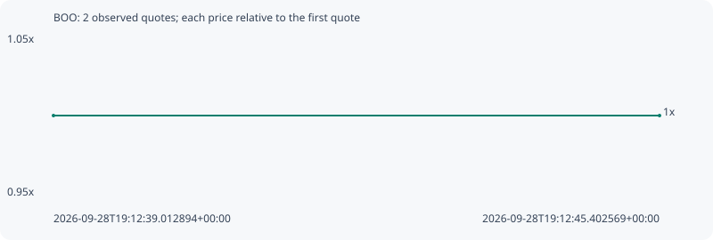

# BOO

**robinhood** / `0xabe232d69c6fe90d80b1fb54f141391dfce71e18`

[All tokens](README.md) · [Market window](../README.md)

## Native assessments

This contract is in the quote cohort; it has no native model assessment in this window.

## Series c4a720a99adb75493657

Pool: `not supplied`

[Complete series](../series/robinhood/c4a720a99adb75493657.json)

Every dot is a captured quote. Lines connect observations; the curve ends at the last available quote.

| Peak | Final | Return | Maximum drawdown |
| ---: | ---: | ---: | ---: |
| 1.0000x | 1.0000x | +0.00% | 0.00% |

### Complete quote timeline

| Time (UTC) | Price (USD) | Multiple | Evidence |
| --- | ---: | ---: | --- |
| 2026-09-28T19:12:39.012894+00:00 | 2.71984e-05 | 1.0000x | `capture:fe8ad944-154e-4481-bd56-8ab821bfbfe1:rank:48` |
| 2026-09-28T19:12:45.402569+00:00 | 2.71984e-05 | 1.0000x | `capture:8deb508c-ea33-4c21-a5c5-f0991dd6dcac:rank:51` |

### Exit-policy timeline

Calculated from captured quotes under the window policy. Native assessments are linked separately above.

| Time (UTC) | Action | Price (USD) | Evidence |
| --- | --- | ---: | --- |
| 2026-09-28T19:12:39.012894+00:00 | BUY | 2.71984e-05 | `capture:fe8ad944-154e-4481-bd56-8ab821bfbfe1:rank:48` |
| 2026-09-28T19:12:45.402569+00:00 | HOLD | 2.71984e-05 | `capture:8deb508c-ea33-4c21-a5c5-f0991dd6dcac:rank:51` |
