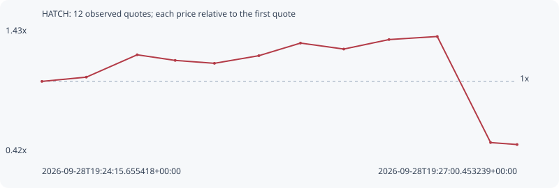

# HATCH

**solana** / `9tfFNiVpdtMKHZJY71t3QGAiuG55E9y9DWBaTgsApump`

[All tokens](README.md) · [Market window](../README.md)

## Native assessments

This contract is in the quote cohort; it has no native model assessment in this window.

## Series 53170d46737b9d40981a

Pool: `not supplied`

[Complete series](../series/solana/53170d46737b9d40981a.json)

Every dot is a captured quote. Lines connect observations; the curve ends at the last available quote.

| Peak | Final | Return | Maximum drawdown |
| ---: | ---: | ---: | ---: |
| 1.3618x | 0.4908x | -50.92% | 63.96% |

### Complete quote timeline

| Time (UTC) | Price (USD) | Multiple | Evidence |
| --- | ---: | ---: | --- |
| 2026-09-28T19:24:15.655418+00:00 | 8.58744e-06 | 1.0000x | `capture:5b9df0f6-51c0-4dbb-9de7-7df7a46bfee0:rank:50` |
| 2026-09-28T19:24:31.056437+00:00 | 8.88172e-06 | 1.0343x | `capture:971b5dda-397d-4fe7-b49e-94713bb088df:rank:45` |
| 2026-09-28T19:24:48.687179+00:00 | 1.04281e-05 | 1.2143x | `capture:feb72cbd-a170-4ba3-8a11-eb1df1686719:rank:42` |
| 2026-09-28T19:25:01.877958+00:00 | 1.00389e-05 | 1.1690x | `capture:fd6d01ae-d246-439e-ac58-27ae75880eb9:rank:40` |
| 2026-09-28T19:25:15.488701+00:00 | 9.83897e-06 | 1.1457x | `capture:b8fee87c-9981-475c-930b-99c255910a9f:rank:34` |
| 2026-09-28T19:25:30.900173+00:00 | 1.03664e-05 | 1.2072x | `capture:7f757769-25c3-429a-81d0-c6b2ee45ee15:rank:33` |
| 2026-09-28T19:25:45.342895+00:00 | 1.12387e-05 | 1.3087x | `capture:0ca3656d-ce8c-444b-8f77-acf34c08a1f4:rank:32` |
| 2026-09-28T19:26:00.340634+00:00 | 1.0825e-05 | 1.2606x | `capture:5b3728c5-aff9-43f3-bbb5-25b251825caa:rank:32` |
| 2026-09-28T19:26:16.031602+00:00 | 1.14823e-05 | 1.3371x | `capture:bb8d4bfc-85e1-4d55-a2ff-e47193bcce5f:rank:30` |
| 2026-09-28T19:26:32.771713+00:00 | 1.16948e-05 | 1.3618x | `capture:2fed7296-b3d1-4ba6-8398-799ee55f1f2b:rank:29` |
| 2026-09-28T19:26:51.267717+00:00 | 4.35216e-06 | 0.5068x | `capture:4cc162c2-aa4a-403b-a901-4bb5058380d6:rank:27` |
| 2026-09-28T19:27:00.453239+00:00 | 4.21498e-06 | 0.4908x | `capture:4273fbb8-5342-4e37-8d61-ced6b88e542d:rank:28` |

### Exit-policy timeline

Calculated from captured quotes under the window policy. Native assessments are linked separately above.

| Time (UTC) | Action | Price (USD) | Evidence |
| --- | --- | ---: | --- |
| 2026-09-28T19:24:15.655418+00:00 | BUY | 8.58744e-06 | `capture:5b9df0f6-51c0-4dbb-9de7-7df7a46bfee0:rank:50` |
| 2026-09-28T19:24:31.056437+00:00 | HOLD | 8.88172e-06 | `capture:971b5dda-397d-4fe7-b49e-94713bb088df:rank:45` |
| 2026-09-28T19:24:48.687179+00:00 | HOLD | 1.04281e-05 | `capture:feb72cbd-a170-4ba3-8a11-eb1df1686719:rank:42` |
| 2026-09-28T19:25:01.877958+00:00 | HOLD | 1.00389e-05 | `capture:fd6d01ae-d246-439e-ac58-27ae75880eb9:rank:40` |
| 2026-09-28T19:25:15.488701+00:00 | HOLD | 9.83897e-06 | `capture:b8fee87c-9981-475c-930b-99c255910a9f:rank:34` |
| 2026-09-28T19:25:30.900173+00:00 | HOLD | 1.03664e-05 | `capture:7f757769-25c3-429a-81d0-c6b2ee45ee15:rank:33` |
| 2026-09-28T19:25:45.342895+00:00 | PROFIT | 1.12387e-05 | `capture:0ca3656d-ce8c-444b-8f77-acf34c08a1f4:rank:32` |
| 2026-09-28T19:26:00.340634+00:00 | HOLD_BAG | 1.0825e-05 | `capture:5b3728c5-aff9-43f3-bbb5-25b251825caa:rank:32` |
| 2026-09-28T19:26:16.031602+00:00 | HOLD_BAG | 1.14823e-05 | `capture:bb8d4bfc-85e1-4d55-a2ff-e47193bcce5f:rank:30` |
| 2026-09-28T19:26:32.771713+00:00 | HOLD_BAG | 1.16948e-05 | `capture:2fed7296-b3d1-4ba6-8398-799ee55f1f2b:rank:29` |
| 2026-09-28T19:26:51.267717+00:00 | SL | 4.35216e-06 | `capture:4cc162c2-aa4a-403b-a901-4bb5058380d6:rank:27` |
