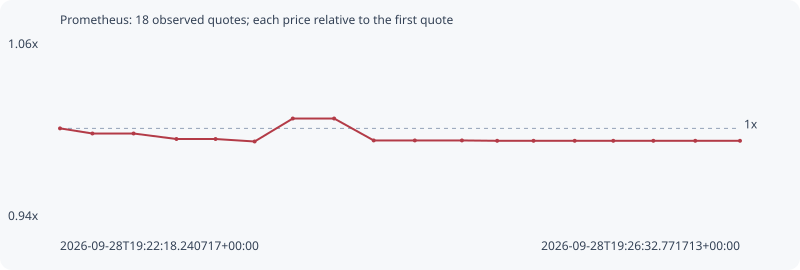

# Prometheus

**solana** / `63zfjPfH4uaX3TQZoD35WqUrqiuCQQWndMTxQHsJpump`

[All tokens](README.md) · [Market window](../README.md)

## Native assessments

This contract is in the quote cohort; it has no native model assessment in this window.

## Series 96ee1630a8315efc711b

Pool: `not supplied`

[Complete series](../series/solana/96ee1630a8315efc711b.json)

Every dot is a captured quote. Lines connect observations; the curve ends at the last available quote.

| Peak | Final | Return | Maximum drawdown |
| ---: | ---: | ---: | ---: |
| 1.0063x | 0.9921x | -0.79% | 1.41% |

### Complete quote timeline

| Time (UTC) | Price (USD) | Multiple | Evidence |
| --- | ---: | ---: | --- |
| 2026-09-28T19:22:18.240717+00:00 | 0.000429375 | 1.0000x | `capture:546b2c55-1845-4da7-bc9c-4439cd0ccdba:rank:93` |
| 2026-09-28T19:22:30.371968+00:00 | 0.000427975 | 0.9967x | `capture:507d17cb-af67-4a81-a2b2-d5ddfbc40021:rank:89` |
| 2026-09-28T19:22:45.783808+00:00 | 0.000427975 | 0.9967x | `capture:9558d322-c429-480b-885f-82f4481c8506:rank:94` |
| 2026-09-28T19:23:01.833252+00:00 | 0.000426467 | 0.9932x | `capture:c5462412-2da1-4432-8949-8fcd1492c57f:rank:91` |
| 2026-09-28T19:23:16.460099+00:00 | 0.000426467 | 0.9932x | `capture:2d456a2a-6755-4e1d-9a80-b6e3b2d44ec1:rank:92` |
| 2026-09-28T19:23:31.092727+00:00 | 0.00042579 | 0.9917x | `capture:0e687519-8b01-4d7e-b48c-e2ec34135d17:rank:88` |
| 2026-09-28T19:23:45.375171+00:00 | 0.000432075 | 1.0063x | `capture:1b404fa0-870b-4e7c-bafd-c3ef241c5093:rank:90` |
| 2026-09-28T19:24:00.852400+00:00 | 0.000432075 | 1.0063x | `capture:5205c587-4734-452c-b758-46c4814dded1:rank:89` |
| 2026-09-28T19:24:15.655418+00:00 | 0.000426077 | 0.9923x | `capture:5b9df0f6-51c0-4dbb-9de7-7df7a46bfee0:rank:78` |
| 2026-09-28T19:24:31.056437+00:00 | 0.000426077 | 0.9923x | `capture:971b5dda-397d-4fe7-b49e-94713bb088df:rank:79` |
| 2026-09-28T19:24:48.687179+00:00 | 0.000426077 | 0.9923x | `capture:feb72cbd-a170-4ba3-8a11-eb1df1686719:rank:78` |
| 2026-09-28T19:25:01.877958+00:00 | 0.000425979 | 0.9921x | `capture:fd6d01ae-d246-439e-ac58-27ae75880eb9:rank:76` |
| 2026-09-28T19:25:15.488701+00:00 | 0.000425979 | 0.9921x | `capture:b8fee87c-9981-475c-930b-99c255910a9f:rank:76` |
| 2026-09-28T19:25:30.900173+00:00 | 0.000425979 | 0.9921x | `capture:7f757769-25c3-429a-81d0-c6b2ee45ee15:rank:80` |
| 2026-09-28T19:25:45.342895+00:00 | 0.000425979 | 0.9921x | `capture:0ca3656d-ce8c-444b-8f77-acf34c08a1f4:rank:79` |
| 2026-09-28T19:26:00.340634+00:00 | 0.000425979 | 0.9921x | `capture:5b3728c5-aff9-43f3-bbb5-25b251825caa:rank:80` |
| 2026-09-28T19:26:16.031602+00:00 | 0.000425979 | 0.9921x | `capture:bb8d4bfc-85e1-4d55-a2ff-e47193bcce5f:rank:80` |
| 2026-09-28T19:26:32.771713+00:00 | 0.000425979 | 0.9921x | `capture:2fed7296-b3d1-4ba6-8398-799ee55f1f2b:rank:81` |

### Exit-policy timeline

Calculated from captured quotes under the window policy. Native assessments are linked separately above.

| Time (UTC) | Action | Price (USD) | Evidence |
| --- | --- | ---: | --- |
| 2026-09-28T19:22:18.240717+00:00 | BUY | 0.000429375 | `capture:546b2c55-1845-4da7-bc9c-4439cd0ccdba:rank:93` |
| 2026-09-28T19:22:30.371968+00:00 | HOLD | 0.000427975 | `capture:507d17cb-af67-4a81-a2b2-d5ddfbc40021:rank:89` |
| 2026-09-28T19:22:45.783808+00:00 | HOLD | 0.000427975 | `capture:9558d322-c429-480b-885f-82f4481c8506:rank:94` |
| 2026-09-28T19:23:01.833252+00:00 | HOLD | 0.000426467 | `capture:c5462412-2da1-4432-8949-8fcd1492c57f:rank:91` |
| 2026-09-28T19:23:16.460099+00:00 | HOLD | 0.000426467 | `capture:2d456a2a-6755-4e1d-9a80-b6e3b2d44ec1:rank:92` |
| 2026-09-28T19:23:31.092727+00:00 | HOLD | 0.00042579 | `capture:0e687519-8b01-4d7e-b48c-e2ec34135d17:rank:88` |
| 2026-09-28T19:23:45.375171+00:00 | HOLD | 0.000432075 | `capture:1b404fa0-870b-4e7c-bafd-c3ef241c5093:rank:90` |
| 2026-09-28T19:24:00.852400+00:00 | HOLD | 0.000432075 | `capture:5205c587-4734-452c-b758-46c4814dded1:rank:89` |
| 2026-09-28T19:24:15.655418+00:00 | HOLD | 0.000426077 | `capture:5b9df0f6-51c0-4dbb-9de7-7df7a46bfee0:rank:78` |
| 2026-09-28T19:24:31.056437+00:00 | HOLD | 0.000426077 | `capture:971b5dda-397d-4fe7-b49e-94713bb088df:rank:79` |
| 2026-09-28T19:24:48.687179+00:00 | HOLD | 0.000426077 | `capture:feb72cbd-a170-4ba3-8a11-eb1df1686719:rank:78` |
| 2026-09-28T19:25:01.877958+00:00 | HOLD | 0.000425979 | `capture:fd6d01ae-d246-439e-ac58-27ae75880eb9:rank:76` |
| 2026-09-28T19:25:15.488701+00:00 | HOLD | 0.000425979 | `capture:b8fee87c-9981-475c-930b-99c255910a9f:rank:76` |
| 2026-09-28T19:25:30.900173+00:00 | HOLD | 0.000425979 | `capture:7f757769-25c3-429a-81d0-c6b2ee45ee15:rank:80` |
| 2026-09-28T19:25:45.342895+00:00 | HOLD | 0.000425979 | `capture:0ca3656d-ce8c-444b-8f77-acf34c08a1f4:rank:79` |
| 2026-09-28T19:26:00.340634+00:00 | HOLD | 0.000425979 | `capture:5b3728c5-aff9-43f3-bbb5-25b251825caa:rank:80` |
| 2026-09-28T19:26:16.031602+00:00 | HOLD | 0.000425979 | `capture:bb8d4bfc-85e1-4d55-a2ff-e47193bcce5f:rank:80` |
| 2026-09-28T19:26:32.771713+00:00 | HOLD | 0.000425979 | `capture:2fed7296-b3d1-4ba6-8398-799ee55f1f2b:rank:81` |
