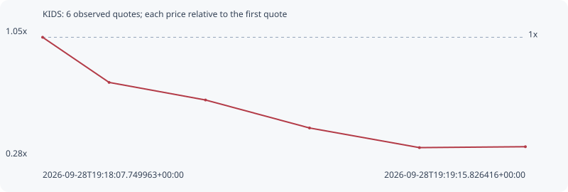

# KIDS

**solana** / `Ak3t4DtSzXxASA6wsXSyRzdMfTSvoedeMU1ym6WtaDDu`

[All tokens](README.md) · [Market window](../README.md)

## Native assessments

This contract is in the quote cohort; it has no native model assessment in this window.

## Series a203fa168c73acfbae31

Pool: `not supplied`

[Complete series](../series/solana/a203fa168c73acfbae31.json)

Every dot is a captured quote. Lines connect observations; the curve ends at the last available quote.

| Peak | Final | Return | Maximum drawdown |
| ---: | ---: | ---: | ---: |
| 1.0000x | 0.3356x | -66.44% | 66.99% |

### Complete quote timeline

| Time (UTC) | Price (USD) | Multiple | Evidence |
| --- | ---: | ---: | --- |
| 2026-09-28T19:18:07.749963+00:00 | 1.34913e-05 | 1.0000x | `capture:b0fb1b47-4973-472f-9619-8480bc7d294e:rank:29` |
| 2026-09-28T19:18:17.126008+00:00 | 9.794e-06 | 0.7259x | `capture:5ed98f51-d1e1-422a-81df-4186a8b0a0a2:rank:27` |
| 2026-09-28T19:18:30.722167+00:00 | 8.35338e-06 | 0.6192x | `capture:9f88d118-9108-4dff-bbfc-246eaed5ce38:rank:28` |
| 2026-09-28T19:18:45.386687+00:00 | 6.06193e-06 | 0.4493x | `capture:f533100a-ce62-4457-9107-42e7601ea5d7:rank:22` |
| 2026-09-28T19:19:00.883835+00:00 | 4.45333e-06 | 0.3301x | `capture:a2495d99-5671-4c7e-b87c-48f48d90f2f2:rank:20` |
| 2026-09-28T19:19:15.826416+00:00 | 4.52771e-06 | 0.3356x | `capture:ba1dc6a3-b8b7-461a-8110-8490f03539a5:rank:17` |

### Exit-policy timeline

Calculated from captured quotes under the window policy. Native assessments are linked separately above.

| Time (UTC) | Action | Price (USD) | Evidence |
| --- | --- | ---: | --- |
| 2026-09-28T19:18:07.749963+00:00 | BUY | 1.34913e-05 | `capture:b0fb1b47-4973-472f-9619-8480bc7d294e:rank:29` |
| 2026-09-28T19:18:17.126008+00:00 | SL | 9.794e-06 | `capture:5ed98f51-d1e1-422a-81df-4186a8b0a0a2:rank:27` |
