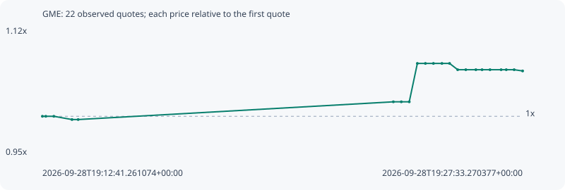

# GME

**bsc** / `0x38d58d65e280a3451634a09b2515015153bc7777`

[All tokens](README.md) · [Market window](../README.md)

## Native assessments

This contract is in the quote cohort; it has no native model assessment in this window.

## Series d033f0b00195bf1d88cc

Pool: `not supplied`

[Complete series](../series/bsc/d033f0b00195bf1d88cc.json)

Every dot is a captured quote. Lines connect observations; the curve ends at the last available quote.

| Peak | Final | Return | Maximum drawdown |
| ---: | ---: | ---: | ---: |
| 1.0749x | 1.0643x | +6.43% | 0.99% |

### Complete quote timeline

| Time (UTC) | Price (USD) | Multiple | Evidence |
| --- | ---: | ---: | --- |
| 2026-09-28T19:12:41.261074+00:00 | 0.000196376 | 1.0000x | `capture:795a88f0-804c-4f14-a3e8-ce8d9318f6df:rank:91` |
| 2026-09-28T19:12:47.639745+00:00 | 0.000196376 | 1.0000x | `capture:c2d8bd1a-9ed6-4d75-91ae-006bea65a635:rank:90` |
| 2026-09-28T19:13:02.549284+00:00 | 0.000196376 | 1.0000x | `capture:0aa38b41-b2e7-48f5-a3ba-8fd4a983fff8:rank:86` |
| 2026-09-28T19:13:36.268178+00:00 | 0.000195469 | 0.9954x | `capture:577859f6-aadc-4653-b269-a860dbe8c41c:rank:91` |
| 2026-09-28T19:13:47.694462+00:00 | 0.000195469 | 0.9954x | `capture:4e60f1a9-1927-46db-ae10-f1b1530de61d:rank:93` |
| 2026-09-28T19:23:33.140484+00:00 | 0.000200405 | 1.0205x | `capture:ef2304f7-c374-4b90-a3e4-d8976f05c226:rank:91` |
| 2026-09-28T19:23:47.927661+00:00 | 0.000200405 | 1.0205x | `capture:51aa913c-158f-4059-8727-ff1ace24834c:rank:89` |
| 2026-09-28T19:24:02.684719+00:00 | 0.000200405 | 1.0205x | `capture:77fa5264-b080-4409-8d15-3f5504293a7d:rank:87` |
| 2026-09-28T19:24:17.754261+00:00 | 0.000211092 | 1.0749x | `capture:9e642626-a894-4304-aad8-bfad3e85b1e6:rank:72` |
| 2026-09-28T19:24:32.694463+00:00 | 0.000211092 | 1.0749x | `capture:2934d705-4adf-40dc-b5ef-2f9f3edbbe61:rank:74` |
| 2026-09-28T19:24:47.591753+00:00 | 0.000211092 | 1.0749x | `capture:1cb45dcb-fe83-4fcc-8cfd-c5de8d369858:rank:89` |
| 2026-09-28T19:25:03.394485+00:00 | 0.000211092 | 1.0749x | `capture:f1b0620f-7caf-483d-8db4-440b4d786962:rank:89` |
| 2026-09-28T19:25:17.566680+00:00 | 0.000211092 | 1.0749x | `capture:89c3d45d-a145-4312-88dc-a4340e727616:rank:91` |
| 2026-09-28T19:25:32.640282+00:00 | 0.000209343 | 1.0660x | `capture:a41f01eb-b1b7-4ed5-a604-19b71e522502:rank:77` |
| 2026-09-28T19:25:47.745538+00:00 | 0.000209343 | 1.0660x | `capture:b20e5ea5-a03d-4b94-91ce-404a72f5de9b:rank:74` |
| 2026-09-28T19:26:06.431923+00:00 | 0.000209343 | 1.0660x | `capture:a3278748-b5f3-45be-a966-ab473520d9c2:rank:73` |
| 2026-09-28T19:26:17.917162+00:00 | 0.000209343 | 1.0660x | `capture:3b80c987-c82b-4a3e-8f0b-d3017a78edcb:rank:71` |
| 2026-09-28T19:26:32.687411+00:00 | 0.000209343 | 1.0660x | `capture:d1fef60a-e7ad-4594-a8e8-74ee96c47ae4:rank:71` |
| 2026-09-28T19:26:53.320509+00:00 | 0.000209343 | 1.0660x | `capture:5f09420c-1544-46ff-a2e4-39235f8f73a9:rank:72` |
| 2026-09-28T19:27:02.865937+00:00 | 0.000209343 | 1.0660x | `capture:bd21661a-974d-4bab-9276-4e2f7e7d279a:rank:72` |
| 2026-09-28T19:27:17.494949+00:00 | 0.000209343 | 1.0660x | `capture:c5d9da1a-7d95-4d7f-8cef-ffb660ac56d0:rank:70` |
| 2026-09-28T19:27:33.270377+00:00 | 0.000208996 | 1.0643x | `capture:1cb6d037-a95b-477e-be82-4cc75b729c8b:rank:69` |

### Exit-policy timeline

Calculated from captured quotes under the window policy. Native assessments are linked separately above.

| Time (UTC) | Action | Price (USD) | Evidence |
| --- | --- | ---: | --- |
| 2026-09-28T19:12:41.261074+00:00 | BUY | 0.000196376 | `capture:795a88f0-804c-4f14-a3e8-ce8d9318f6df:rank:91` |
| 2026-09-28T19:12:47.639745+00:00 | HOLD | 0.000196376 | `capture:c2d8bd1a-9ed6-4d75-91ae-006bea65a635:rank:90` |
| 2026-09-28T19:13:02.549284+00:00 | HOLD | 0.000196376 | `capture:0aa38b41-b2e7-48f5-a3ba-8fd4a983fff8:rank:86` |
| 2026-09-28T19:13:36.268178+00:00 | HOLD | 0.000195469 | `capture:577859f6-aadc-4653-b269-a860dbe8c41c:rank:91` |
| 2026-09-28T19:13:47.694462+00:00 | HOLD | 0.000195469 | `capture:4e60f1a9-1927-46db-ae10-f1b1530de61d:rank:93` |
| 2026-09-28T19:23:33.140484+00:00 | HOLD | 0.000200405 | `capture:ef2304f7-c374-4b90-a3e4-d8976f05c226:rank:91` |
| 2026-09-28T19:23:47.927661+00:00 | HOLD | 0.000200405 | `capture:51aa913c-158f-4059-8727-ff1ace24834c:rank:89` |
| 2026-09-28T19:24:02.684719+00:00 | HOLD | 0.000200405 | `capture:77fa5264-b080-4409-8d15-3f5504293a7d:rank:87` |
| 2026-09-28T19:24:17.754261+00:00 | HOLD | 0.000211092 | `capture:9e642626-a894-4304-aad8-bfad3e85b1e6:rank:72` |
| 2026-09-28T19:24:32.694463+00:00 | HOLD | 0.000211092 | `capture:2934d705-4adf-40dc-b5ef-2f9f3edbbe61:rank:74` |
| 2026-09-28T19:24:47.591753+00:00 | HOLD | 0.000211092 | `capture:1cb45dcb-fe83-4fcc-8cfd-c5de8d369858:rank:89` |
| 2026-09-28T19:25:03.394485+00:00 | HOLD | 0.000211092 | `capture:f1b0620f-7caf-483d-8db4-440b4d786962:rank:89` |
| 2026-09-28T19:25:17.566680+00:00 | HOLD | 0.000211092 | `capture:89c3d45d-a145-4312-88dc-a4340e727616:rank:91` |
| 2026-09-28T19:25:32.640282+00:00 | HOLD | 0.000209343 | `capture:a41f01eb-b1b7-4ed5-a604-19b71e522502:rank:77` |
| 2026-09-28T19:25:47.745538+00:00 | HOLD | 0.000209343 | `capture:b20e5ea5-a03d-4b94-91ce-404a72f5de9b:rank:74` |
| 2026-09-28T19:26:06.431923+00:00 | HOLD | 0.000209343 | `capture:a3278748-b5f3-45be-a966-ab473520d9c2:rank:73` |
| 2026-09-28T19:26:17.917162+00:00 | HOLD | 0.000209343 | `capture:3b80c987-c82b-4a3e-8f0b-d3017a78edcb:rank:71` |
| 2026-09-28T19:26:32.687411+00:00 | HOLD | 0.000209343 | `capture:d1fef60a-e7ad-4594-a8e8-74ee96c47ae4:rank:71` |
| 2026-09-28T19:26:53.320509+00:00 | HOLD | 0.000209343 | `capture:5f09420c-1544-46ff-a2e4-39235f8f73a9:rank:72` |
| 2026-09-28T19:27:02.865937+00:00 | HOLD | 0.000209343 | `capture:bd21661a-974d-4bab-9276-4e2f7e7d279a:rank:72` |
| 2026-09-28T19:27:17.494949+00:00 | HOLD | 0.000209343 | `capture:c5d9da1a-7d95-4d7f-8cef-ffb660ac56d0:rank:70` |
| 2026-09-28T19:27:33.270377+00:00 | HOLD | 0.000208996 | `capture:1cb6d037-a95b-477e-be82-4cc75b729c8b:rank:69` |
