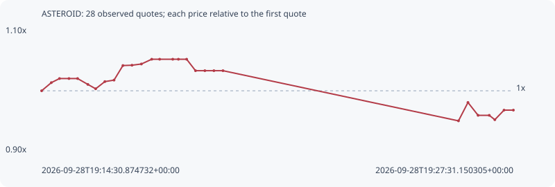

# ASTEROID

**solana** / `7cXWSNTq71PZREBmGCBvZirkNwoGokWBQz9fWferViiV`

[All tokens](README.md) · [Market window](../README.md)

## Native assessments

This contract is in the quote cohort; it has no native model assessment in this window.

## Series 80bf3512867a71042514

Pool: `not supplied`

[Complete series](../series/solana/80bf3512867a71042514.json)

Every dot is a captured quote. Lines connect observations; the curve ends at the last available quote.

| Peak | Final | Return | Maximum drawdown |
| ---: | ---: | ---: | ---: |
| 1.0500x | 0.9693x | -3.07% | 9.31% |

### Complete quote timeline

| Time (UTC) | Price (USD) | Multiple | Evidence |
| --- | ---: | ---: | --- |
| 2026-09-28T19:14:30.874732+00:00 | 0.000443129 | 1.0000x | `capture:fa585070-b1ae-4f9d-afbd-aa986f487793:rank:93` |
| 2026-09-28T19:14:46.892387+00:00 | 0.000448834 | 1.0129x | `capture:7d9e3e65-8bda-4696-b6d1-7a86825bd98c:rank:86` |
| 2026-09-28T19:15:00.432009+00:00 | 0.000451724 | 1.0194x | `capture:797f9a41-958a-44ba-ac57-3b9cacf5d06b:rank:83` |
| 2026-09-28T19:15:16.098308+00:00 | 0.000451724 | 1.0194x | `capture:ab2becb9-3f94-4a57-b9e8-472ad0998012:rank:83` |
| 2026-09-28T19:15:30.340579+00:00 | 0.000451724 | 1.0194x | `capture:564db5fc-5586-41d3-88fb-a9a955708f1d:rank:84` |
| 2026-09-28T19:15:47.323285+00:00 | 0.000447605 | 1.0101x | `capture:65003429-a569-4442-8d4f-b2c93db69061:rank:79` |
| 2026-09-28T19:16:00.259696+00:00 | 0.000444531 | 1.0032x | `capture:4236f8d5-90c4-4c9b-a73e-d6443ae3bf32:rank:78` |
| 2026-09-28T19:16:15.455827+00:00 | 0.000449582 | 1.0146x | `capture:acc657c6-9a43-46bf-986e-7b907c831cba:rank:80` |
| 2026-09-28T19:16:30.624202+00:00 | 0.000450617 | 1.0169x | `capture:0d391072-ec81-4bb7-9be0-0d6bbb801c70:rank:75` |
| 2026-09-28T19:16:45.311485+00:00 | 0.000460865 | 1.0400x | `capture:72cccbac-c3fe-4991-8f62-08c53849b146:rank:76` |
| 2026-09-28T19:17:00.368914+00:00 | 0.000461095 | 1.0405x | `capture:1232cf18-7088-40a1-9f55-ad9ae22b44f5:rank:78` |
| 2026-09-28T19:17:15.914647+00:00 | 0.000461949 | 1.0425x | `capture:9792e199-c0c2-4272-ac95-24501e4a3f79:rank:78` |
| 2026-09-28T19:17:32.965607+00:00 | 0.0004653 | 1.0500x | `capture:0f04cfe5-88a0-4a83-ae8d-85c5cb3cdc89:rank:74` |
| 2026-09-28T19:17:46.087880+00:00 | 0.0004653 | 1.0500x | `capture:ee91a1c6-bc99-4c7a-9cdc-bd6cb5478a9b:rank:76` |
| 2026-09-28T19:18:07.749963+00:00 | 0.0004653 | 1.0500x | `capture:b0fb1b47-4973-472f-9619-8480bc7d294e:rank:77` |
| 2026-09-28T19:18:17.126008+00:00 | 0.0004653 | 1.0500x | `capture:5ed98f51-d1e1-422a-81df-4186a8b0a0a2:rank:76` |
| 2026-09-28T19:18:30.722167+00:00 | 0.0004653 | 1.0500x | `capture:9f88d118-9108-4dff-bbfc-246eaed5ce38:rank:81` |
| 2026-09-28T19:18:45.386687+00:00 | 0.000457251 | 1.0319x | `capture:f533100a-ce62-4457-9107-42e7601ea5d7:rank:81` |
| 2026-09-28T19:19:00.883835+00:00 | 0.000457251 | 1.0319x | `capture:a2495d99-5671-4c7e-b87c-48f48d90f2f2:rank:83` |
| 2026-09-28T19:19:15.826416+00:00 | 0.000457251 | 1.0319x | `capture:ba1dc6a3-b8b7-461a-8110-8490f03539a5:rank:84` |
| 2026-09-28T19:19:30.814098+00:00 | 0.000457251 | 1.0319x | `capture:b25d90dc-c8db-4388-8a2b-d06541e5320f:rank:82` |
| 2026-09-28T19:26:00.340634+00:00 | 0.000421995 | 0.9523x | `capture:5b3728c5-aff9-43f3-bbb5-25b251825caa:rank:79` |
| 2026-09-28T19:26:16.031602+00:00 | 0.000434912 | 0.9815x | `capture:bb8d4bfc-85e1-4d55-a2ff-e47193bcce5f:rank:79` |
| 2026-09-28T19:26:32.771713+00:00 | 0.000425878 | 0.9611x | `capture:2fed7296-b3d1-4ba6-8398-799ee55f1f2b:rank:86` |
| 2026-09-28T19:26:51.267717+00:00 | 0.000425878 | 0.9611x | `capture:4cc162c2-aa4a-403b-a901-4bb5058380d6:rank:85` |
| 2026-09-28T19:27:00.453239+00:00 | 0.00042279 | 0.9541x | `capture:4273fbb8-5342-4e37-8d61-ced6b88e542d:rank:87` |
| 2026-09-28T19:27:15.715818+00:00 | 0.00042953 | 0.9693x | `capture:d04c9116-4617-4b61-8b98-5489321cd1cc:rank:81` |
| 2026-09-28T19:27:31.150305+00:00 | 0.00042953 | 0.9693x | `capture:7cad37e8-83d3-4438-8055-245db6707e2e:rank:82` |

### Exit-policy timeline

Calculated from captured quotes under the window policy. Native assessments are linked separately above.

| Time (UTC) | Action | Price (USD) | Evidence |
| --- | --- | ---: | --- |
| 2026-09-28T19:14:30.874732+00:00 | BUY | 0.000443129 | `capture:fa585070-b1ae-4f9d-afbd-aa986f487793:rank:93` |
| 2026-09-28T19:14:46.892387+00:00 | HOLD | 0.000448834 | `capture:7d9e3e65-8bda-4696-b6d1-7a86825bd98c:rank:86` |
| 2026-09-28T19:15:00.432009+00:00 | HOLD | 0.000451724 | `capture:797f9a41-958a-44ba-ac57-3b9cacf5d06b:rank:83` |
| 2026-09-28T19:15:16.098308+00:00 | HOLD | 0.000451724 | `capture:ab2becb9-3f94-4a57-b9e8-472ad0998012:rank:83` |
| 2026-09-28T19:15:30.340579+00:00 | HOLD | 0.000451724 | `capture:564db5fc-5586-41d3-88fb-a9a955708f1d:rank:84` |
| 2026-09-28T19:15:47.323285+00:00 | HOLD | 0.000447605 | `capture:65003429-a569-4442-8d4f-b2c93db69061:rank:79` |
| 2026-09-28T19:16:00.259696+00:00 | HOLD | 0.000444531 | `capture:4236f8d5-90c4-4c9b-a73e-d6443ae3bf32:rank:78` |
| 2026-09-28T19:16:15.455827+00:00 | HOLD | 0.000449582 | `capture:acc657c6-9a43-46bf-986e-7b907c831cba:rank:80` |
| 2026-09-28T19:16:30.624202+00:00 | HOLD | 0.000450617 | `capture:0d391072-ec81-4bb7-9be0-0d6bbb801c70:rank:75` |
| 2026-09-28T19:16:45.311485+00:00 | HOLD | 0.000460865 | `capture:72cccbac-c3fe-4991-8f62-08c53849b146:rank:76` |
| 2026-09-28T19:17:00.368914+00:00 | HOLD | 0.000461095 | `capture:1232cf18-7088-40a1-9f55-ad9ae22b44f5:rank:78` |
| 2026-09-28T19:17:15.914647+00:00 | HOLD | 0.000461949 | `capture:9792e199-c0c2-4272-ac95-24501e4a3f79:rank:78` |
| 2026-09-28T19:17:32.965607+00:00 | HOLD | 0.0004653 | `capture:0f04cfe5-88a0-4a83-ae8d-85c5cb3cdc89:rank:74` |
| 2026-09-28T19:17:46.087880+00:00 | HOLD | 0.0004653 | `capture:ee91a1c6-bc99-4c7a-9cdc-bd6cb5478a9b:rank:76` |
| 2026-09-28T19:18:07.749963+00:00 | HOLD | 0.0004653 | `capture:b0fb1b47-4973-472f-9619-8480bc7d294e:rank:77` |
| 2026-09-28T19:18:17.126008+00:00 | HOLD | 0.0004653 | `capture:5ed98f51-d1e1-422a-81df-4186a8b0a0a2:rank:76` |
| 2026-09-28T19:18:30.722167+00:00 | HOLD | 0.0004653 | `capture:9f88d118-9108-4dff-bbfc-246eaed5ce38:rank:81` |
| 2026-09-28T19:18:45.386687+00:00 | HOLD | 0.000457251 | `capture:f533100a-ce62-4457-9107-42e7601ea5d7:rank:81` |
| 2026-09-28T19:19:00.883835+00:00 | HOLD | 0.000457251 | `capture:a2495d99-5671-4c7e-b87c-48f48d90f2f2:rank:83` |
| 2026-09-28T19:19:15.826416+00:00 | HOLD | 0.000457251 | `capture:ba1dc6a3-b8b7-461a-8110-8490f03539a5:rank:84` |
| 2026-09-28T19:19:30.814098+00:00 | HOLD | 0.000457251 | `capture:b25d90dc-c8db-4388-8a2b-d06541e5320f:rank:82` |
| 2026-09-28T19:26:00.340634+00:00 | HOLD | 0.000421995 | `capture:5b3728c5-aff9-43f3-bbb5-25b251825caa:rank:79` |
| 2026-09-28T19:26:16.031602+00:00 | HOLD | 0.000434912 | `capture:bb8d4bfc-85e1-4d55-a2ff-e47193bcce5f:rank:79` |
| 2026-09-28T19:26:32.771713+00:00 | HOLD | 0.000425878 | `capture:2fed7296-b3d1-4ba6-8398-799ee55f1f2b:rank:86` |
| 2026-09-28T19:26:51.267717+00:00 | HOLD | 0.000425878 | `capture:4cc162c2-aa4a-403b-a901-4bb5058380d6:rank:85` |
| 2026-09-28T19:27:00.453239+00:00 | HOLD | 0.00042279 | `capture:4273fbb8-5342-4e37-8d61-ced6b88e542d:rank:87` |
| 2026-09-28T19:27:15.715818+00:00 | HOLD | 0.00042953 | `capture:d04c9116-4617-4b61-8b98-5489321cd1cc:rank:81` |
| 2026-09-28T19:27:31.150305+00:00 | HOLD | 0.00042953 | `capture:7cad37e8-83d3-4438-8055-245db6707e2e:rank:82` |
