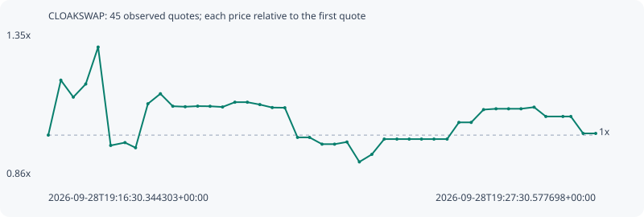

# CLOAKSWAP

**robinhood** / `0xa8936b7148efda48226de8c06706c8f7b0f85c98`

[All tokens](README.md) · [Market window](../README.md)

## Native assessments

This contract is in the quote cohort; it has no native model assessment in this window.

## Series 5aafd500498c1a2694fc

Pool: `not supplied`

[Complete series](../series/robinhood/5aafd500498c1a2694fc.json)

Every dot is a captured quote. Lines connect observations; the curve ends at the last available quote.

| Peak | Final | Return | Maximum drawdown |
| ---: | ---: | ---: | ---: |
| 1.2951x | 1.0056x | +0.56% | 29.72% |

### Complete quote timeline

| Time (UTC) | Price (USD) | Multiple | Evidence |
| --- | ---: | ---: | --- |
| 2026-09-28T19:16:30.344303+00:00 | 7.75496e-05 | 1.0000x | `capture:18d587e7-b24d-4b8d-82f1-0ac2903a3303:rank:18` |
| 2026-09-28T19:16:45.486467+00:00 | 9.1821e-05 | 1.1840x | `capture:4ca26bf7-9d1e-455b-a63e-1b5df831b997:rank:14` |
| 2026-09-28T19:17:00.510014+00:00 | 8.74247e-05 | 1.1273x | `capture:d9309a4d-09d7-45ee-91ce-c4a055e8faac:rank:14` |
| 2026-09-28T19:17:15.523068+00:00 | 9.08376e-05 | 1.1713x | `capture:333d670d-dbd3-4656-95f9-1bc781b271db:rank:14` |
| 2026-09-28T19:17:30.451540+00:00 | 0.000100438 | 1.2951x | `capture:e161007c-0751-46e4-acc9-c8e28cd7190a:rank:13` |
| 2026-09-28T19:17:45.582227+00:00 | 7.48632e-05 | 0.9654x | `capture:a3f98285-516a-4bd4-b2c4-63596c968a6b:rank:12` |
| 2026-09-28T19:18:02.849542+00:00 | 7.56026e-05 | 0.9749x | `capture:53a348cd-74d6-4031-ba2b-02d70c63e42b:rank:12` |
| 2026-09-28T19:18:15.585380+00:00 | 7.42669e-05 | 0.9577x | `capture:ea19027f-d2c1-43cc-973f-0d8eb46ed64e:rank:11` |
| 2026-09-28T19:18:30.489414+00:00 | 8.56996e-05 | 1.1051x | `capture:c5cd70df-4ca4-4388-b3c5-f977fa86f8a2:rank:10` |
| 2026-09-28T19:18:45.550203+00:00 | 8.83018e-05 | 1.1386x | `capture:728d4974-5fe3-40a8-8e99-2139c59da3e3:rank:10` |
| 2026-09-28T19:19:00.487408+00:00 | 8.50599e-05 | 1.0968x | `capture:297e4fae-3bb5-49eb-b490-a4f34898851c:rank:10` |
| 2026-09-28T19:19:15.451095+00:00 | 8.49257e-05 | 1.0951x | `capture:0bcc0576-3637-4b2c-b0e4-f9e05871b187:rank:9` |
| 2026-09-28T19:19:30.512866+00:00 | 8.50825e-05 | 1.0971x | `capture:bb499bdc-159a-4072-a450-312045f32cef:rank:9` |
| 2026-09-28T19:19:45.438706+00:00 | 8.50479e-05 | 1.0967x | `capture:59b12f7b-2112-42c7-834a-a2eb9bcaee3d:rank:8` |
| 2026-09-28T19:20:00.494705+00:00 | 8.48631e-05 | 1.0943x | `capture:5b06d6b3-9eca-4487-82fb-6b28820c37d9:rank:9` |
| 2026-09-28T19:20:15.393373+00:00 | 8.61061e-05 | 1.1103x | `capture:17802da9-7cee-48c3-9f5b-5829781be3f6:rank:10` |
| 2026-09-28T19:20:30.417446+00:00 | 8.61061e-05 | 1.1103x | `capture:f2fe9ac4-89a0-4ad3-8f15-5a70d7e1d5f7:rank:10` |
| 2026-09-28T19:20:45.464282+00:00 | 8.5492e-05 | 1.1024x | `capture:26559b75-812f-4386-982b-eba5073faf44:rank:10` |
| 2026-09-28T19:21:00.449260+00:00 | 8.4714e-05 | 1.0924x | `capture:186445b2-8971-4639-85b9-26b2e8fb9d2c:rank:8` |
| 2026-09-28T19:21:15.606838+00:00 | 8.46652e-05 | 1.0918x | `capture:c2a8ab31-038e-42f4-8e33-852fee1b9a24:rank:7` |
| 2026-09-28T19:21:30.959683+00:00 | 7.69544e-05 | 0.9923x | `capture:300e0f35-12d4-46a9-a17e-17adbe8e1059:rank:7` |
| 2026-09-28T19:21:45.420062+00:00 | 7.69544e-05 | 0.9923x | `capture:ec22b61b-732a-44d2-be85-c577051928eb:rank:12` |
| 2026-09-28T19:22:00.489634+00:00 | 7.51994e-05 | 0.9697x | `capture:d6c64542-18c5-48a0-a6c9-f0e2a9c54b41:rank:15` |
| 2026-09-28T19:22:15.632268+00:00 | 7.51994e-05 | 0.9697x | `capture:13e6d33e-e854-4b87-b3da-49aedec6950e:rank:13` |
| 2026-09-28T19:22:30.535979+00:00 | 7.57614e-05 | 0.9769x | `capture:091fb4d2-10fc-4d5f-9c22-af9f55e90e4a:rank:12` |
| 2026-09-28T19:22:45.520851+00:00 | 7.0586e-05 | 0.9102x | `capture:128617a9-4055-4a8d-8b04-c8876bad9c70:rank:16` |
| 2026-09-28T19:23:00.594785+00:00 | 7.25475e-05 | 0.9355x | `capture:b6c633f1-3960-4db3-a2ca-34618f913368:rank:18` |
| 2026-09-28T19:23:15.534636+00:00 | 7.65186e-05 | 0.9867x | `capture:d5a0d1a4-a366-4985-80da-e34160e2f58c:rank:19` |
| 2026-09-28T19:23:30.815940+00:00 | 7.65186e-05 | 0.9867x | `capture:c6f23ed9-c47c-4f73-bf08-86a494a11aa2:rank:21` |
| 2026-09-28T19:23:45.643860+00:00 | 7.65186e-05 | 0.9867x | `capture:0b8bbeb9-cbaa-4cb2-a853-2bb146bd23e5:rank:28` |
| 2026-09-28T19:24:00.467430+00:00 | 7.65186e-05 | 0.9867x | `capture:4a231962-827e-445d-ab7d-bb974bfc841b:rank:30` |
| 2026-09-28T19:24:15.505143+00:00 | 7.65186e-05 | 0.9867x | `capture:b7273a78-8f87-4dcc-877e-f47f549e0fe8:rank:34` |
| 2026-09-28T19:24:31.344409+00:00 | 7.65186e-05 | 0.9867x | `capture:85f4db1c-c852-45c3-99aa-4320f3839031:rank:38` |
| 2026-09-28T19:24:45.576445+00:00 | 8.08549e-05 | 1.0426x | `capture:da07dfaa-56d9-4a51-99df-1ad071803eb0:rank:41` |
| 2026-09-28T19:25:00.412700+00:00 | 8.08549e-05 | 1.0426x | `capture:1dec2f8f-4694-4c32-8be8-eeec3980c853:rank:46` |
| 2026-09-28T19:25:15.316372+00:00 | 8.4177e-05 | 1.0855x | `capture:52eaf5a3-351e-4c29-b00b-a167107703e3:rank:46` |
| 2026-09-28T19:25:30.354898+00:00 | 8.43957e-05 | 1.0883x | `capture:d70b1f6a-3ec3-4ec2-8c88-db476beae4f9:rank:47` |
| 2026-09-28T19:25:45.483791+00:00 | 8.43957e-05 | 1.0883x | `capture:ebb21e05-3dc6-4a8f-a800-fa79ba147200:rank:48` |
| 2026-09-28T19:26:00.522113+00:00 | 8.43957e-05 | 1.0883x | `capture:a33301e4-8f37-4fb5-af69-629635c54fe6:rank:56` |
| 2026-09-28T19:26:16.279485+00:00 | 8.48155e-05 | 1.0937x | `capture:085b2ea9-3985-4608-a1cd-1eddc6b16122:rank:54` |
| 2026-09-28T19:26:30.447392+00:00 | 8.23923e-05 | 1.0624x | `capture:36fd4b46-5420-443d-b1ed-b86b98706671:rank:51` |
| 2026-09-28T19:26:51.039990+00:00 | 8.23923e-05 | 1.0624x | `capture:653b62fa-7a58-45fd-95e9-3b36912dc139:rank:65` |
| 2026-09-28T19:27:00.598930+00:00 | 8.23923e-05 | 1.0624x | `capture:8041f6b0-6188-445c-83ef-3a6fb7daf321:rank:69` |
| 2026-09-28T19:27:15.438746+00:00 | 7.79874e-05 | 1.0056x | `capture:b4c48612-e04d-4782-96a6-e80c2955d3b9:rank:67` |
| 2026-09-28T19:27:30.577698+00:00 | 7.79874e-05 | 1.0056x | `capture:ff6b3949-9c3c-4cdf-b48c-d4010666c140:rank:68` |

### Exit-policy timeline

Calculated from captured quotes under the window policy. Native assessments are linked separately above.

| Time (UTC) | Action | Price (USD) | Evidence |
| --- | --- | ---: | --- |
| 2026-09-28T19:16:30.344303+00:00 | BUY | 7.75496e-05 | `capture:18d587e7-b24d-4b8d-82f1-0ac2903a3303:rank:18` |
| 2026-09-28T19:16:45.486467+00:00 | HOLD | 9.1821e-05 | `capture:4ca26bf7-9d1e-455b-a63e-1b5df831b997:rank:14` |
| 2026-09-28T19:17:00.510014+00:00 | HOLD | 8.74247e-05 | `capture:d9309a4d-09d7-45ee-91ce-c4a055e8faac:rank:14` |
| 2026-09-28T19:17:15.523068+00:00 | HOLD | 9.08376e-05 | `capture:333d670d-dbd3-4656-95f9-1bc781b271db:rank:14` |
| 2026-09-28T19:17:30.451540+00:00 | PROFIT | 0.000100438 | `capture:e161007c-0751-46e4-acc9-c8e28cd7190a:rank:13` |
| 2026-09-28T19:17:45.582227+00:00 | HOLD_BAG | 7.48632e-05 | `capture:a3f98285-516a-4bd4-b2c4-63596c968a6b:rank:12` |
| 2026-09-28T19:18:02.849542+00:00 | HOLD_BAG | 7.56026e-05 | `capture:53a348cd-74d6-4031-ba2b-02d70c63e42b:rank:12` |
| 2026-09-28T19:18:15.585380+00:00 | HOLD_BAG | 7.42669e-05 | `capture:ea19027f-d2c1-43cc-973f-0d8eb46ed64e:rank:11` |
| 2026-09-28T19:18:30.489414+00:00 | HOLD_BAG | 8.56996e-05 | `capture:c5cd70df-4ca4-4388-b3c5-f977fa86f8a2:rank:10` |
| 2026-09-28T19:18:45.550203+00:00 | HOLD_BAG | 8.83018e-05 | `capture:728d4974-5fe3-40a8-8e99-2139c59da3e3:rank:10` |
| 2026-09-28T19:19:00.487408+00:00 | HOLD_BAG | 8.50599e-05 | `capture:297e4fae-3bb5-49eb-b490-a4f34898851c:rank:10` |
| 2026-09-28T19:19:15.451095+00:00 | HOLD_BAG | 8.49257e-05 | `capture:0bcc0576-3637-4b2c-b0e4-f9e05871b187:rank:9` |
| 2026-09-28T19:19:30.512866+00:00 | HOLD_BAG | 8.50825e-05 | `capture:bb499bdc-159a-4072-a450-312045f32cef:rank:9` |
| 2026-09-28T19:19:45.438706+00:00 | HOLD_BAG | 8.50479e-05 | `capture:59b12f7b-2112-42c7-834a-a2eb9bcaee3d:rank:8` |
| 2026-09-28T19:20:00.494705+00:00 | HOLD_BAG | 8.48631e-05 | `capture:5b06d6b3-9eca-4487-82fb-6b28820c37d9:rank:9` |
| 2026-09-28T19:20:15.393373+00:00 | HOLD_BAG | 8.61061e-05 | `capture:17802da9-7cee-48c3-9f5b-5829781be3f6:rank:10` |
| 2026-09-28T19:20:30.417446+00:00 | HOLD_BAG | 8.61061e-05 | `capture:f2fe9ac4-89a0-4ad3-8f15-5a70d7e1d5f7:rank:10` |
| 2026-09-28T19:20:45.464282+00:00 | HOLD_BAG | 8.5492e-05 | `capture:26559b75-812f-4386-982b-eba5073faf44:rank:10` |
| 2026-09-28T19:21:00.449260+00:00 | HOLD_BAG | 8.4714e-05 | `capture:186445b2-8971-4639-85b9-26b2e8fb9d2c:rank:8` |
| 2026-09-28T19:21:15.606838+00:00 | HOLD_BAG | 8.46652e-05 | `capture:c2a8ab31-038e-42f4-8e33-852fee1b9a24:rank:7` |
| 2026-09-28T19:21:30.959683+00:00 | HOLD_BAG | 7.69544e-05 | `capture:300e0f35-12d4-46a9-a17e-17adbe8e1059:rank:7` |
| 2026-09-28T19:21:45.420062+00:00 | HOLD_BAG | 7.69544e-05 | `capture:ec22b61b-732a-44d2-be85-c577051928eb:rank:12` |
| 2026-09-28T19:22:00.489634+00:00 | HOLD_BAG | 7.51994e-05 | `capture:d6c64542-18c5-48a0-a6c9-f0e2a9c54b41:rank:15` |
| 2026-09-28T19:22:15.632268+00:00 | HOLD_BAG | 7.51994e-05 | `capture:13e6d33e-e854-4b87-b3da-49aedec6950e:rank:13` |
| 2026-09-28T19:22:30.535979+00:00 | HOLD_BAG | 7.57614e-05 | `capture:091fb4d2-10fc-4d5f-9c22-af9f55e90e4a:rank:12` |
| 2026-09-28T19:22:45.520851+00:00 | HOLD_BAG | 7.0586e-05 | `capture:128617a9-4055-4a8d-8b04-c8876bad9c70:rank:16` |
| 2026-09-28T19:23:00.594785+00:00 | HOLD_BAG | 7.25475e-05 | `capture:b6c633f1-3960-4db3-a2ca-34618f913368:rank:18` |
| 2026-09-28T19:23:15.534636+00:00 | HOLD_BAG | 7.65186e-05 | `capture:d5a0d1a4-a366-4985-80da-e34160e2f58c:rank:19` |
| 2026-09-28T19:23:30.815940+00:00 | HOLD_BAG | 7.65186e-05 | `capture:c6f23ed9-c47c-4f73-bf08-86a494a11aa2:rank:21` |
| 2026-09-28T19:23:45.643860+00:00 | HOLD_BAG | 7.65186e-05 | `capture:0b8bbeb9-cbaa-4cb2-a853-2bb146bd23e5:rank:28` |
| 2026-09-28T19:24:00.467430+00:00 | HOLD_BAG | 7.65186e-05 | `capture:4a231962-827e-445d-ab7d-bb974bfc841b:rank:30` |
| 2026-09-28T19:24:15.505143+00:00 | HOLD_BAG | 7.65186e-05 | `capture:b7273a78-8f87-4dcc-877e-f47f549e0fe8:rank:34` |
| 2026-09-28T19:24:31.344409+00:00 | HOLD_BAG | 7.65186e-05 | `capture:85f4db1c-c852-45c3-99aa-4320f3839031:rank:38` |
| 2026-09-28T19:24:45.576445+00:00 | HOLD_BAG | 8.08549e-05 | `capture:da07dfaa-56d9-4a51-99df-1ad071803eb0:rank:41` |
| 2026-09-28T19:25:00.412700+00:00 | HOLD_BAG | 8.08549e-05 | `capture:1dec2f8f-4694-4c32-8be8-eeec3980c853:rank:46` |
| 2026-09-28T19:25:15.316372+00:00 | HOLD_BAG | 8.4177e-05 | `capture:52eaf5a3-351e-4c29-b00b-a167107703e3:rank:46` |
| 2026-09-28T19:25:30.354898+00:00 | HOLD_BAG | 8.43957e-05 | `capture:d70b1f6a-3ec3-4ec2-8c88-db476beae4f9:rank:47` |
| 2026-09-28T19:25:45.483791+00:00 | HOLD_BAG | 8.43957e-05 | `capture:ebb21e05-3dc6-4a8f-a800-fa79ba147200:rank:48` |
| 2026-09-28T19:26:00.522113+00:00 | HOLD_BAG | 8.43957e-05 | `capture:a33301e4-8f37-4fb5-af69-629635c54fe6:rank:56` |
| 2026-09-28T19:26:16.279485+00:00 | HOLD_BAG | 8.48155e-05 | `capture:085b2ea9-3985-4608-a1cd-1eddc6b16122:rank:54` |
| 2026-09-28T19:26:30.447392+00:00 | HOLD_BAG | 8.23923e-05 | `capture:36fd4b46-5420-443d-b1ed-b86b98706671:rank:51` |
| 2026-09-28T19:26:51.039990+00:00 | HOLD_BAG | 8.23923e-05 | `capture:653b62fa-7a58-45fd-95e9-3b36912dc139:rank:65` |
| 2026-09-28T19:27:00.598930+00:00 | HOLD_BAG | 8.23923e-05 | `capture:8041f6b0-6188-445c-83ef-3a6fb7daf321:rank:69` |
| 2026-09-28T19:27:15.438746+00:00 | HOLD_BAG | 7.79874e-05 | `capture:b4c48612-e04d-4782-96a6-e80c2955d3b9:rank:67` |
| 2026-09-28T19:27:30.577698+00:00 | HOLD_BAG | 7.79874e-05 | `capture:ff6b3949-9c3c-4cdf-b48c-d4010666c140:rank:68` |
