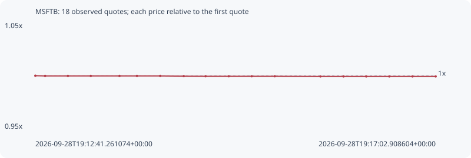

# MSFTB

**bsc** / `0x80106cb3ead06659a5ad19df39d9b4733863b9b0`

[All tokens](README.md) · [Market window](../README.md)

## Native assessments

This contract is in the quote cohort; it has no native model assessment in this window.

## Series 9997cf588f7837b8b6af

Pool: `not supplied`

[Complete series](../series/bsc/9997cf588f7837b8b6af.json)

Every dot is a captured quote. Lines connect observations; the curve ends at the last available quote.

| Peak | Final | Return | Maximum drawdown |
| ---: | ---: | ---: | ---: |
| 1.0000x | 0.9993x | -0.07% | 0.07% |

### Complete quote timeline

| Time (UTC) | Price (USD) | Multiple | Evidence |
| --- | ---: | ---: | --- |
| 2026-09-28T19:12:41.261074+00:00 | 511.735 | 1.0000x | `capture:795a88f0-804c-4f14-a3e8-ce8d9318f6df:rank:92` |
| 2026-09-28T19:12:47.639745+00:00 | 511.632 | 0.9998x | `capture:c2d8bd1a-9ed6-4d75-91ae-006bea65a635:rank:88` |
| 2026-09-28T19:13:02.549284+00:00 | 511.632 | 0.9998x | `capture:0aa38b41-b2e7-48f5-a3ba-8fd4a983fff8:rank:84` |
| 2026-09-28T19:13:17.511052+00:00 | 511.632 | 0.9998x | `capture:87e92f15-0601-4987-bd47-ae2e9f91de16:rank:86` |
| 2026-09-28T19:13:36.268178+00:00 | 511.632 | 0.9998x | `capture:577859f6-aadc-4653-b269-a860dbe8c41c:rank:82` |
| 2026-09-28T19:13:47.694462+00:00 | 511.632 | 0.9998x | `capture:4e60f1a9-1927-46db-ae10-f1b1530de61d:rank:80` |
| 2026-09-28T19:14:02.894344+00:00 | 511.632 | 0.9998x | `capture:6211f86d-6ba6-4eb3-a4e2-2f80b0dffff7:rank:81` |
| 2026-09-28T19:14:18.283251+00:00 | 511.52 | 0.9996x | `capture:68440f72-d36c-4c27-867d-03a757db141f:rank:75` |
| 2026-09-28T19:14:32.527710+00:00 | 511.468 | 0.9995x | `capture:4f6a3c72-f6f0-49d7-97fe-a760f1872e88:rank:69` |
| 2026-09-28T19:14:47.684789+00:00 | 511.468 | 0.9995x | `capture:abe58c43-9edf-4da1-b6d9-c4db72f14d79:rank:73` |
| 2026-09-28T19:15:02.698030+00:00 | 511.468 | 0.9995x | `capture:d9b7eccd-b77f-4cc6-8305-4a84d44c62e0:rank:81` |
| 2026-09-28T19:15:17.739331+00:00 | 511.468 | 0.9995x | `capture:08cc1e53-32bc-48e9-9abe-0b7caf40b440:rank:81` |
| 2026-09-28T19:15:47.591170+00:00 | 511.384 | 0.9993x | `capture:98b3c66b-c70a-4987-9342-10165ae058ec:rank:85` |
| 2026-09-28T19:16:02.665866+00:00 | 511.384 | 0.9993x | `capture:831c8e00-640d-4942-9ad6-ae68e842f3cf:rank:86` |
| 2026-09-28T19:16:17.512218+00:00 | 511.384 | 0.9993x | `capture:a4477278-80c9-4a7a-9a8f-66687623072c:rank:89` |
| 2026-09-28T19:16:32.607943+00:00 | 511.384 | 0.9993x | `capture:4487eb62-651f-462e-aece-4003e9e61067:rank:90` |
| 2026-09-28T19:16:47.751534+00:00 | 511.384 | 0.9993x | `capture:39d9c9d0-d8a7-439e-86b7-5fff162807b9:rank:90` |
| 2026-09-28T19:17:02.908604+00:00 | 511.384 | 0.9993x | `capture:16fde76e-cae4-4138-b96e-57b291931df8:rank:91` |

### Exit-policy timeline

Calculated from captured quotes under the window policy. Native assessments are linked separately above.

| Time (UTC) | Action | Price (USD) | Evidence |
| --- | --- | ---: | --- |
| 2026-09-28T19:12:41.261074+00:00 | BUY | 511.735 | `capture:795a88f0-804c-4f14-a3e8-ce8d9318f6df:rank:92` |
| 2026-09-28T19:12:47.639745+00:00 | HOLD | 511.632 | `capture:c2d8bd1a-9ed6-4d75-91ae-006bea65a635:rank:88` |
| 2026-09-28T19:13:02.549284+00:00 | HOLD | 511.632 | `capture:0aa38b41-b2e7-48f5-a3ba-8fd4a983fff8:rank:84` |
| 2026-09-28T19:13:17.511052+00:00 | HOLD | 511.632 | `capture:87e92f15-0601-4987-bd47-ae2e9f91de16:rank:86` |
| 2026-09-28T19:13:36.268178+00:00 | HOLD | 511.632 | `capture:577859f6-aadc-4653-b269-a860dbe8c41c:rank:82` |
| 2026-09-28T19:13:47.694462+00:00 | HOLD | 511.632 | `capture:4e60f1a9-1927-46db-ae10-f1b1530de61d:rank:80` |
| 2026-09-28T19:14:02.894344+00:00 | HOLD | 511.632 | `capture:6211f86d-6ba6-4eb3-a4e2-2f80b0dffff7:rank:81` |
| 2026-09-28T19:14:18.283251+00:00 | HOLD | 511.52 | `capture:68440f72-d36c-4c27-867d-03a757db141f:rank:75` |
| 2026-09-28T19:14:32.527710+00:00 | HOLD | 511.468 | `capture:4f6a3c72-f6f0-49d7-97fe-a760f1872e88:rank:69` |
| 2026-09-28T19:14:47.684789+00:00 | HOLD | 511.468 | `capture:abe58c43-9edf-4da1-b6d9-c4db72f14d79:rank:73` |
| 2026-09-28T19:15:02.698030+00:00 | HOLD | 511.468 | `capture:d9b7eccd-b77f-4cc6-8305-4a84d44c62e0:rank:81` |
| 2026-09-28T19:15:17.739331+00:00 | HOLD | 511.468 | `capture:08cc1e53-32bc-48e9-9abe-0b7caf40b440:rank:81` |
| 2026-09-28T19:15:47.591170+00:00 | HOLD | 511.384 | `capture:98b3c66b-c70a-4987-9342-10165ae058ec:rank:85` |
| 2026-09-28T19:16:02.665866+00:00 | HOLD | 511.384 | `capture:831c8e00-640d-4942-9ad6-ae68e842f3cf:rank:86` |
| 2026-09-28T19:16:17.512218+00:00 | HOLD | 511.384 | `capture:a4477278-80c9-4a7a-9a8f-66687623072c:rank:89` |
| 2026-09-28T19:16:32.607943+00:00 | HOLD | 511.384 | `capture:4487eb62-651f-462e-aece-4003e9e61067:rank:90` |
| 2026-09-28T19:16:47.751534+00:00 | HOLD | 511.384 | `capture:39d9c9d0-d8a7-439e-86b7-5fff162807b9:rank:90` |
| 2026-09-28T19:17:02.908604+00:00 | HOLD | 511.384 | `capture:16fde76e-cae4-4138-b96e-57b291931df8:rank:91` |
