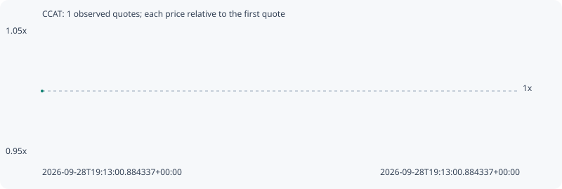

# CCAT

**solana** / `9i5UQBxF3PfdAxypu6ZPps9CfHopUqNubeQ4sdejTQDa`

[All tokens](README.md) · [Market window](../README.md)

## Native assessments

This contract is in the quote cohort; it has no native model assessment in this window.

## Series e958d32670cca01ddac8

Pool: `not supplied`

[Complete series](../series/solana/e958d32670cca01ddac8.json)

Every dot is a captured quote. Lines connect observations; the curve ends at the last available quote.

Fewer than two quotes: return and drawdown are not calculated.

### Complete quote timeline

| Time (UTC) | Price (USD) | Multiple | Evidence |
| --- | ---: | ---: | --- |
| 2026-09-28T19:13:00.884337+00:00 | 5.78699e-06 | 1.0000x | `capture:5867894f-39b4-4bcd-bd87-86394c63aab4:rank:95` |

### Exit-policy timeline

Calculated from captured quotes under the window policy. Native assessments are linked separately above.

| Time (UTC) | Action | Price (USD) | Evidence |
| --- | --- | ---: | --- |
