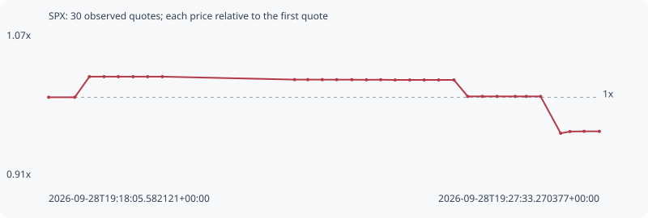

# SPX

**bsc** / `0xca56094722450016f280c4fd6a333e5c36903827`

[All tokens](README.md) · [Market window](../README.md)

## Native assessments

This contract is in the quote cohort; it has no native model assessment in this window.

## Series 0bc79548d7db57e80819

Pool: `not supplied`

[Complete series](../series/bsc/0bc79548d7db57e80819.json)

Every dot is a captured quote. Lines connect observations; the curve ends at the last available quote.

| Peak | Final | Return | Maximum drawdown |
| ---: | ---: | ---: | ---: |
| 1.0232x | 0.9616x | -3.84% | 6.23% |

### Complete quote timeline

| Time (UTC) | Price (USD) | Multiple | Evidence |
| --- | ---: | ---: | --- |
| 2026-09-28T19:18:05.582121+00:00 | 0.0981936 | 1.0000x | `capture:07127a86-393c-4e05-bde5-d28a70a854fb:rank:96` |
| 2026-09-28T19:18:32.607444+00:00 | 0.0981936 | 1.0000x | `capture:86009bbc-85b0-465e-8657-55be8d6c15de:rank:99` |
| 2026-09-28T19:18:47.632598+00:00 | 0.100471 | 1.0232x | `capture:bfa4352f-2279-41ec-a6fd-d3e101a21181:rank:84` |
| 2026-09-28T19:19:02.666276+00:00 | 0.100471 | 1.0232x | `capture:6fe1da90-a254-48b3-b112-ab24c6060e81:rank:87` |
| 2026-09-28T19:19:17.488471+00:00 | 0.100471 | 1.0232x | `capture:b87f439a-4825-4a6f-b17c-0b78464d9310:rank:83` |
| 2026-09-28T19:19:32.672995+00:00 | 0.100471 | 1.0232x | `capture:ceae4194-4b79-45b3-9a66-758dd19e2a7b:rank:81` |
| 2026-09-28T19:19:47.615151+00:00 | 0.100471 | 1.0232x | `capture:0dedf968-cc48-4422-8bbf-180ff2103dbf:rank:91` |
| 2026-09-28T19:20:02.835112+00:00 | 0.100471 | 1.0232x | `capture:adbb19f8-5a81-4d70-8990-a6ffd414f250:rank:94` |
| 2026-09-28T19:22:19.090071+00:00 | 0.100145 | 1.0199x | `capture:30ef0b61-e0e1-4eba-95c6-de3dc48fe868:rank:95` |
| 2026-09-28T19:22:32.671189+00:00 | 0.100142 | 1.0198x | `capture:5d031323-644d-4272-bacc-8a363d4b77cb:rank:86` |
| 2026-09-28T19:22:47.674643+00:00 | 0.100142 | 1.0198x | `capture:c8838291-6f5a-42d9-9013-9d9421deb79e:rank:79` |
| 2026-09-28T19:23:02.516005+00:00 | 0.100136 | 1.0198x | `capture:f8b60e63-80ce-442a-9ca7-659f2b5ca21d:rank:52` |
| 2026-09-28T19:23:18.123882+00:00 | 0.100136 | 1.0198x | `capture:f689df34-2acf-42e7-a37b-1a7d50808302:rank:52` |
| 2026-09-28T19:23:33.140484+00:00 | 0.100122 | 1.0196x | `capture:ef2304f7-c374-4b90-a3e4-d8976f05c226:rank:51` |
| 2026-09-28T19:23:47.927661+00:00 | 0.100132 | 1.0197x | `capture:51aa913c-158f-4059-8727-ff1ace24834c:rank:52` |
| 2026-09-28T19:24:02.684719+00:00 | 0.100106 | 1.0195x | `capture:77fa5264-b080-4409-8d15-3f5504293a7d:rank:45` |
| 2026-09-28T19:24:17.754261+00:00 | 0.100106 | 1.0195x | `capture:9e642626-a894-4304-aad8-bfad3e85b1e6:rank:44` |
| 2026-09-28T19:24:32.694463+00:00 | 0.100106 | 1.0195x | `capture:2934d705-4adf-40dc-b5ef-2f9f3edbbe61:rank:44` |
| 2026-09-28T19:24:47.591753+00:00 | 0.100106 | 1.0195x | `capture:1cb45dcb-fe83-4fcc-8cfd-c5de8d369858:rank:43` |
| 2026-09-28T19:25:03.394485+00:00 | 0.100106 | 1.0195x | `capture:f1b0620f-7caf-483d-8db4-440b4d786962:rank:43` |
| 2026-09-28T19:25:17.566680+00:00 | 0.098286 | 1.0009x | `capture:89c3d45d-a145-4312-88dc-a4340e727616:rank:41` |
| 2026-09-28T19:25:32.640282+00:00 | 0.098286 | 1.0009x | `capture:a41f01eb-b1b7-4ed5-a604-19b71e522502:rank:41` |
| 2026-09-28T19:25:47.745538+00:00 | 0.098286 | 1.0009x | `capture:b20e5ea5-a03d-4b94-91ce-404a72f5de9b:rank:42` |
| 2026-09-28T19:26:06.431923+00:00 | 0.098286 | 1.0009x | `capture:a3278748-b5f3-45be-a966-ab473520d9c2:rank:42` |
| 2026-09-28T19:26:17.917162+00:00 | 0.098286 | 1.0009x | `capture:3b80c987-c82b-4a3e-8f0b-d3017a78edcb:rank:40` |
| 2026-09-28T19:26:32.687411+00:00 | 0.098286 | 1.0009x | `capture:d1fef60a-e7ad-4594-a8e8-74ee96c47ae4:rank:43` |
| 2026-09-28T19:26:53.320509+00:00 | 0.0942071 | 0.9594x | `capture:5f09420c-1544-46ff-a2e4-39235f8f73a9:rank:35` |
| 2026-09-28T19:27:02.865937+00:00 | 0.0943962 | 0.9613x | `capture:bd21661a-974d-4bab-9276-4e2f7e7d279a:rank:35` |
| 2026-09-28T19:27:17.494949+00:00 | 0.0944188 | 0.9616x | `capture:c5d9da1a-7d95-4d7f-8cef-ffb660ac56d0:rank:34` |
| 2026-09-28T19:27:33.270377+00:00 | 0.0944188 | 0.9616x | `capture:1cb6d037-a95b-477e-be82-4cc75b729c8b:rank:33` |

### Exit-policy timeline

Calculated from captured quotes under the window policy. Native assessments are linked separately above.

| Time (UTC) | Action | Price (USD) | Evidence |
| --- | --- | ---: | --- |
| 2026-09-28T19:18:05.582121+00:00 | BUY | 0.0981936 | `capture:07127a86-393c-4e05-bde5-d28a70a854fb:rank:96` |
| 2026-09-28T19:18:32.607444+00:00 | HOLD | 0.0981936 | `capture:86009bbc-85b0-465e-8657-55be8d6c15de:rank:99` |
| 2026-09-28T19:18:47.632598+00:00 | HOLD | 0.100471 | `capture:bfa4352f-2279-41ec-a6fd-d3e101a21181:rank:84` |
| 2026-09-28T19:19:02.666276+00:00 | HOLD | 0.100471 | `capture:6fe1da90-a254-48b3-b112-ab24c6060e81:rank:87` |
| 2026-09-28T19:19:17.488471+00:00 | HOLD | 0.100471 | `capture:b87f439a-4825-4a6f-b17c-0b78464d9310:rank:83` |
| 2026-09-28T19:19:32.672995+00:00 | HOLD | 0.100471 | `capture:ceae4194-4b79-45b3-9a66-758dd19e2a7b:rank:81` |
| 2026-09-28T19:19:47.615151+00:00 | HOLD | 0.100471 | `capture:0dedf968-cc48-4422-8bbf-180ff2103dbf:rank:91` |
| 2026-09-28T19:20:02.835112+00:00 | HOLD | 0.100471 | `capture:adbb19f8-5a81-4d70-8990-a6ffd414f250:rank:94` |
| 2026-09-28T19:22:19.090071+00:00 | HOLD | 0.100145 | `capture:30ef0b61-e0e1-4eba-95c6-de3dc48fe868:rank:95` |
| 2026-09-28T19:22:32.671189+00:00 | HOLD | 0.100142 | `capture:5d031323-644d-4272-bacc-8a363d4b77cb:rank:86` |
| 2026-09-28T19:22:47.674643+00:00 | HOLD | 0.100142 | `capture:c8838291-6f5a-42d9-9013-9d9421deb79e:rank:79` |
| 2026-09-28T19:23:02.516005+00:00 | HOLD | 0.100136 | `capture:f8b60e63-80ce-442a-9ca7-659f2b5ca21d:rank:52` |
| 2026-09-28T19:23:18.123882+00:00 | HOLD | 0.100136 | `capture:f689df34-2acf-42e7-a37b-1a7d50808302:rank:52` |
| 2026-09-28T19:23:33.140484+00:00 | HOLD | 0.100122 | `capture:ef2304f7-c374-4b90-a3e4-d8976f05c226:rank:51` |
| 2026-09-28T19:23:47.927661+00:00 | HOLD | 0.100132 | `capture:51aa913c-158f-4059-8727-ff1ace24834c:rank:52` |
| 2026-09-28T19:24:02.684719+00:00 | HOLD | 0.100106 | `capture:77fa5264-b080-4409-8d15-3f5504293a7d:rank:45` |
| 2026-09-28T19:24:17.754261+00:00 | HOLD | 0.100106 | `capture:9e642626-a894-4304-aad8-bfad3e85b1e6:rank:44` |
| 2026-09-28T19:24:32.694463+00:00 | HOLD | 0.100106 | `capture:2934d705-4adf-40dc-b5ef-2f9f3edbbe61:rank:44` |
| 2026-09-28T19:24:47.591753+00:00 | HOLD | 0.100106 | `capture:1cb45dcb-fe83-4fcc-8cfd-c5de8d369858:rank:43` |
| 2026-09-28T19:25:03.394485+00:00 | HOLD | 0.100106 | `capture:f1b0620f-7caf-483d-8db4-440b4d786962:rank:43` |
| 2026-09-28T19:25:17.566680+00:00 | HOLD | 0.098286 | `capture:89c3d45d-a145-4312-88dc-a4340e727616:rank:41` |
| 2026-09-28T19:25:32.640282+00:00 | HOLD | 0.098286 | `capture:a41f01eb-b1b7-4ed5-a604-19b71e522502:rank:41` |
| 2026-09-28T19:25:47.745538+00:00 | HOLD | 0.098286 | `capture:b20e5ea5-a03d-4b94-91ce-404a72f5de9b:rank:42` |
| 2026-09-28T19:26:06.431923+00:00 | HOLD | 0.098286 | `capture:a3278748-b5f3-45be-a966-ab473520d9c2:rank:42` |
| 2026-09-28T19:26:17.917162+00:00 | HOLD | 0.098286 | `capture:3b80c987-c82b-4a3e-8f0b-d3017a78edcb:rank:40` |
| 2026-09-28T19:26:32.687411+00:00 | HOLD | 0.098286 | `capture:d1fef60a-e7ad-4594-a8e8-74ee96c47ae4:rank:43` |
| 2026-09-28T19:26:53.320509+00:00 | HOLD | 0.0942071 | `capture:5f09420c-1544-46ff-a2e4-39235f8f73a9:rank:35` |
| 2026-09-28T19:27:02.865937+00:00 | HOLD | 0.0943962 | `capture:bd21661a-974d-4bab-9276-4e2f7e7d279a:rank:35` |
| 2026-09-28T19:27:17.494949+00:00 | HOLD | 0.0944188 | `capture:c5d9da1a-7d95-4d7f-8cef-ffb660ac56d0:rank:34` |
| 2026-09-28T19:27:33.270377+00:00 | HOLD | 0.0944188 | `capture:1cb6d037-a95b-477e-be82-4cc75b729c8b:rank:33` |
