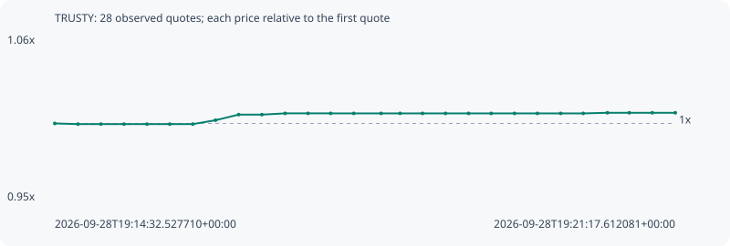

# TRUSTY

**bsc** / `0x4e79a464877b63f411500a4d158b3532cecf7777`

[All tokens](README.md) · [Market window](../README.md)

## Native assessments

This contract is in the quote cohort; it has no native model assessment in this window.

## Series d69bae50ea570ea1a3a5

Pool: `not supplied`

[Complete series](../series/bsc/d69bae50ea570ea1a3a5.json)

Every dot is a captured quote. Lines connect observations; the curve ends at the last available quote.

| Peak | Final | Return | Maximum drawdown |
| ---: | ---: | ---: | ---: |
| 1.0070x | 1.0070x | +0.70% | 0.04% |

### Complete quote timeline

| Time (UTC) | Price (USD) | Multiple | Evidence |
| --- | ---: | ---: | --- |
| 2026-09-28T19:14:32.527710+00:00 | 2.15852e-05 | 1.0000x | `capture:4f6a3c72-f6f0-49d7-97fe-a760f1872e88:rank:29` |
| 2026-09-28T19:14:47.684789+00:00 | 2.15756e-05 | 0.9996x | `capture:abe58c43-9edf-4da1-b6d9-c4db72f14d79:rank:31` |
| 2026-09-28T19:15:02.698030+00:00 | 2.15756e-05 | 0.9996x | `capture:d9b7eccd-b77f-4cc6-8305-4a84d44c62e0:rank:34` |
| 2026-09-28T19:15:17.739331+00:00 | 2.15756e-05 | 0.9996x | `capture:08cc1e53-32bc-48e9-9abe-0b7caf40b440:rank:33` |
| 2026-09-28T19:15:32.749915+00:00 | 2.15756e-05 | 0.9996x | `capture:81e75e19-4c52-4e91-ba7d-af89c6539b19:rank:34` |
| 2026-09-28T19:15:47.591170+00:00 | 2.15756e-05 | 0.9996x | `capture:98b3c66b-c70a-4987-9342-10165ae058ec:rank:36` |
| 2026-09-28T19:16:02.665866+00:00 | 2.15756e-05 | 0.9996x | `capture:831c8e00-640d-4942-9ad6-ae68e842f3cf:rank:38` |
| 2026-09-28T19:16:17.512218+00:00 | 2.1631e-05 | 1.0021x | `capture:a4477278-80c9-4a7a-9a8f-66687623072c:rank:35` |
| 2026-09-28T19:16:32.607943+00:00 | 2.17097e-05 | 1.0058x | `capture:4487eb62-651f-462e-aece-4003e9e61067:rank:35` |
| 2026-09-28T19:16:47.751534+00:00 | 2.17097e-05 | 1.0058x | `capture:39d9c9d0-d8a7-439e-86b7-5fff162807b9:rank:35` |
| 2026-09-28T19:17:02.908604+00:00 | 2.17274e-05 | 1.0066x | `capture:16fde76e-cae4-4138-b96e-57b291931df8:rank:37` |
| 2026-09-28T19:17:17.816055+00:00 | 2.17274e-05 | 1.0066x | `capture:7f9359fa-2f23-4e78-9500-f9df7d85a6b2:rank:37` |
| 2026-09-28T19:17:32.654140+00:00 | 2.17274e-05 | 1.0066x | `capture:4e95b3e2-d20d-4729-ac41-d7699561b97b:rank:41` |
| 2026-09-28T19:17:47.717594+00:00 | 2.1727e-05 | 1.0066x | `capture:2cc72c7e-c2ae-4eb2-929b-e80f3d8c4e15:rank:34` |
| 2026-09-28T19:18:05.582121+00:00 | 2.1727e-05 | 1.0066x | `capture:07127a86-393c-4e05-bde5-d28a70a854fb:rank:34` |
| 2026-09-28T19:18:17.953086+00:00 | 2.1727e-05 | 1.0066x | `capture:ca903b0a-a9a8-4246-873f-5115402fbf9c:rank:37` |
| 2026-09-28T19:18:32.607444+00:00 | 2.1727e-05 | 1.0066x | `capture:86009bbc-85b0-465e-8657-55be8d6c15de:rank:40` |
| 2026-09-28T19:18:47.632598+00:00 | 2.1727e-05 | 1.0066x | `capture:bfa4352f-2279-41ec-a6fd-d3e101a21181:rank:48` |
| 2026-09-28T19:19:02.666276+00:00 | 2.1727e-05 | 1.0066x | `capture:6fe1da90-a254-48b3-b112-ab24c6060e81:rank:49` |
| 2026-09-28T19:19:17.488471+00:00 | 2.1727e-05 | 1.0066x | `capture:b87f439a-4825-4a6f-b17c-0b78464d9310:rank:59` |
| 2026-09-28T19:19:32.672995+00:00 | 2.1727e-05 | 1.0066x | `capture:ceae4194-4b79-45b3-9a66-758dd19e2a7b:rank:67` |
| 2026-09-28T19:19:47.615151+00:00 | 2.1727e-05 | 1.0066x | `capture:0dedf968-cc48-4422-8bbf-180ff2103dbf:rank:75` |
| 2026-09-28T19:20:02.835112+00:00 | 2.1727e-05 | 1.0066x | `capture:adbb19f8-5a81-4d70-8990-a6ffd414f250:rank:72` |
| 2026-09-28T19:20:17.561225+00:00 | 2.1727e-05 | 1.0066x | `capture:0feecf05-56c0-4db7-a137-f63b427a7830:rank:70` |
| 2026-09-28T19:20:33.351338+00:00 | 2.17357e-05 | 1.0070x | `capture:5752259a-2bcb-4e27-ac90-6ef5a52d1cf7:rank:61` |
| 2026-09-28T19:20:47.599416+00:00 | 2.17357e-05 | 1.0070x | `capture:1ab71e23-e150-479b-a1fa-e2a362332d1e:rank:60` |
| 2026-09-28T19:21:02.616817+00:00 | 2.17357e-05 | 1.0070x | `capture:ec0d171f-d990-484a-94d1-c335d7f6e8fb:rank:60` |
| 2026-09-28T19:21:17.612081+00:00 | 2.17357e-05 | 1.0070x | `capture:cc46cbda-0be4-42ba-bcf4-4a03c9e7e894:rank:60` |

### Exit-policy timeline

Calculated from captured quotes under the window policy. Native assessments are linked separately above.

| Time (UTC) | Action | Price (USD) | Evidence |
| --- | --- | ---: | --- |
| 2026-09-28T19:14:32.527710+00:00 | BUY | 2.15852e-05 | `capture:4f6a3c72-f6f0-49d7-97fe-a760f1872e88:rank:29` |
| 2026-09-28T19:14:47.684789+00:00 | HOLD | 2.15756e-05 | `capture:abe58c43-9edf-4da1-b6d9-c4db72f14d79:rank:31` |
| 2026-09-28T19:15:02.698030+00:00 | HOLD | 2.15756e-05 | `capture:d9b7eccd-b77f-4cc6-8305-4a84d44c62e0:rank:34` |
| 2026-09-28T19:15:17.739331+00:00 | HOLD | 2.15756e-05 | `capture:08cc1e53-32bc-48e9-9abe-0b7caf40b440:rank:33` |
| 2026-09-28T19:15:32.749915+00:00 | HOLD | 2.15756e-05 | `capture:81e75e19-4c52-4e91-ba7d-af89c6539b19:rank:34` |
| 2026-09-28T19:15:47.591170+00:00 | HOLD | 2.15756e-05 | `capture:98b3c66b-c70a-4987-9342-10165ae058ec:rank:36` |
| 2026-09-28T19:16:02.665866+00:00 | HOLD | 2.15756e-05 | `capture:831c8e00-640d-4942-9ad6-ae68e842f3cf:rank:38` |
| 2026-09-28T19:16:17.512218+00:00 | HOLD | 2.1631e-05 | `capture:a4477278-80c9-4a7a-9a8f-66687623072c:rank:35` |
| 2026-09-28T19:16:32.607943+00:00 | HOLD | 2.17097e-05 | `capture:4487eb62-651f-462e-aece-4003e9e61067:rank:35` |
| 2026-09-28T19:16:47.751534+00:00 | HOLD | 2.17097e-05 | `capture:39d9c9d0-d8a7-439e-86b7-5fff162807b9:rank:35` |
| 2026-09-28T19:17:02.908604+00:00 | HOLD | 2.17274e-05 | `capture:16fde76e-cae4-4138-b96e-57b291931df8:rank:37` |
| 2026-09-28T19:17:17.816055+00:00 | HOLD | 2.17274e-05 | `capture:7f9359fa-2f23-4e78-9500-f9df7d85a6b2:rank:37` |
| 2026-09-28T19:17:32.654140+00:00 | HOLD | 2.17274e-05 | `capture:4e95b3e2-d20d-4729-ac41-d7699561b97b:rank:41` |
| 2026-09-28T19:17:47.717594+00:00 | HOLD | 2.1727e-05 | `capture:2cc72c7e-c2ae-4eb2-929b-e80f3d8c4e15:rank:34` |
| 2026-09-28T19:18:05.582121+00:00 | HOLD | 2.1727e-05 | `capture:07127a86-393c-4e05-bde5-d28a70a854fb:rank:34` |
| 2026-09-28T19:18:17.953086+00:00 | HOLD | 2.1727e-05 | `capture:ca903b0a-a9a8-4246-873f-5115402fbf9c:rank:37` |
| 2026-09-28T19:18:32.607444+00:00 | HOLD | 2.1727e-05 | `capture:86009bbc-85b0-465e-8657-55be8d6c15de:rank:40` |
| 2026-09-28T19:18:47.632598+00:00 | HOLD | 2.1727e-05 | `capture:bfa4352f-2279-41ec-a6fd-d3e101a21181:rank:48` |
| 2026-09-28T19:19:02.666276+00:00 | HOLD | 2.1727e-05 | `capture:6fe1da90-a254-48b3-b112-ab24c6060e81:rank:49` |
| 2026-09-28T19:19:17.488471+00:00 | HOLD | 2.1727e-05 | `capture:b87f439a-4825-4a6f-b17c-0b78464d9310:rank:59` |
| 2026-09-28T19:19:32.672995+00:00 | HOLD | 2.1727e-05 | `capture:ceae4194-4b79-45b3-9a66-758dd19e2a7b:rank:67` |
| 2026-09-28T19:19:47.615151+00:00 | HOLD | 2.1727e-05 | `capture:0dedf968-cc48-4422-8bbf-180ff2103dbf:rank:75` |
| 2026-09-28T19:20:02.835112+00:00 | HOLD | 2.1727e-05 | `capture:adbb19f8-5a81-4d70-8990-a6ffd414f250:rank:72` |
| 2026-09-28T19:20:17.561225+00:00 | HOLD | 2.1727e-05 | `capture:0feecf05-56c0-4db7-a137-f63b427a7830:rank:70` |
| 2026-09-28T19:20:33.351338+00:00 | HOLD | 2.17357e-05 | `capture:5752259a-2bcb-4e27-ac90-6ef5a52d1cf7:rank:61` |
| 2026-09-28T19:20:47.599416+00:00 | HOLD | 2.17357e-05 | `capture:1ab71e23-e150-479b-a1fa-e2a362332d1e:rank:60` |
| 2026-09-28T19:21:02.616817+00:00 | HOLD | 2.17357e-05 | `capture:ec0d171f-d990-484a-94d1-c335d7f6e8fb:rank:60` |
| 2026-09-28T19:21:17.612081+00:00 | HOLD | 2.17357e-05 | `capture:cc46cbda-0be4-42ba-bcf4-4a03c9e7e894:rank:60` |
